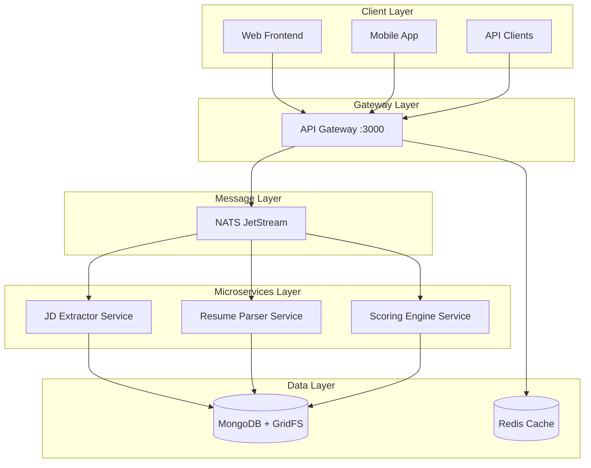

# 🔌 API Contracts & Service Integration Specification

**Version**: 1.0.0  
**Last Updated**: 2025-08-15  
**Project**: AI Recruitment Clerk

---

## 📋 Document Purpose

This document defines **all external API endpoints** through the Gateway service and **inter-service asynchronous message formats** via NATS JetStream for the AI Recruitment Clerk system. It serves as the **single source of truth** for API contracts and service integration patterns.

## 🏗️ System Architecture Overview



---

## 🌐 External API Endpoints (Gateway)

**Base URL**: `http://localhost:3000/api`  
**Authentication**: JWT Bearer Token (where required)  
**Content-Type**: `application/json`

### 🔐 Authentication & Authorization

#### POST `/auth/register`
**Purpose**: User registration  
**Authentication**: None  
**Request Body**:
```typescript
interface RegisterRequest {
  username: string;
  email: string;
  password: string;
  confirmPassword: string;
}
```
**Response**:
```typescript
interface RegisterResponse {
  success: boolean;
  message: string;
  userId?: string;
}
```

#### POST `/auth/login`
**Purpose**: User authentication  
**Authentication**: None  
**Request Body**:
```typescript
interface LoginRequest {
  email: string;
  password: string;
}
```
**Response**:
```typescript
interface LoginResponse {
  success: boolean;
  access_token: string;
  refresh_token: string;
  user: UserProfile;
}
```

#### POST `/auth/refresh`
**Purpose**: Refresh access token  
**Authentication**: Refresh Token  
**Request Body**:
```typescript
interface RefreshRequest {
  refresh_token: string;
}
```
**Response**:
```typescript
interface RefreshResponse {
  access_token: string;
  expires_in: number;
}
```

#### POST `/auth/logout`
**Purpose**: User logout  
**Authentication**: Bearer Token  
**Response**:
```typescript
interface LogoutResponse {
  success: boolean;
  message: string;
}
```

#### GET `/auth/profile`
**Purpose**: Get user profile  
**Authentication**: Bearer Token  
**Response**:
```typescript
interface UserProfile {
  id: string;
  username: string;
  email: string;
  role: string;
  createdAt: string;
  lastLoginAt: string;
}
```

### 📄 Job & Resume Processing

#### POST `/jobs`
**Purpose**: Create new job posting  
**Authentication**: Bearer Token  
**Request Body**:
```typescript
interface CreateJobRequest {
  title: string;
  company: string;
  description: string;
  requirements: string[];
  location: string;
  salaryRange?: {
    min: number;
    max: number;
    currency: string;
  };
}
```
**Response**:
```typescript
interface CreateJobResponse {
  success: boolean;
  jobId: string;
  message: string;
}
```

#### POST `/jobs/:jobId/resumes`
**Purpose**: Upload resume for job analysis  
**Authentication**: Bearer Token or Guest  
**Content-Type**: `multipart/form-data`  
**Request**:
```typescript
interface UploadResumeRequest {
  file: File; // PDF format, max 10MB
  metadata?: {
    candidateName?: string;
    email?: string;
    phone?: string;
  };
}
```
**Response**:
```typescript
interface UploadResumeResponse {
  success: boolean;
  resumeId: string;
  analysisId: string;
  estimatedProcessingTime: number; // seconds
}
```

#### GET `/jobs`
**Purpose**: List all jobs  
**Authentication**: Bearer Token  
**Query Parameters**:
```typescript
interface ListJobsQuery {
  page?: number;
  limit?: number;
  status?: 'active' | 'closed' | 'draft';
  search?: string;
}
```
**Response**:
```typescript
interface ListJobsResponse {
  jobs: JobSummary[];
  pagination: {
    page: number;
    limit: number;
    total: number;
    totalPages: number;
  };
}
```

#### GET `/jobs/:jobId`
**Purpose**: Get job details  
**Authentication**: Bearer Token  
**Response**:
```typescript
interface JobDetailsResponse {
  job: JobDetail;
  statistics: {
    totalResumes: number;
    averageScore: number;
    processingStatus: string;
  };
}
```

#### GET `/jobs/:jobId/resumes`
**Purpose**: List resumes for job  
**Authentication**: Bearer Token  
**Query Parameters**:
```typescript
interface ListResumesQuery {
  page?: number;
  limit?: number;
  minScore?: number;
  status?: 'processing' | 'completed' | 'failed';
}
```
**Response**:
```typescript
interface ListResumesResponse {
  resumes: ResumeSummary[];
  pagination: PaginationInfo;
}
```

#### GET `/jobs/:jobId/reports`
**Purpose**: Get analysis reports for job  
**Authentication**: Bearer Token  
**Response**:
```typescript
interface JobReportsResponse {
  reports: AnalysisReport[];
  summary: {
    totalCandidates: number;
    averageScore: number;
    topSkills: string[];
    recommendations: string[];
  };
}
```

### 👤 Guest Services

#### POST `/guest/resume/analyze`
**Purpose**: Guest resume analysis (rate-limited)  
**Authentication**: None (Rate Limited)  
**Content-Type**: `multipart/form-data`  
**Request**:
```typescript
interface GuestAnalyzeRequest {
  file: File; // PDF format, max 5MB for guests
  jobDescription?: string; // Optional JD for matching
}
```
**Response**:
```typescript
interface GuestAnalyzeResponse {
  success: boolean;
  analysisId: string;
  guestToken: string; // For result retrieval
  estimatedProcessingTime: number;
}
```

#### GET `/guest/resume/analysis/:analysisId`
**Purpose**: Get guest analysis results  
**Authentication**: Guest Token  
**Headers**: `X-Guest-Token: {guestToken}`  
**Response**:
```typescript
interface GuestAnalysisResponse {
  status: 'processing' | 'completed' | 'failed';
  progress?: number; // 0-100
  results?: {
    extractedInfo: ResumeDTO;
    suggestions: string[];
    score?: number; // If JD was provided
    remainingFreeAnalyses: number;
  };
  error?: string;
}
```

### 📊 Analytics & Monitoring

#### GET `/analytics/dashboard`
**Purpose**: Analytics dashboard data  
**Authentication**: Bearer Token (Admin)  
**Response**:
```typescript
interface DashboardResponse {
  overview: {
    totalJobs: number;
    totalResumes: number;
    averageProcessingTime: number;
    systemHealth: 'healthy' | 'warning' | 'critical';
  };
  recentActivity: ActivityItem[];
  performanceMetrics: PerformanceMetrics;
}
```

#### POST `/analytics/events`
**Purpose**: Track user events  
**Authentication**: Bearer Token or Guest  
**Request Body**:
```typescript
interface TrackEventRequest {
  eventType: string;
  eventData: Record<string, any>;
  timestamp: string;
  sessionId?: string;
}
```

### 🏥 System Health & Status

#### GET `/health`
**Purpose**: System health check  
**Authentication**: None  
**Response**:
```typescript
interface HealthResponse {
  status: 'healthy' | 'degraded' | 'unhealthy';
  timestamp: string;
  services: {
    database: ServiceHealth;
    cache: ServiceHealth;
    messageQueue: ServiceHealth;
    microservices: {
      jdExtractor: ServiceHealth;
      resumeParser: ServiceHealth;
      scoringEngine: ServiceHealth;
    };
  };
  version: string;
}

interface ServiceHealth {
  status: 'up' | 'down' | 'degraded';
  responseTime?: number;
  details?: string;
}
```

#### GET `/status`
**Purpose**: API Gateway status  
**Authentication**: None  
**Response**:
```typescript
interface StatusResponse {
  service: 'AI-Recruitment-Gateway';
  version: string;
  environment: string;
  uptime: number;
  timestamp: string;
}
```

---

## 📨 Inter-Service Message Contracts (NATS)

**Message Broker**: NATS JetStream  
**Stream Strategy**: Subject-based routing  
**Persistence**: JetStream persistent messages  
**Delivery**: At-least-once guarantee

### 📄 Job Processing Events

#### Event: `job.jd.submitted`
**Publisher**: API Gateway  
**Subscribers**: JD Extractor Service  
**Purpose**: Trigger JD analysis when job is created

```typescript
interface JobJdSubmittedEvent {
  jobId: string;
  jobTitle: string;
  jdText: string;
  timestamp: string;
}
```

#### Event: `analysis.jd.extracted`
**Publisher**: JD Extractor Service  
**Subscribers**: Scoring Engine Service  
**Purpose**: JD analysis completion notification

```typescript
interface AnalysisJdExtractedEvent {
  jobId: string;
  extractedData: JdDTO;
  timestamp: string;
  processingTimeMs: number;
}
```

### 📋 Resume Processing Events

#### Event: `job.resume.submitted`
**Publisher**: API Gateway  
**Subscribers**: Resume Parser Service  
**Purpose**: Trigger resume parsing when uploaded

```typescript
interface ResumeSubmittedEvent {
  jobId: string;
  resumeId: string;
  originalFilename: string;
  tempGridFsUrl: string; // Internal service access URL
}
```

#### Event: `analysis.resume.parsed`
**Publisher**: Resume Parser Service  
**Subscribers**: Scoring Engine Service  
**Purpose**: Resume parsing completion notification

```typescript
interface AnalysisResumeParsedEvent {
  jobId: string;
  resumeId: string;
  resumeDto: ResumeDTO;
  timestamp: string;
  processingTimeMs: number;
}
```

#### Event: `job.resume.failed`
**Publisher**: Resume Parser Service  
**Subscribers**: API Gateway (notification)  
**Purpose**: Resume processing failure notification

```typescript
interface JobResumeFailedEvent {
  jobId: string;
  resumeId: string;
  originalFilename: string;
  error: string;
  retryCount: number;
  timestamp: string;
}
```

### 🎯 Scoring & Analysis Events

#### Event: `analysis.match.scored`
**Publisher**: Scoring Engine Service  
**Subscribers**: API Gateway (notification)  
**Purpose**: Matching score calculation completion

```typescript
interface AnalysisMatchScoredEvent {
  jobId: string;
  resumeId: string;
  score: number;
  breakdown: ScoreBreakdown;
  recommendations: string[];
  timestamp: string;
  processingTimeMs: number;
}

interface ScoreBreakdown {
  skillsMatch: number;
  experienceMatch: number;
  educationMatch: number;
  overallFit: number;
  confidence: number;
}
```

---

## 📊 Data Transfer Objects (DTOs)

### JD (Job Description) DTO
```typescript
interface JdDTO {
  jobId: string;
  title: string;
  company: string;
  description: string;
  requirements: {
    skills: string[];
    experience: {
      years: number;
      level: 'entry' | 'mid' | 'senior' | 'executive';
    };
    education: {
      degree: string;
      field?: string;
      required: boolean;
    };
    languages?: string[];
  };
  responsibilities: string[];
  benefits?: string[];
  location: {
    city: string;
    country: string;
    remote: boolean;
  };
  salaryRange?: {
    min: number;
    max: number;
    currency: string;
  };
  extractedAt: string;
}
```

### Resume DTO
```typescript
interface ResumeDTO {
  resumeId: string;
  personalInfo: {
    name: string;
    email?: string;
    phone?: string;
    location?: string;
    linkedin?: string;
  };
  workExperience: WorkExperience[];
  education: Education[];
  skills: {
    technical: string[];
    soft: string[];
    languages: Language[];
  };
  certifications?: Certification[];
  projects?: Project[];
  summary?: string;
  extractedAt: string;
}

interface WorkExperience {
  company: string;
  position: string;
  startDate: string;
  endDate?: string; // null for current position
  description: string;
  achievements?: string[];
  technologies?: string[];
}

interface Education {
  institution: string;
  degree: string;
  field: string;
  graduationDate?: string;
  gpa?: number;
  achievements?: string[];
}

interface Language {
  language: string;
  proficiency: 'beginner' | 'intermediate' | 'advanced' | 'native';
}

interface Certification {
  name: string;
  issuer: string;
  issueDate: string;
  expiryDate?: string;
  credentialId?: string;
}

interface Project {
  name: string;
  description: string;
  technologies: string[];
  startDate?: string;
  endDate?: string;
  url?: string;
}
```

---

## 🔒 Security & Authentication

### JWT Token Structure
```typescript
interface JWTPayload {
  sub: string; // User ID
  email: string;
  role: string;
  iat: number;
  exp: number;
  jti: string; // Token ID for revocation
}
```

### Rate Limiting
- **Guest APIs**: 10 requests/hour per IP
- **Authenticated APIs**: 1000 requests/hour per user
- **File Uploads**: 5 uploads/hour (guest), 50 uploads/hour (authenticated)

### Security Headers
- `X-Content-Type-Options: nosniff`
- `X-Frame-Options: DENY`
- `X-XSS-Protection: 1; mode=block`
- `Strict-Transport-Security: max-age=31536000`

---

## 📈 Performance & SLA

### Response Time Targets
- **Authentication**: < 500ms
- **File Upload**: < 2s
- **Resume Processing**: < 30s
- **JD Analysis**: < 10s
- **Scoring**: < 5s

### Availability Targets
- **API Gateway**: 99.9% uptime
- **Message Processing**: 99.95% success rate
- **Data Consistency**: 100% (eventual consistency acceptable)

### Throughput Capacity
- **Concurrent Users**: 1000
- **Resume Processing**: 100 resumes/minute
- **API Requests**: 10,000 requests/minute

---

## 🔄 Error Handling & Retry Policies

### Standard Error Response
```typescript
interface ErrorResponse {
  success: false;
  error: {
    code: string;
    message: string;
    details?: any;
    timestamp: string;
    requestId: string;
  };
}
```

### Error Codes
- `AUTH_001`: Invalid credentials
- `AUTH_002`: Token expired
- `UPLOAD_001`: File too large
- `UPLOAD_002`: Invalid file format
- `PROC_001`: Processing timeout
- `PROC_002`: AI service unavailable
- `RATE_001`: Rate limit exceeded

### Message Retry Policies
- **Max Retries**: 3 attempts
- **Backoff Strategy**: Exponential (1s, 2s, 4s)
- **Dead Letter Queue**: After max retries
- **Timeout**: 30s per message processing

---

## 🧪 Testing & Validation

### Contract Testing
- **API Contract Tests**: OpenAPI specification validation
- **Message Contract Tests**: Schema validation for NATS events
- **Integration Tests**: End-to-end workflow validation

### Monitoring & Observability
- **Request Tracing**: Correlation IDs across services
- **Performance Metrics**: Response times, throughput, error rates
- **Business Metrics**: Processing success rates, user engagement

---

## 📚 Additional Resources

- **OpenAPI Specification**: `/docs/api-spec.openapi.yml`
- **Message Schema Registry**: `/docs/nats-schemas/`
- **Postman Collection**: `/docs/postman/ai-recruitment-api.json`
- **Integration Guide**: `/docs/INTEGRATION_GUIDE.md`

---

**Document Status**: ✅ **COMPLETE**  
**Next Review**: 2025-09-15  
**Maintainer**: Development Team