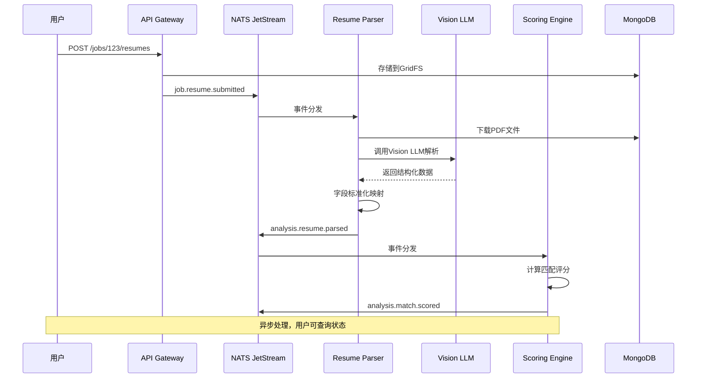

# 技术架构总结

> **AI Recruitment Clerk - 智能招聘助理**  
> **架构模式**: 事件驱动微服务  
> **核心技术**: TypeScript + NestJS + MongoDB + NATS

## 🏗 架构概览

### 设计哲学
- **事件驱动**: 通过NATS JetStream实现服务解耦
- **微服务化**: 单一职责原则，独立部署扩展
- **类型安全**: 全TypeScript技术栈
- **测试先行**: TDD方法论贯穿开发

### 系统拓扑

```mermaid
graph TB
    subgraph "用户交互层"
        SPA[Angular SPA]
    end
    
    subgraph "网关层"  
        GW[API Gateway<br/>端口统一<br/>认证授权<br/>文件上传]
    end
    
    subgraph "业务微服务层"
        JD[JD Extractor<br/>职位需求提取<br/>结构化分析]
        RP[Resume Parser<br/>简历PDF解析<br/>Vision LLM集成]
        SE[Scoring Engine<br/>匹配度计算<br/>AI评分算法]
        RG[Report Generator<br/>报告生成<br/>Markdown输出]
    end
    
    subgraph "基础设施层"
        NATS[NATS JetStream<br/>事件总线<br/>消息持久化]
        DB[MongoDB<br/>文档存储<br/>结构化数据]
        GFS[GridFS<br/>文件存储<br/>PDF/报告文件]
    end
    
    subgraph "外部服务"
        LLM[Vision LLM API<br/>Gemini/GPT-4V<br/>PDF智能解析]
    end
    
    SPA -.->|HTTPS REST| GW
    GW -->|发布事件| NATS
    NATS -->|事件分发| JD & RP & SE & RG
    RP <-->|API调用| LLM
    JD & RP & SE & RG <-->|数据读写| DB & GFS
    
    style GW fill:#4CAF50,color:#fff
    style NATS fill:#FF9800,color:#fff  
    style DB fill:#2196F3,color:#fff
    style LLM fill:#9C27B0,color:#fff
```



## 🔄 事件流架构

### 核心事件类型

| 事件名称 | 发布者 | 订阅者 | 触发时机 | 数据载荷 |
|----------|--------|--------|----------|----------|
| `job.jd.submitted` | API Gateway | JD Extractor | JD文本提交 | `{jobId, jdText}` |
| `analysis.jd.extracted` | JD Extractor | Scoring Engine | JD分析完成 | `{jobId, jdDto}` |
| `job.resume.submitted` | API Gateway | Resume Parser | 简历上传 | `{jobId, resumeId, tempGridFsUrl}` |
| `analysis.resume.parsed` | Resume Parser | Scoring Engine | 简历解析完成 | `{jobId, resumeId, resumeDto}` |
| `job.resume.failed` | Resume Parser | Monitoring | 解析失败 | `{jobId, resumeId, error}` |
| `analysis.match.scored` | Scoring Engine | Report Generator | 匹配评分完成 | `{jobId, resumeId, score}` |

### 事件流示例



## 🎯 核心服务架构

### 1. Resume Parser Service (核心重点)

**技术栈**:
- NestJS 11 + TypeScript
- Vision LLM API集成
- MongoDB GridFS
- NATS JetStream

**服务组件**:
```typescript
ResumeParsingSvc/
├── parsing/
│   ├── parsing.service.ts        # 核心协调器
│   └── parsing.service.spec.ts   # 35个单元测试
├── vision-llm/
│   ├── vision-llm.service.ts     # Vision LLM集成
│   └── vision-llm.service.spec.ts # 46个单元测试  
├── gridfs/
│   ├── gridfs.service.ts         # 文件存储
│   └── gridfs.service.spec.ts    # 58个单元测试
├── field-mapper/
│   ├── field-mapper.service.ts   # 数据标准化
│   └── field-mapper.service.spec.ts # 46个单元测试
└── nats/
    ├── nats.client.ts            # 事件客户端
    └── nats.client.spec.ts       # 55个单元测试
```

**处理流程**:
1. 订阅 `job.resume.submitted` 事件
2. 从GridFS下载PDF文件
3. 调用Vision LLM API解析PDF
4. 字段映射与数据标准化
5. 发布 `analysis.resume.parsed` 事件

### 2. 其他核心服务

**JD Extractor Service**:
- LLM驱动的JD文本分析
- 结构化职位需求提取
- 技能标签智能识别

**Scoring Engine Service**:
- 多维度匹配算法
- 机器学习评分模型
- 实时评分计算

**API Gateway**:
- 统一API入口
- JWT认证授权
- 文件上传处理
- 请求路由分发

## 📦 共享库架构

### @ai-recruitment-clerk/shared-dtos

**目的**: 确保跨服务的数据模型一致性

**结构**:
```typescript
shared-dtos/
├── models/
│   └── resume.dto.ts           # ResumeDTO标准化模型
├── events/  
│   ├── resume-events.dto.ts    # 简历相关事件
│   └── job-events.dto.ts       # 岗位相关事件
├── validation/                 # 数据验证 (计划中)
└── index.ts                    # 统一导出
```

**核心数据模型**:
```typescript
interface ResumeDTO {
  contactInfo: {
    name: string;
    email: string | null;
    phone: string | null;
  };
  skills: string[];
  workExperience: WorkExperience[];
  education: Education[];
}
```

## 🗄 数据架构

### MongoDB文档设计

```javascript
// jobs集合
{
  _id: ObjectId,
  jobId: "uuid",
  title: "软件工程师",
  jdText: "岗位描述文本...",
  jdDto: { /* 结构化JD数据 */ },
  status: "active",
  createdAt: ISODate,
  updatedAt: ISODate
}

// resumes集合  
{
  _id: ObjectId,
  jobId: "job-uuid",
  resumeId: "resume-uuid", 
  originalFilename: "resume.pdf",
  gridFsFileId: ObjectId,     // GridFS文件引用
  resumeDto: { /* 结构化简历数据 */ },
  status: "parsed|failed|processing",
  matchScore: 0.85,
  createdAt: ISODate,
  processedAt: ISODate
}
```

### GridFS文件存储

- **用途**: 存储PDF简历文件和生成的报告
- **优势**: 支持>16MB文件，流式处理
- **集成**: 与MongoDB无缝集成

## 🔧 技术选型理由

| 技术 | 选择理由 | 替代方案 |
|------|----------|----------|
| **NestJS** | TypeScript原生支持，模块化架构，企业级成熟度 | Express, Fastify |
| **MongoDB** | 灵活Schema，适合非结构化数据，GridFS文件支持 | PostgreSQL, MySQL |  
| **NATS JetStream** | 轻量级，高性能，云原生，持久化支持 | RabbitMQ, Kafka |
| **Angular** | TypeScript生态统一，企业级功能丰富 | React, Vue |
| **Nx Monorepo** | 多服务统一管理，依赖共享，构建优化 | Lerna, Rush |

## 📊 性能与扩展性

### 性能目标

| 指标 | 目标值 | 实现策略 |
|------|--------|----------|
| **简历处理时间** | <30秒 | 并行处理，缓存优化 |
| **API响应时间** | <2秒 | 异步处理，事件驱动 |
| **并发处理** | 100简历/分钟 | 微服务水平扩展 |
| **系统可用性** | >99.9% | 容错设计，监控告警 |

### 扩展性设计

**水平扩展**:
- 每个微服务独立扩展
- NATS支持集群模式
- MongoDB分片支持

**垂直优化**:
- Vision LLM API并发调用
- GridFS流式文件处理
- 事件批处理优化

## 🔒 安全性设计

### 认证授权
- JWT Token机制
- API Gateway统一认证
- 基于角色的访问控制

### 数据安全
- 敏感信息加密存储
- API请求签名验证
- 文件上传安全检查

### 通信安全
- HTTPS加密传输
- 服务间TLS通信
- 敏感配置环境变量化

## 🎯 架构优势

1. **高度解耦**: 事件驱动确保服务独立演进
2. **弹性扩展**: 微服务架构支持按需扩展
3. **类型安全**: TypeScript全栈确保类型一致性
4. **测试友好**: TDD方法论保证代码质量
5. **业务聚焦**: 单一职责原则提高开发效率

## 🔮 未来演进

### 技术演进方向
- **AI能力增强**: 多模型集成，准确率优化
- **实时性提升**: 事件流处理优化
- **智能化运维**: 自动监控，预测性维护
- **多租户支持**: SaaS化架构演进

### 架构优化计划
- 引入API网关缓存层
- 实现事件重放机制
- 添加分布式链路追踪
- 构建自动化部署流水线

---

**架构成熟度**: Phase 1完成 ✅  
**下一步重点**: Resume Parser Service业务逻辑实现