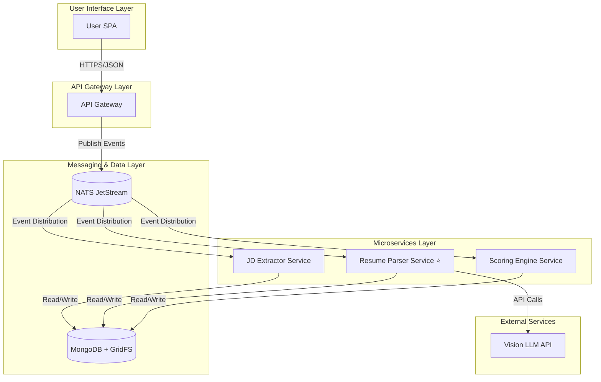

# AI Recruitment Clerk

> **Intelligent Recruitment Assistant - AI-Powered Resume & Job Matching System**

[](https://www.typescriptlang.org/)
[](https://nestjs.com/)
[](https://angular.io/)
[](https://www.mongodb.com/)
[](https://nats.io/)
[](https://nx.dev/)

**English** | [中文](./README.zh-CN.md)

## 🎯 Project Overview

AI Recruitment Clerk is an **event-driven microservices system** that automates the resume screening process using AI technology, aiming to reduce manual screening time by over 70% while achieving 95%+ accuracy in key information extraction.

### Core Features
- 🤖 **Intelligent Resume Parsing**: Vision LLM-based structured extraction from PDF resumes
- 📋 **Smart JD Analysis**: Automated extraction of job requirements and key skills
- ⚡ **Precise Matching Scoring**: AI-driven candidate-position compatibility calculation
- 🔄 **Event-Driven Architecture**: High-reliability asynchronous processing with NATS JetStream
- 📊 **Smart Report Generation**: Automated generation of detailed matching analysis reports

## 📚 Documentation Navigation

| Document Type | File Path | Description |
|---------------|-----------|-------------|
| **🔖 Project Overview** | [`PROJECT_OVERVIEW.md`](./docs/en-US/PROJECT_OVERVIEW.md) | **Complete project architecture, tech stack, development status** |
| 📈 Development Status | [`DEVELOPMENT_STATUS.md`](./docs/en-US/DEVELOPMENT_STATUS.md) | Development progress and milestones |
| 🏗 System Architecture | [`ARCHITECTURE_SUMMARY.md`](./docs/en-US/ARCHITECTURE_SUMMARY.md) | Technical architecture deep dive |
| 👨‍💻 Developer Guide | [`DEVELOPER_GUIDE.md`](./docs/en-US/DEVELOPER_GUIDE.md) | Development environment and standards |
| 📋 Project Mission | [`specs/PROJECT_MISSION.md`](./specs/PROJECT_MISSION.md) | Project goals and core mission |
| 🏗 System Context | [`specs/SYSTEM_CONTEXT.mermaid`](./specs/SYSTEM_CONTEXT.mermaid) | System boundary and context diagram |
| 🛡 API Specification | [`specs/api_spec.openapi.yml`](./specs/api_spec.openapi.yml) | RESTful API interface definitions |

## 🏗 System Architecture



## 🛠 Technology Stack

| Layer | Technology | Purpose |
|-------|------------|---------|
| **Frontend** | Angular 18 + TypeScript | Enterprise SPA user interface |
| **Backend** | NestJS 11 + Node.js | Microservices framework |
| **Database** | MongoDB 6.x + GridFS | Document database + file storage |
| **Message Queue** | NATS JetStream | Event stream processing |
| **Project Management** | Nx Monorepo | Multi-service unified management |
| **Package Manager** | pnpm | Efficient dependency management |
| **Testing** | Jest + Supertest | Unit testing + integration testing |
| **AI Services** | Vision LLM API | PDF parsing and structured extraction |

## 📁 Workspace Structure

```
AI-Recruitment-Clerk/
├── 📱 apps/                     # Application services
│   ├── app-gateway/            # API gateway service
│   ├── jd-extractor-svc/       # JD extraction service
│   ├── resume-parser-svc/      # Resume parsing service ⭐
│   └── scoring-engine-svc/     # Scoring engine service
├── 📦 libs/                     # Shared libraries
│   └── shared-dtos/            # Unified data models
├── 📋 specs/                    # Specifications
├── 📚 documents/               # Project documents
├── 🌐 docs/                     # Bilingual documentation
│   ├── en-US/                  # English documentation
│   └── zh-CN/                  # Chinese documentation
└── 🧪 Service test suites
```

## ✅ Development Status

| Service Name | Architecture | Unit Tests | Business Logic | Integration Tests | Status |
|-------------|-------------|------------|----------------|------------------|--------|
| **resume-parser-svc** | ✅ | ✅ **240+ tests** | 🔄 | 📋 | **TDD Ready** |
| **jd-extractor-svc** | ✅ | 📋 | 📋 | 📋 | Architecture Complete |
| **scoring-engine-svc** | ✅ | 📋 | 📋 | 📋 | Architecture Complete |
| **app-gateway** | ✅ | 📋 | 🔄 | 📋 | Basic Implementation |

### Resume Parser Service Highlights ⭐
- **240+ comprehensive unit test suite completed**
- Complete TDD methodology implementation
- Core feature: Test 4 - `analysis.resume.parsed` event payload verification
- Includes complete Mock strategies and boundary testing
- Ready to enter business logic implementation phase

## 🚀 Quick Start

### Prerequisites
- Node.js 18+
- pnpm 8+
- MongoDB 6+
- NATS Server

### Installation & Running

```bash
# 📦 Install dependencies
pnpm install

# 🏗 Build all services
pnpm exec nx run-many --target=build --all

# 🧪 Run tests
pnpm exec nx run-many --target=test --all

# 🚀 Start specific services
pnpm exec nx serve app-gateway
pnpm exec nx serve resume-parser-svc
```

### Common Commands

```bash
# 📋 Build specific project
pnpm exec nx build <project-name>

# 🧪 Run specific project tests
pnpm exec nx test <project-name>

# 🔍 Code linting
pnpm exec nx lint <project-name>

# 📊 Run all tests
pnpm exec nx run-many --target=test --all

# 🏗 Build production version
pnpm exec nx run-many --target=build --all --prod
```

## 🎮 Core Services Overview

### Resume Parser Service (Primary Focus)
**Responsibility**: PDF resume parsing and structured data extraction

**Processing Flow**:
```
job.resume.submitted event → GridFS download → Vision LLM parsing → 
Field standardization mapping → analysis.resume.parsed event publication
```

**Test Maturity**: ✅ 240+ unit tests completed, covering all boundary conditions

### Other Services
- **API Gateway**: Unified entry point, routing distribution, file upload processing
- **JD Extractor**: Job description intelligent analysis and structured extraction
- **Scoring Engine**: Resume-job matching AI calculation

## 🔄 Event Flow Architecture

The system adopts event-driven architecture with main event flows:

```
User uploads resume → job.resume.submitted → Resume Parser → 
analysis.resume.parsed → Scoring Engine → analysis.match.scored
```

Detailed event definitions are available in the [`libs/shared-dtos`](./libs/shared-dtos/) shared library.

## 📊 Performance Targets

- ⚡ **Processing Speed**: <30 seconds/resume
- 🎯 **Accuracy Rate**: >95% information extraction accuracy
- 💪 **Concurrent Capability**: 100 resumes/minute
- 🔄 **Availability**: >99.9% system availability
- 📈 **Efficiency Improvement**: 70% reduction in manual screening time

## 🤝 Contributing Guidelines

1. Follow TDD development methodology
2. Ensure code coverage >90%
3. Use TypeScript strict mode
4. Follow NestJS best practices
5. Run complete test suite before committing

## 📄 License

This project is licensed under the ISC License.

---

**Project Status**: 🔄 Development Phase - Resume Parser Service TDD ready, preparing for business logic implementation

> 💡 View [`docs/en-US/PROJECT_OVERVIEW.md`](./docs/en-US/PROJECT_OVERVIEW.md) for detailed architectural design and development status information.