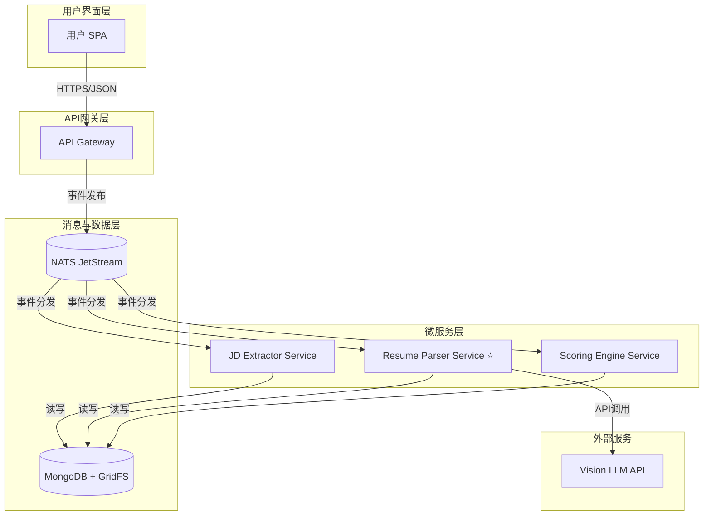

# AI Recruitment Clerk

> **智能招聘助理 - 基于AI的简历与岗位匹配系统**

[](https://www.typescriptlang.org/)
[](https://nestjs.com/)
[](https://angular.io/)
[](https://www.mongodb.com/)
[](https://nats.io/)
[](https://nx.dev/)

[English](./README.md) | **中文**

## 🎯 项目概述

AI Recruitment Clerk 是一个**事件驱动的微服务系统**，旨在通过AI技术自动化简历筛选过程，将人工初筛时间减少70%以上，关键信息提取准确率达到95%以上。

### 核心功能
- 🤖 **智能简历解析**: 基于Vision LLM的PDF简历结构化提取
- 📋 **JD智能分析**: 自动提取职位需求和关键技能
- ⚡ **精准匹配评分**: AI驱动的候选人-职位匹配度计算
- 🔄 **事件驱动架构**: 基于NATS JetStream的高可靠异步处理
- 📊 **智能报告生成**: 自动化生成详细的匹配分析报告

## 📚 文档导航

| 文档类型 | 文件路径 | 描述 |
|----------|----------|------|
| **🔖 项目概览** | [`PROJECT_OVERVIEW.zh-CN.md`](./docs/zh-CN/PROJECT_OVERVIEW.zh-CN.md) | **完整项目架构、技术栈、开发状态** |
| 📋 开发状态 | [`DEVELOPMENT_STATUS.zh-CN.md`](./docs/zh-CN/DEVELOPMENT_STATUS.zh-CN.md) | 开发进度与里程碑 |
| 🏗 系统架构 | [`ARCHITECTURE_SUMMARY.zh-CN.md`](./docs/zh-CN/ARCHITECTURE_SUMMARY.zh-CN.md) | 技术架构详解 |
| 👨‍💻 开发指南 | [`DEVELOPER_GUIDE.zh-CN.md`](./docs/zh-CN/DEVELOPER_GUIDE.zh-CN.md) | 开发环境与规范 |
| 📋 项目使命 | [`specs/PROJECT_MISSION.md`](./specs/PROJECT_MISSION.md) | 项目目标与核心使命 |
| 🏗 系统上下文 | [`specs/SYSTEM_CONTEXT.mermaid`](./specs/SYSTEM_CONTEXT.mermaid) | 系统边界与上下文图 |
| 🛡 API规范 | [`specs/api_spec.openapi.yml`](./specs/api_spec.openapi.yml) | RESTful API接口定义 |

## 🏗 系统架构



## 🛠 技术栈

| 层级 | 技术选型 | 用途 |
|------|----------|------|
| **前端** | Angular 18 + TypeScript | 企业级SPA用户界面 |
| **后端** | NestJS 11 + Node.js | 微服务框架 |
| **数据库** | MongoDB 6.x + GridFS | 文档数据库 + 文件存储 |
| **消息队列** | NATS JetStream | 事件流处理 |
| **项目管理** | Nx Monorepo | 多服务统一管理 |
| **包管理** | pnpm | 高效依赖管理 |
| **测试** | Jest + Supertest | 单元测试 + 集成测试 |
| **AI服务** | Vision LLM API | PDF解析与结构化提取 |

## 📁 工作区结构

```
AI-Recruitment-Clerk/
├── 📱 apps/                     # 应用服务
│   ├── app-gateway/            # API网关服务
│   ├── jd-extractor-svc/       # JD提取服务
│   ├── resume-parser-svc/      # 简历解析服务 ⭐
│   └── scoring-engine-svc/     # 评分引擎服务
├── 📦 libs/                     # 共享库
│   └── shared-dtos/            # 统一数据模型
├── 📋 specs/                    # 规格说明
├── 📚 documents/               # 项目文档
├── 🌐 docs/                     # 双语文档
│   ├── en-US/                  # 英文文档
│   └── zh-CN/                  # 中文文档
└── 🧪 各服务测试套件
```

## ✅ 开发状态

| 服务名称 | 架构设计 | 单元测试 | 业务实现 | 集成测试 | 状态 |
|----------|----------|----------|----------|----------|------|
| **resume-parser-svc** | ✅ | ✅ **240+ tests** | 🔄 | 📋 | **TDD就绪** |
| **jd-extractor-svc** | ✅ | 📋 | 📋 | 📋 | 架构完成 |
| **scoring-engine-svc** | ✅ | 📋 | 📋 | 📋 | 架构完成 |
| **app-gateway** | ✅ | 📋 | 🔄 | 📋 | 基础实现 |

### Resume Parser Service 亮点 ⭐
- **240+ 全面单元测试套件完成**
- 完整TDD方法论实施
- 核心功能：Test 4 - `analysis.resume.parsed`事件载荷验证
- 包含完整的Mock策略和边界测试
- 准备进入业务逻辑实现阶段

## 🚀 快速开始

### 前置要求
- Node.js 18+
- pnpm 8+
- MongoDB 6+
- NATS Server

### 安装与运行

```bash
# 📦 安装依赖
pnpm install

# 🏗 构建所有服务
pnpm exec nx run-many --target=build --all

# 🧪 运行测试
pnpm exec nx run-many --target=test --all

# 🚀 启动特定服务
pnpm exec nx serve app-gateway
pnpm exec nx serve resume-parser-svc
```

### 常用命令

```bash
# 📋 构建特定项目
pnpm exec nx build <project-name>

# 🧪 运行特定项目测试
pnpm exec nx test <project-name>

# 🔍 代码检查
pnpm exec nx lint <project-name>

# 📊 运行所有测试
pnpm exec nx run-many --target=test --all

# 🏗 构建生产版本
pnpm exec nx run-many --target=build --all --prod
```

## 🎮 核心服务说明

### Resume Parser Service (核心重点)
**职责**: PDF简历解析与结构化数据提取

**处理流程**:
```
job.resume.submitted事件 → GridFS下载 → Vision LLM解析 → 
字段标准化映射 → analysis.resume.parsed事件发布
```

**测试成熟度**: ✅ 240+ 单元测试完成，覆盖所有边界条件

### 其他服务
- **API Gateway**: 统一入口，路由分发，文件上传处理
- **JD Extractor**: 职位描述智能分析与结构化提取
- **Scoring Engine**: 简历-职位匹配度AI计算

## 🔄 事件流架构

系统采用事件驱动架构，主要事件流：

```
用户上传简历 → job.resume.submitted → Resume Parser → 
analysis.resume.parsed → Scoring Engine → analysis.match.scored
```

详细事件定义请参考 [`libs/shared-dtos`](./libs/shared-dtos/) 共享库。

## 📊 性能目标

- ⚡ **处理速度**: <30秒/简历
- 🎯 **准确率**: >95%信息提取准确率
- 💪 **并发能力**: 100简历/分钟
- 🔄 **可用性**: >99.9%系统可用性
- 📈 **效率提升**: 70%人工初筛时间减少

## 🤝 贡献指南

1. 遵循TDD开发方法论
2. 确保代码覆盖率>90%
3. 使用TypeScript严格模式
4. 遵循NestJS最佳实践
5. 提交前运行完整测试套件

## 📄 许可证

本项目采用 ISC 许可证。

---

**项目状态**: 🔄 开发阶段 - Resume Parser Service TDD就绪，准备业务逻辑实现

> 💡 查看 [`docs/zh-CN/PROJECT_OVERVIEW.zh-CN.md`](./docs/zh-CN/PROJECT_OVERVIEW.zh-CN.md) 获取详细的架构设计和开发状态信息。