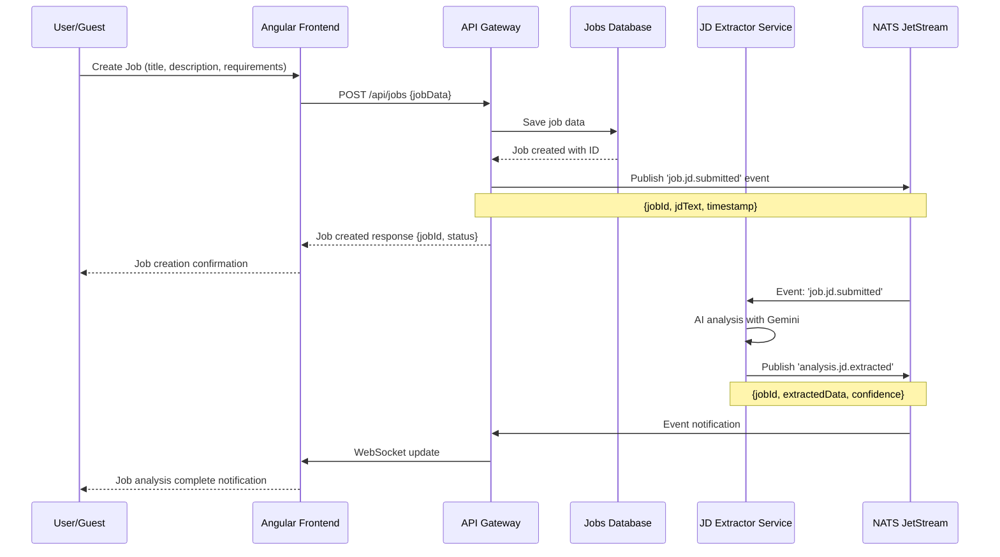
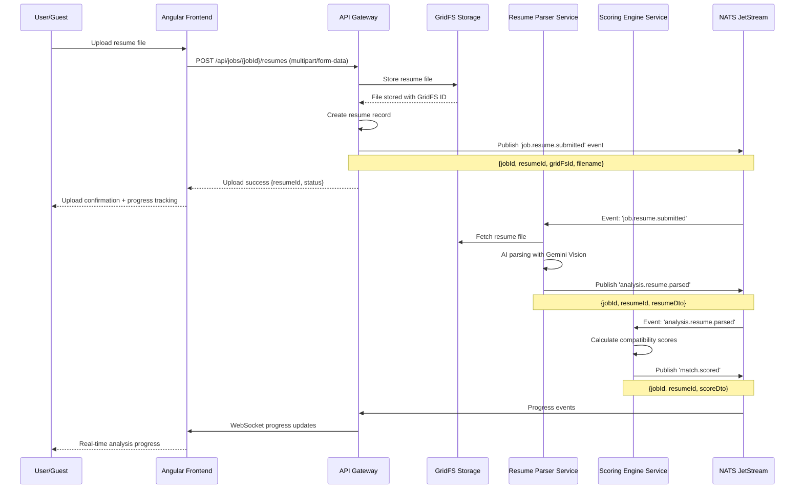
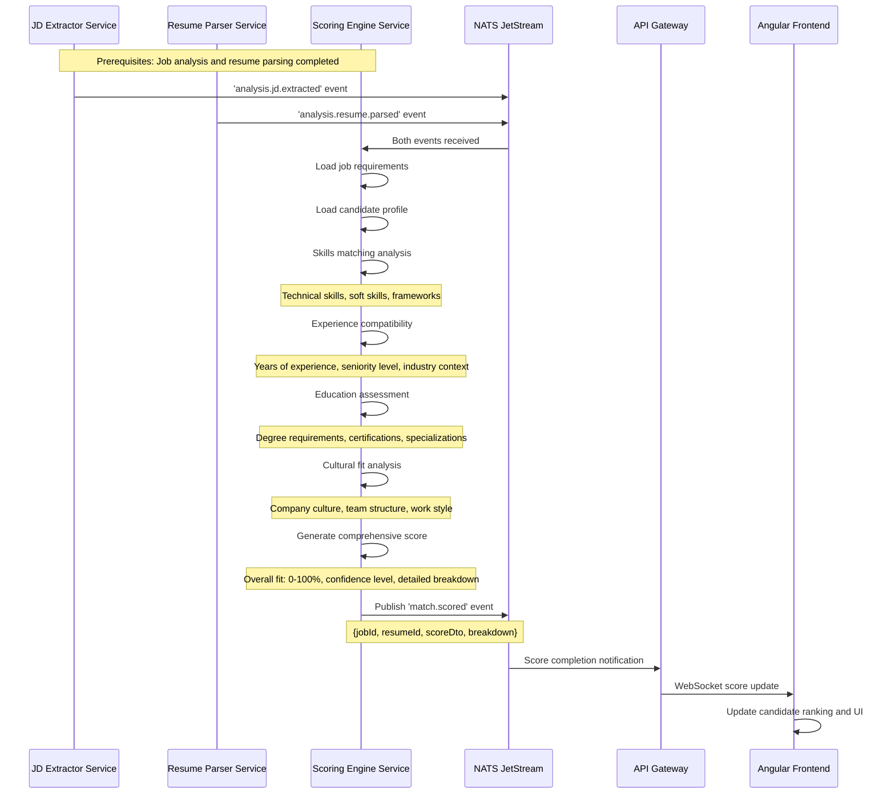
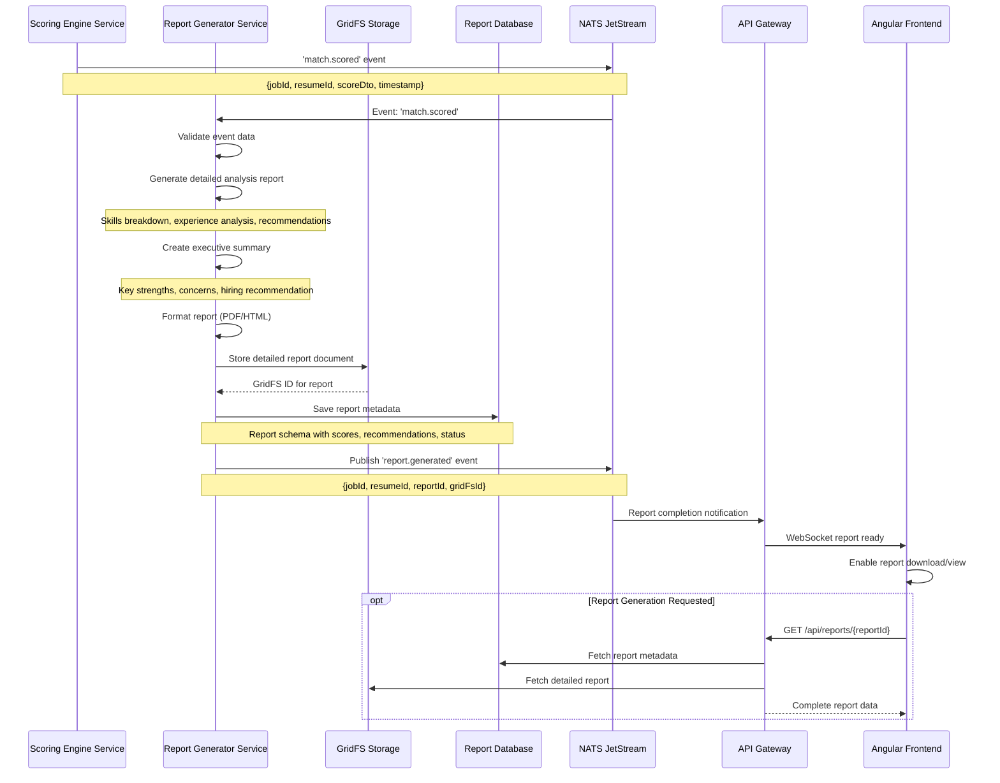
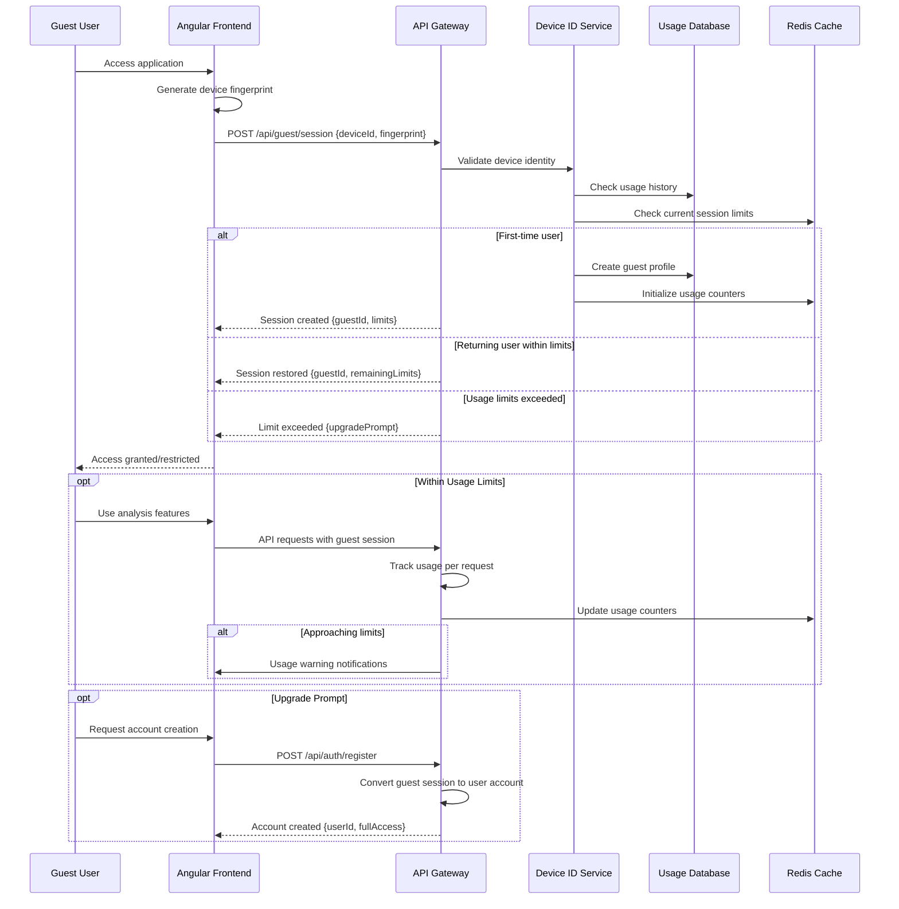

# Business Workflow Design - AI Recruitment Clerk

## System Architecture Overview

The AI Recruitment Clerk is an event-driven microservices system that provides intelligent resume analysis and candidate matching capabilities. The system supports both B2B enterprise users and B2C freemium guests, with real-time progress tracking and comprehensive security.

### Core Technology Stack
- **Frontend**: Angular 17+ with standalone components, NgRx state management
- **API Gateway**: NestJS-based orchestration layer (Port 8080)
- **Microservices**: NestJS microservices with specialized AI processing capabilities
- **Messaging**: NATS JetStream for event-driven communication
- **Database**: MongoDB with GridFS for file storage
- **Caching**: Redis for session management and performance optimization
- **AI Integration**: Google Gemini AI for resume parsing and job description analysis

### System Components

#### Frontend Layer
- **Enhanced Dashboard**: Central hub with real-time analytics and task management
- **Unified Analysis**: Comprehensive resume analysis interface with progress tracking
- **Jobs Management**: Job creation, editing, and candidate management
- **Guest Support**: Device-based freemium access with usage tracking
- **Real-time Updates**: WebSocket integration for live progress updates

#### API Gateway (app-gateway)
- **Central Orchestration**: Routes requests to appropriate microservices
- **Authentication & Authorization**: JWT-based security with RBAC
- **Guest Management**: Device fingerprinting and usage limit enforcement
- **NATS Event Publishing**: Initiates workflows by publishing events
- **Real-time Communication**: WebSocket gateway for live updates

#### Microservices Architecture
1. **resume-parser-svc**: AI-powered resume parsing using Gemini Vision
2. **jd-extractor-svc**: Job description analysis and requirement extraction
3. **scoring-engine-svc**: Intelligent candidate scoring and matching
4. **report-generator-svc**: Comprehensive report generation with multiple formats

## Primary Business Workflows

### 1. Job Creation Workflow

**Trigger**: User creates a new job posting through the Jobs interface



**Key Events**:
- `job.jd.submitted` → Triggers AI-powered job description analysis
- `analysis.jd.extracted` → Job requirements successfully extracted and parsed

---

### 2. Resume Upload & Analysis Workflow

**Trigger**: User uploads a resume for analysis against a specific job



**Key Events**:
- `job.resume.submitted` → Initiates AI-powered resume parsing
- `analysis.resume.parsed` → Resume successfully parsed and structured
- `match.scored` → Compatibility scoring completed

---

### 3. Candidate Scoring Workflow

**Trigger**: Resume parsing completion triggers intelligent scoring analysis



**Scoring Components**:
- **Skills Match** (40%): Technical and soft skills compatibility
- **Experience Match** (30%): Years of experience and seniority alignment
- **Education Match** (20%): Educational requirements and certifications
- **Cultural Fit** (10%): Company culture and team dynamics compatibility

---

### 4. Report Generation Workflow

**Trigger**: Scoring completion triggers comprehensive report generation



**Report Types**:
- **Match Analysis**: Detailed compatibility assessment with scoring breakdown
- **Candidate Summary**: Executive summary with key insights and recommendations
- **Full Report**: Comprehensive analysis including detailed skill matching and improvement suggestions

---

### 5. Guest User Workflow

**Trigger**: Unauthenticated user accesses the system for trial usage



**Guest Limitations**:
- **Analysis Limit**: 3 resume analyses per device per day
- **Feature Access**: Basic analysis only, no advanced reports
- **Storage**: 24-hour temporary storage of results
- **Upgrade Path**: Seamless conversion to full account with preserved data

---

## NATS Event-Driven Architecture

### Event Flow Summary

```
Job Creation → job.jd.submitted → analysis.jd.extracted
Resume Upload → job.resume.submitted → analysis.resume.parsed → match.scored → report.generated
```

### Critical Event Patterns

1. **Event Ordering**: Events must be processed in sequence for data consistency
2. **Error Handling**: Failed events trigger retry mechanisms and error notifications
3. **Progress Tracking**: Real-time WebSocket updates for all workflow stages
4. **Scalability**: Event-driven design supports horizontal scaling of services
5. **Monitoring**: Comprehensive logging and performance tracking across all events

### Performance Characteristics

- **Resume Processing**: 2-5 seconds (AI parsing + scoring)
- **Job Analysis**: 1-3 seconds (requirement extraction)
- **Report Generation**: 3-7 seconds (comprehensive analysis)
- **Real-time Updates**: <100ms WebSocket latency
- **Concurrent Processing**: Supports 100+ simultaneous analyses

---

## Security & Compliance

### Authentication & Authorization
- **JWT Tokens**: Secure session management with refresh token rotation
- **RBAC**: Role-based access control for enterprise users
- **Device Fingerprinting**: Secure guest user identification and tracking

### Data Protection
- **Encryption**: All sensitive data encrypted at rest and in transit
- **GDPR Compliance**: Data retention policies and right-to-deletion support
- **Audit Logging**: Comprehensive activity tracking for compliance requirements

### Rate Limiting & Abuse Prevention
- **API Rate Limits**: Configurable per-user and per-endpoint limits
- **Guest Usage Tracking**: Device-based usage monitoring and enforcement
- **DDoS Protection**: Intelligent request throttling and blocking

---

This business workflow design provides a comprehensive overview of the AI Recruitment Clerk system's primary workflows, emphasizing the event-driven architecture that enables scalable, real-time processing of recruitment tasks.

## UAT Test Plan: Job Creation Workflow

### Test Objective
Confirm that a business user can create a new job posting from the Jobs area, observe real-time progress feedback, and reach the final confirmation page without errors.

### Preconditions
- The local environment is running using the Docker Compose stack with the `apps` profile enabled.
- The tester has access to a standard recruiter account with permission to create jobs.
- The browser cache is cleared or a private/incognito window is being used to avoid stale session data.

### Execution Steps
1. Open a browser and navigate to the local frontend URL (`http://localhost:4200`).
2. Log in with the provided recruiter credentials.
3. From the main dashboard, select `Jobs` in the left navigation menu.
4. Click the `Create Job` button to open the job creation form.
5. Fill out the form using the sample data below:
   - Job Title: `Senior Solutions Architect`
   - Location: `Remote - North America`
   - Employment Type: `Full-time`
   - Salary Range: `150000 - 185000`
   - Job Description: copy/paste the sample text from the UAT packet (3–4 paragraphs).
   - Key Requirements: add at least three bullet points (e.g., `10+ years in enterprise architecture`, `Experience with cloud-native design`, `Strong stakeholder communication`).
6. Click `Next` to review the summary and ensure the real-time progress bar animates across the top of the page.
7. Press `Submit Job` on the confirmation screen.
8. Wait for the submission to complete and allow the app to navigate to the job detail page.

### Expected Results
1. The login page loads without error and displays the company branding.
2. The dashboard appears with the recruiter’s name in the header and no warning banners.
3. The Jobs list view loads, showing existing jobs (if any) with filters visible.
4. The job creation form appears with empty fields ready for input.
5. All entered sample data is accepted, and no validation errors are displayed.
6. The progress bar moves smoothly to the next stage and shows a status such as “Reviewing details…”.
7. A loading indicator appears, then disappears without showing any error messages.
8. The screen transitions to the new job detail page, displays the title “Senior Solutions Architect,” shows the progress bar at 100%, and presents a success toast confirming the job was created.

## UAT Test Plan: Resume Upload & Analysis

### Test Objective
Verify that a recruiter can upload a candidate resume to an existing job, observe each processing stage, and view the final analysis scores and report links without encountering errors.

### Preconditions
- A job such as “Senior Solutions Architect” already exists and is visible in the Jobs list.
- A sample resume PDF (e.g., `Candidate-Solutions-Architect.pdf`) is saved locally and meets the size/type requirements.
- The tester is logged in with recruiter permissions and the local stack is running with all microservices active.

### Execution Steps
1. From the dashboard, select `Jobs` in the left navigation menu.
2. Click the job card titled `Senior Solutions Architect` to open its detail page.
3. In the `Resumes` tab, press the `Upload Resume` button.
4. In the upload dialog, click `Browse`, choose `Candidate-Solutions-Architect.pdf`, and confirm the selection.
5. Click `Start Analysis` to begin processing.
6. Watch the real-time progress widget as it advances through each stage (`Uploading File`, `Parsing Resume`, `Scoring Candidate`, `Generating Report`).
7. Wait for the progress widget to reach 100% and disappear.
8. Review the analysis summary displayed on the job detail page.

### Expected Results
1. The Jobs list loads and displays the “Senior Solutions Architect” entry.
2. The job detail page opens, showing tabs for Overview, Resumes, Analytics, etc.
3. The upload modal appears with drag-and-drop/browse options and shows accepted file types.
4. The selected file name is visible in the dialog with a green checkmark indicating it passed validation.
5. The dialog closes automatically, and the progress widget appears at the top of the Resumes tab.
6. Each stage updates in sequence with labels such as “Uploading File,” “Parsing Resume,” “Scoring Candidate,” and “Generating Report,” accompanied by animated progress.
7. The widget displays “Analysis Complete” briefly before closing, and a success toast confirms the analysis finished.
8. A new resume entry appears in the Resumes table showing candidate name, match score (e.g., 86%), strengths/risks badges, and buttons for `View Report` and `Download PDF`.
