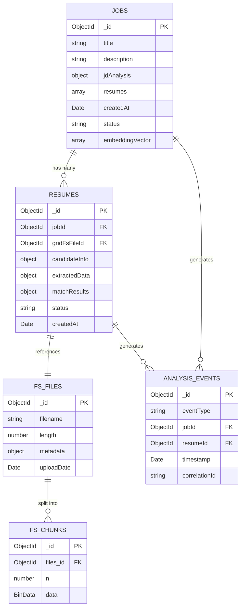

# Database Schema Documentation

## Overview

AI Recruitment Clerk uses **MongoDB** as the primary database with **GridFS** for file storage. This document outlines the complete data model and relationships.

## Collections

### 1. `jobs` Collection

Stores job postings and their analysis results.

**Schema**:
```typescript
{
  _id: ObjectId,
  title: string,                    // Job title
  description: string,              // Full job description
  requirements: string,             // Required qualifications
  location: string,                 // Job location
  salary?: string,                  // Salary range (optional)
  companyName?: string,             // Company name (optional)
  
  // JD Analysis Results (populated by jd-extractor-svc)
  jdAnalysis?: {
    extractedSkills: string[],      // Extracted required skills
    experienceLevel: string,        // Junior/Mid/Senior
    keyResponsibilities: string[],  // Main job responsibilities
    preferredQualifications: string[],
    analyzedAt: Date
  },
  
  // Resume Processing Metadata
  resumes: [{
    resumeId: ObjectId,             // Reference to resumes collection
    candidateName: string,
    candidateEmail: string,
    uploadedAt: Date,
    status: 'pending' | 'parsing' | 'parsed' | 'scored' | 'failed',
    matchScore?: number,            // 0-100 score from scoring-engine-svc
    scoredAt?: Date
  }],
  
  // Timestamps
  createdAt: Date,
  updatedAt: Date,
  
  // Status tracking
  status: 'draft' | 'active' | 'closed',
  
  // Semantic caching metadata
  embeddingVector?: number[],      // OpenAI embedding for semantic search
  embeddingModel?: string,         // e.g., "text-embedding-3-small"
  semanticCacheHit?: boolean       // Whether this JD was served from cache
}
```

**Indexes**:
```javascript
db.jobs.createIndex({ "createdAt": -1 })
db.jobs.createIndex({ "status": 1, "createdAt": -1 })
db.jobs.createIndex({ "resumes.candidateEmail": 1 })
```

---

### 2. `resumes` Collection

Stores parsed resume data extracted from PDF files.

**Schema**:
```typescript
{
  _id: ObjectId,
  jobId: ObjectId,                  // Reference to jobs collection
  
  // File Metadata
  originalFilename: string,         // Original PDF filename
  gridFsFileId: ObjectId,          // GridFS file reference
  fileSize: number,                 // File size in bytes
  mimeType: string,                 // e.g., "application/pdf"
  
  // Candidate Information (extracted by resume-parser-svc)
  candidateInfo: {
    name: string,
    email: string,
    phone?: string,
    location?: string,
    linkedIn?: string,
    github?: string,
    website?: string
  },
  
  // Extracted Data
  extractedData: {
    skills: string[],               // Technical and soft skills
    experience: [{
      company: string,
      position: string,
      duration: string,             // e.g., "2 years 3 months"
      startDate?: string,
      endDate?: string,
      description?: string
    }],
    education: [{
      institution: string,
      degree: string,
      field: string,
      graduationYear?: string,
      gpa?: string
    }],
    certifications?: [{
      name: string,
      issuer: string,
      date?: string
    }],
    languages?: string[],
    summary?: string                // Professional summary
  },
  
  // Processing Metadata
  parsedBy: 'gemini-vision' | 'manual',
  parsingMetadata: {
    modelVersion?: string,          // e.g., "gemini-1.5-flash"
    tokensUsed?: number,
    processingTimeMs?: number,
    confidence?: number,            // 0-1 confidence score
    apiResponseRaw?: object         // Full LLM response for debugging
  },
  
  // Match Results (from scoring-engine-svc)
  matchResults?: {
    overallScore: number,           // 0-100
    skillMatch: number,             // 0-100
    experienceMatch: number,        // 0-100
    educationMatch: number,         // 0-100
    detailedAnalysis: {
      matchedSkills: string[],
      missingSkills: string[],
      experienceGap?: string,
      strengths: string[],
      concerns: string[]
    },
    scoredAt: Date
  },
  
  // Timestamps
  createdAt: Date,
  updatedAt: Date,
  parsedAt?: Date,
  
  // Status
  status: 'uploaded' | 'parsing' | 'parsed' | 'failed',
  errorMessage?: string             // If parsing failed
}
```

**Indexes**:
```javascript
db.resumes.createIndex({ "jobId": 1, "createdAt": -1 })
db.resumes.createIndex({ "candidateInfo.email": 1 })
db.resumes.createIndex({ "status": 1 })
db.resumes.createIndex({ "matchResults.overallScore": -1 })
```

---

### 3. GridFS Collections

**`fs.files`** - File metadata
```typescript
{
  _id: ObjectId,
  length: number,                   // File size
  chunkSize: number,                // 261120 bytes (255 KB)
  uploadDate: Date,
  filename: string,
  metadata: {
    contentType: string,            // "application/pdf"
    originalName: string,
    jobId: string,
    candidateEmail: string
  }
}
```

**`fs.chunks`** - Binary file chunks
```typescript
{
  _id: ObjectId,
  files_id: ObjectId,               // Reference to fs.files
  n: number,                        // Chunk sequence number
  data: BinData                     // Binary chunk data
}
```

**Indexes**:
```javascript
db.fs.files.createIndex({ "filename": 1, "uploadDate": -1 })
db.fs.files.createIndex({ "metadata.jobId": 1 })
db.fs.chunks.createIndex({ "files_id": 1, "n": 1 }, { unique: true })
```

---

### 4. `analysis_events` Collection (Optional)

Event sourcing log for audit and debugging.

**Schema**:
```typescript
{
  _id: ObjectId,
  eventType: string,                // e.g., "job.resume.submitted"
  eventData: object,                // NATS event payload
  jobId?: ObjectId,
  resumeId?: ObjectId,
  service: string,                  // Service that generated event
  timestamp: Date,
  correlationId: string,            // For distributed tracing
  metadata: object
}
```

**Indexes**:
```javascript
db.analysis_events.createIndex({ "timestamp": -1 })
db.analysis_events.createIndex({ "eventType": 1, "timestamp": -1 })
db.analysis_events.createIndex({ "jobId": 1 })
db.analysis_events.createIndex({ "correlationId": 1 })
```

---

## Relationships

### Entity Relationship Diagram



---

## Data Flow

### 1. Job Creation Flow
```
User → POST /api/jobs
  ↓
API Gateway creates job document
  ↓
jobs collection: { status: 'draft', ... }
  ↓
JD Extractor updates: { jdAnalysis: {...}, embeddingVector: [...] }
```

### 2. Resume Upload Flow
```
User → POST /api/jobs/:id/resume (multipart/form-data)
  ↓
API Gateway stores PDF in GridFS
  ↓
fs.files + fs.chunks created
  ↓
resumes collection: { status: 'uploaded', gridFsFileId: ... }
  ↓
Resume Parser downloads PDF, calls Vision LLM
  ↓
resumes collection updated: { status: 'parsed', extractedData: {...} }
  ↓
Scoring Engine calculates match
  ↓
resumes collection updated: { matchResults: {...} }
  ↓
jobs.resumes array updated with summary
```

---

## Storage Optimization

### GridFS Configuration
- **Chunk Size**: 255 KB (optimal for PDF streaming)
- **Metadata Indexing**: Enabled for fast lookup by jobId
- **Retention Policy**: 90 days for inactive jobs

### Query Optimization Tips

**1. Get all resumes for a job (sorted by score)**:
```javascript
db.resumes.find({ jobId: ObjectId("...") })
  .sort({ "matchResults.overallScore": -1 })
  .limit(20)
```

**2. Find candidates with specific skills**:
```javascript
db.resumes.find({ 
  "extractedData.skills": { $in: ["React", "TypeScript"] },
  "matchResults.overallScore": { $gte: 75 }
})
```

**3. Get job with all resume data (aggregation)**:
```javascript
db.jobs.aggregate([
  { $match: { _id: ObjectId("...") } },
  { $lookup: {
      from: "resumes",
      localField: "_id",
      foreignField: "jobId",
      as: "resumeDetails"
  }},
  { $unwind: "$resumeDetails" },
  { $sort: { "resumeDetails.matchResults.overallScore": -1 } }
])
```

---

## Backup & Maintenance

### Recommended Backup Strategy
```bash
# Daily full backup
mongodump --uri="mongodb://localhost:27017/ai-recruitment" \
  --out=/backups/$(date +%Y%m%d)

# Weekly GridFS backup (separate)
mongodump --uri="mongodb://localhost:27017/ai-recruitment" \
  --collection=fs.files --collection=fs.chunks \
  --out=/backups/gridfs_$(date +%Y%m%d)
```

### Index Maintenance
```javascript
// Rebuild indexes monthly
db.jobs.reIndex()
db.resumes.reIndex()
db.fs.files.reIndex()
db.fs.chunks.reIndex()

// Analyze collection stats
db.jobs.stats()
db.resumes.stats()
```

### Cleanup Old Data
```javascript
// Archive jobs older than 1 year
db.jobs.updateMany(
  { createdAt: { $lt: new Date(Date.now() - 365*24*60*60*1000) } },
  { $set: { status: 'archived' } }
)

// Delete failed resumes older than 30 days
db.resumes.deleteMany({
  status: 'failed',
  createdAt: { $lt: new Date(Date.now() - 30*24*60*60*1000) }
})
```

---

## Performance Metrics

### Collection Sizes (Estimated)
| Collection | Avg Document Size | Expected Growth |
|------------|------------------|-----------------|
| `jobs` | 5 KB | 100/month |
| `resumes` | 15 KB | 2,000/month |
| `fs.files` | 500 bytes | 2,000/month |
| `fs.chunks` | 255 KB | 50,000/month |

### Query Performance Targets
- Job retrieval: <10ms
- Resume search with filters: <100ms
- Full-text skill search: <200ms
- GridFS file download: <500ms for 2MB PDF

---

**Last Updated**: 2025-01-23  
**Schema Version**: 1.0.0
