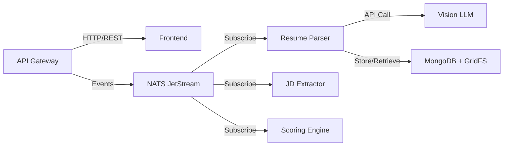

# AI Recruitment Clerk - Developer Reference

> **Comprehensive Technical Reference for Developers and System Integrators**

[](https://www.typescriptlang.org/) [](https://nestjs.com/) [](https://angular.io/) [](https://www.mongodb.com/) [](https://nats.io/)

## 📋 Table of Contents

- [Development Environment](#development-environment)
- [Architecture Deep Dive](#architecture-deep-dive)  
- [Microservices Reference](#microservices-reference)
- [Data Models & DTOs](#data-models--dtos)
- [Event System](#event-system)
- [Testing Framework](#testing-framework)
- [Deployment & DevOps](#deployment--devops)
- [Performance Optimization](#performance-optimization)
- [Security Implementation](#security-implementation)
- [Monitoring & Observability](#monitoring--observability)

## 🛠 Development Environment

### Prerequisites
```bash
Node.js: v18.17.0 or higher
npm: v10.0.0 or higher
Docker: v24.0.0 or higher
Docker Compose: v2.20.0 or higher
MongoDB: v7.0 or higher
NATS Server: v2.10 or higher
```

### Workspace Setup

#### 1. Clone and Install
```bash
git clone https://github.com/your-org/ai-recruitment-clerk.git
cd ai-recruitment-clerk
npm install
```

#### 2. Environment Configuration
```bash
# Copy environment templates
cp .env.example .env.local
cp docker-compose.env.example docker-compose.env

# Configure environment variables
vim .env.local
```

**Required Environment Variables**:
```bash
# Database
MONGODB_URI=mongodb://localhost:27017/ai-recruitment-clerk
MONGODB_DATABASE=ai-recruitment-clerk

# NATS Configuration  
NATS_URL=nats://localhost:4222
NATS_CLUSTER_ID=ai-recruitment-clerk
NATS_CLIENT_ID=app-gateway

# Vision LLM API
VISION_LLM_API_KEY=your-gemini-api-key
VISION_LLM_MODEL=gemini-pro-vision

# Authentication
JWT_SECRET=your-super-secret-jwt-key
JWT_EXPIRES_IN=3600

# File Upload
MAX_FILE_SIZE=10485760  # 10MB
ALLOWED_FILE_TYPES=application/pdf

# Services Configuration
API_GATEWAY_PORT=3000
FRONTEND_PORT=4200
```

#### 3. Start Development Stack
```bash
# Start infrastructure (MongoDB + NATS)
docker-compose -f docker-compose.simple.yml up -d

# Start all services in development mode
npm run dev:all

# Or start individual services
npx nx serve app-gateway
npx nx serve ai-recruitment-frontend
npx nx serve resume-parser-svc
```

### Development Commands

#### Nx Workspace Commands
```bash
# Build all projects
npx nx run-many --target=build --all

# Test all projects  
npx nx run-many --target=test --all

# Lint all projects
npx nx run-many --target=lint --all

# E2E tests
npx nx run ai-recruitment-frontend-e2e:e2e

# Generate new service
npx nx generate @nx/nest:application new-service

# Generate new library
npx nx generate @nx/js:library shared-utils
```

#### Service-Specific Commands
```bash
# Resume Parser Service
npx nx build resume-parser-svc
npx nx test resume-parser-svc
npx nx serve resume-parser-svc

# API Gateway
npx nx build app-gateway  
npx nx test app-gateway
npx nx serve app-gateway

# Frontend
npx nx build ai-recruitment-frontend
npx nx test ai-recruitment-frontend
npx nx serve ai-recruitment-frontend
```

## 🏗 Architecture Deep Dive

### System Design Principles

#### Event-Driven Architecture
The system follows CQRS and Event Sourcing patterns:

```typescript
// Event Flow Example
interface EventFlow {
  trigger: 'User uploads resume';
  event: 'job.resume.submitted';
  processors: ['resume-parser-svc'];
  output: 'analysis.resume.parsed';
  consumers: ['scoring-engine-svc'];
}
```

#### Microservices Communication


### Technology Stack Details

#### Backend Framework: NestJS 11
```typescript
// Module Structure Example
@Module({
  imports: [
    ConfigModule.forRoot(),
    MongooseModule.forRoot(process.env.MONGODB_URI),
    ClientsModule.register([
      {
        name: 'NATS_SERVICE',
        transport: Transport.NATS,
        options: {
          servers: [process.env.NATS_URL],
        },
      },
    ]),
  ],
  controllers: [AppController],
  providers: [AppService],
})
export class AppModule {}
```

#### Frontend Framework: Angular 20
```typescript
// Standalone Component Pattern
@Component({
  selector: 'app-jobs-list',
  standalone: true,
  imports: [CommonModule, RouterModule, MaterialModule],
  template: `
    <div class="jobs-container">
      @for (job of jobs(); track job.jobId) {
        <app-job-card [job]="job" />
      }
    </div>
  `,
})
export class JobsListComponent {
  jobs = signal<Job[]>([]);
  
  constructor(private jobsService = inject(JobsService)) {
    this.loadJobs();
  }
}
```

## 🔧 Microservices Reference

### 1. Resume Parser Service

#### Core Architecture
```typescript
// Main Service Structure
@Injectable()
export class ParsingService {
  constructor(
    private visionLlmService: VisionLlmService,
    private gridfsService: GridfsService,
    private fieldMapperService: FieldMapperService,
    private natsClient: NatsClient,
  ) {}

  async processResumeEvent(event: ResumeSubmittedEvent): Promise<void> {
    try {
      // 1. Download PDF from GridFS
      const pdfBuffer = await this.gridfsService.downloadFile(event.gridFsFileId);
      
      // 2. Parse with Vision LLM
      const rawData = await this.visionLlmService.parseResume(pdfBuffer);
      
      // 3. Map and standardize fields
      const resumeDto = await this.fieldMapperService.mapFields(rawData);
      
      // 4. Publish parsed event
      await this.natsClient.publish('analysis.resume.parsed', {
        jobId: event.jobId,
        resumeId: event.resumeId,
        resumeDto,
      });
    } catch (error) {
      await this.handleError(event, error);
    }
  }
}
```

#### Vision LLM Integration
```typescript
@Injectable()
export class VisionLlmService {
  private readonly prompt = `
    Extract information from this resume PDF and return structured JSON:
    {
      "contactInfo": {
        "name": "string",
        "email": "string|null",
        "phone": "string|null",
        "location": "string|null"
      },
      "skills": ["string"],
      "workExperience": [{
        "company": "string",
        "position": "string", 
        "duration": "string",
        "description": "string"
      }],
      "education": [{
        "institution": "string",
        "degree": "string",
        "field": "string",
        "graduationYear": "string"
      }]
    }
  `;

  async parseResume(pdfBuffer: Buffer): Promise<any> {
    const base64Pdf = pdfBuffer.toString('base64');
    
    const response = await this.geminiClient.generateContent({
      contents: [{
        role: 'user',
        parts: [
          { text: this.prompt },
          { 
            inline_data: {
              mime_type: 'application/pdf',
              data: base64Pdf
            }
          }
        ]
      }]
    });
    
    return JSON.parse(response.response.text());
  }
}
```

#### Field Mapping Service
```typescript
@Injectable()
export class FieldMapperService {
  private readonly skillsMapping = new Map([
    // Frontend Technologies
    ['react', 'React.js'],
    ['reactjs', 'React.js'],
    ['vue', 'Vue.js'],
    ['vuejs', 'Vue.js'],
    ['angular', 'Angular'],
    
    // Backend Technologies  
    ['node', 'Node.js'],
    ['nodejs', 'Node.js'],
    ['express', 'Express.js'],
    ['nestjs', 'NestJS'],
    
    // Databases
    ['mongo', 'MongoDB'],
    ['mongodb', 'MongoDB'],
    ['postgres', 'PostgreSQL'],
    ['mysql', 'MySQL'],
  ]);

  async mapFields(rawData: any): Promise<ResumeDTO> {
    return {
      contactInfo: this.mapContactInfo(rawData.contactInfo),
      skills: this.normalizeSkills(rawData.skills),
      workExperience: this.mapWorkExperience(rawData.workExperience),
      education: this.mapEducation(rawData.education),
    };
  }

  private normalizeSkills(skills: string[]): string[] {
    return skills
      .map(skill => skill.toLowerCase().trim())
      .map(skill => this.skillsMapping.get(skill) || this.capitalizeSkill(skill))
      .filter((skill, index, array) => array.indexOf(skill) === index); // Remove duplicates
  }
}
```

### 2. JD Extractor Service

#### Service Implementation
```typescript
@Injectable()  
export class ExtractionService {
  async processJdEvent(event: JobJdSubmittedEvent): Promise<void> {
    const jdAnalysis = await this.llmService.analyzeJobDescription(event.jdText);
    
    const extractedData: JdDTO = {
      requiredSkills: jdAnalysis.requiredSkills,
      preferredSkills: jdAnalysis.preferredSkills,
      experienceLevel: jdAnalysis.experienceLevel,
      educationRequirements: jdAnalysis.educationRequirements,
      responsibilities: jdAnalysis.responsibilities,
      benefits: jdAnalysis.benefits,
    };

    await this.natsClient.publish('analysis.jd.extracted', {
      jobId: event.jobId,
      jdDto: extractedData,
    });
  }
}
```

### 3. Scoring Engine Service

#### Matching Algorithm
```typescript
@Injectable()
export class ScoringService {
  async calculateMatchScore(
    resumeDto: ResumeDTO,
    jdDto: JdDTO,
  ): Promise<number> {
    const skillsScore = this.calculateSkillsMatch(resumeDto.skills, jdDto.requiredSkills);
    const experienceScore = this.calculateExperienceMatch(
      resumeDto.workExperience,
      jdDto.experienceLevel
    );
    const educationScore = this.calculateEducationMatch(
      resumeDto.education,
      jdDto.educationRequirements
    );

    // Weighted average
    return (
      skillsScore * 0.4 +      // 40% weight
      experienceScore * 0.35 + // 35% weight  
      educationScore * 0.15 +  // 15% weight
      this.calculateCultureFit(resumeDto) * 0.1 // 10% weight
    );
  }

  private calculateSkillsMatch(candidateSkills: string[], requiredSkills: string[]): number {
    const normalizedCandidate = candidateSkills.map(s => s.toLowerCase());
    const normalizedRequired = requiredSkills.map(s => s.toLowerCase());
    
    const matchedSkills = normalizedRequired.filter(skill =>
      normalizedCandidate.some(candidateSkill => 
        candidateSkill.includes(skill) || skill.includes(candidateSkill)
      )
    );

    return matchedSkills.length / normalizedRequired.length;
  }
}
```

### 4. API Gateway

#### File Upload Handling
```typescript
@Controller('jobs')
export class JobsController {
  @Post(':jobId/resumes')
  @UseInterceptors(FilesInterceptor('files', 50, {
    storage: memoryStorage(),
    fileFilter: (req, file, callback) => {
      if (file.mimetype === 'application/pdf') {
        callback(null, true);
      } else {
        callback(new BadRequestException('Only PDF files allowed'), false);
      }
    },
    limits: { fileSize: 10 * 1024 * 1024 }, // 10MB
  }))
  async uploadResumes(
    @Param('jobId') jobId: string,
    @UploadedFiles() files: Express.Multer.File[],
  ): Promise<any> {
    const uploadResults = await Promise.all(
      files.map(file => this.inMemoryStorageService.storeFile(jobId, file))
    );

    // Publish events for each uploaded resume
    for (const result of uploadResults) {
      await this.natsClient.emit('job.resume.submitted', {
        jobId,
        resumeId: result.resumeId,
        tempGridFsUrl: result.gridFsUrl,
        originalFilename: result.originalFilename,
      });
    }

    return {
      jobId,
      submittedResumes: files.length,
      resumeIds: uploadResults.map(r => r.resumeId),
    };
  }
}
```

## 📊 Data Models & DTOs

### Shared Data Models

#### Resume DTO
```typescript
// libs/shared-dtos/src/models/resume.dto.ts
export interface ResumeDTO {
  contactInfo: ContactInfo;
  skills: string[];
  workExperience: WorkExperience[];
  education: Education[];
  languages?: Language[];
  certifications?: Certification[];
  projects?: Project[];
}

export interface ContactInfo {
  name: string;
  email: string | null;
  phone: string | null;
  location?: string;
  linkedin?: string;
  github?: string;
  portfolio?: string;
}

export interface WorkExperience {
  company: string;
  position: string;
  duration: string;
  location?: string;
  description?: string;
  achievements?: string[];
  technologies?: string[];
}

export interface Education {
  institution: string;
  degree: string;
  field?: string;
  graduationYear: string;
  gpa?: string;
  honors?: string;
}
```

#### Job Description DTO
```typescript
export interface JdDTO {
  requiredSkills: string[];
  preferredSkills: string[];
  experienceLevel: 'Entry' | 'Mid' | 'Senior' | 'Lead' | 'Executive';
  educationRequirements: EducationRequirement[];
  responsibilities: string[];
  benefits?: string[];
  salaryRange?: SalaryRange;
  workArrangement?: 'Remote' | 'Hybrid' | 'On-site';
}

export interface EducationRequirement {
  level: 'High School' | 'Associate' | 'Bachelor' | 'Master' | 'PhD';
  field?: string;
  required: boolean;
}

export interface SalaryRange {
  min: number;
  max: number;
  currency: string;
}
```

### Event DTOs

#### Resume Events
```typescript
// libs/shared-dtos/src/events/resume-events.dto.ts
export interface ResumeSubmittedEvent {
  jobId: string;
  resumeId: string;
  tempGridFsUrl: string;
  originalFilename: string;
  uploadedAt: string;
}

export interface AnalysisResumeParsedEvent {
  jobId: string;
  resumeId: string;
  resumeDto: ResumeDTO;
  processingTime: number;
  confidence: number;
  parsedAt: string;
}

export interface JobResumeFailedEvent {
  jobId: string;
  resumeId: string;
  error: string;
  errorCode: string;
  failedAt: string;
}
```

#### Job Events
```typescript
// libs/shared-dtos/src/events/job-events.dto.ts
export interface JobJdSubmittedEvent {
  jobId: string;
  jdText: string;
  submittedBy: string;
  submittedAt: string;
}

export interface AnalysisJdExtractedEvent {
  jobId: string;
  jdDto: JdDTO;
  extractionConfidence: number;
  extractedAt: string;
}

export interface AnalysisMatchScoredEvent {
  jobId: string;
  resumeId: string;
  overallScore: number;
  scoreBreakdown: ScoreBreakdown;
  recommendations: string[];
  scoredAt: string;
}

export interface ScoreBreakdown {
  skillsMatch: number;
  experienceMatch: number;
  educationMatch: number;
  cultureFit: number;
}
```

## 🔔 Event System

### NATS JetStream Configuration

#### Stream Configuration
```typescript
// Stream definitions for event persistence
const streamConfig = {
  name: 'AI_RECRUITMENT',
  subjects: [
    'job.*.submitted',
    'analysis.*.parsed',
    'analysis.*.extracted',
    'analysis.*.scored',
    '*.*.failed',
  ],
  storage: 'file',
  retention: 'limits',
  max_age: 7 * 24 * 60 * 60 * 1000000000, // 7 days in nanoseconds
  max_msgs: 1000000,
  max_bytes: 1024 * 1024 * 1024 * 10, // 10GB
  replicas: 1,
};
```

#### Consumer Configuration
```typescript
@Injectable()
export class NatsClient {
  private connection: NatsConnection;
  private jsClient: JetStreamClient;

  async connect(): Promise<void> {
    this.connection = await connect({
      servers: [process.env.NATS_URL],
      maxReconnectAttempts: 10,
      reconnectTimeWait: 2000,
    });

    this.jsClient = this.connection.jetstream();
  }

  async subscribe<T>(
    subject: string,
    handler: (data: T) => Promise<void>,
    options?: Partial<ConsumerConfig>,
  ): Promise<void> {
    const consumer = await this.jsClient.consumers.get('AI_RECRUITMENT', {
      durable_name: `${subject.replace(/\./g, '_')}_consumer`,
      filter_subject: subject,
      ack_policy: 'explicit',
      max_deliver: 3,
      ack_wait: 30000, // 30 seconds
      ...options,
    });

    const messages = await consumer.consume();
    
    for await (const msg of messages) {
      try {
        const data = JSON.parse(msg.data.toString()) as T;
        await handler(data);
        msg.ack();
      } catch (error) {
        console.error(`Error processing message for ${subject}:`, error);
        msg.nak();
      }
    }
  }

  async publish<T>(subject: string, data: T): Promise<void> {
    await this.jsClient.publish(subject, JSON.stringify(data));
  }
}
```

### Event Handling Patterns

#### Retry Mechanism
```typescript
@Injectable()
export class ResumeEventsController {
  @EventPattern('job.resume.submitted')
  async handleResumeSubmitted(
    @Payload() event: ResumeSubmittedEvent,
    @Ctx() context: NatsContext,
  ): Promise<void> {
    const maxRetries = 3;
    let attempt = 0;

    while (attempt < maxRetries) {
      try {
        await this.parsingService.processResumeEvent(event);
        context.getMessage().ack();
        return;
      } catch (error) {
        attempt++;
        
        if (attempt >= maxRetries) {
          // Publish failure event
          await this.natsClient.publish('job.resume.failed', {
            jobId: event.jobId,
            resumeId: event.resumeId,
            error: error.message,
            errorCode: error.code || 'UNKNOWN_ERROR',
            failedAt: new Date().toISOString(),
          });
          
          context.getMessage().ack(); // Acknowledge to prevent infinite retries
        } else {
          // Wait before retry with exponential backoff
          await new Promise(resolve => setTimeout(resolve, Math.pow(2, attempt) * 1000));
        }
      }
    }
  }
}
```

## 🧪 Testing Framework

### Unit Testing with Jest

#### Service Testing Example
```typescript
// resume-parser-svc/src/parsing/parsing.service.spec.ts
describe('ParsingService', () => {
  let service: ParsingService;
  let visionLlmService: jest.Mocked<VisionLlmService>;
  let gridfsService: jest.Mocked<GridfsService>;

  beforeEach(async () => {
    const module: TestingModule = await Test.createTestingModule({
      providers: [
        ParsingService,
        {
          provide: VisionLlmService,
          useValue: {
            parseResume: jest.fn(),
          },
        },
        {
          provide: GridfsService,
          useValue: {
            downloadFile: jest.fn(),
          },
        },
        {
          provide: NatsClient,
          useValue: {
            publish: jest.fn(),
          },
        },
      ],
    }).compile();

    service = module.get<ParsingService>(ParsingService);
    visionLlmService = module.get(VisionLlmService);
    gridfsService = module.get(GridfsService);
  });

  describe('processResumeEvent', () => {
    it('should process resume successfully', async () => {
      // Arrange
      const event: ResumeSubmittedEvent = {
        jobId: 'job-123',
        resumeId: 'resume-456',
        tempGridFsUrl: 'gridfs://file-789',
        originalFilename: 'john_doe.pdf',
        uploadedAt: '2024-01-15T10:00:00Z',
      };

      const pdfBuffer = Buffer.from('fake pdf content');
      const rawData = {
        contactInfo: { name: 'John Doe', email: 'john@example.com' },
        skills: ['React', 'TypeScript'],
      };

      gridfsService.downloadFile.mockResolvedValue(pdfBuffer);
      visionLlmService.parseResume.mockResolvedValue(rawData);

      // Act
      await service.processResumeEvent(event);

      // Assert
      expect(gridfsService.downloadFile).toHaveBeenCalledWith('gridfs://file-789');
      expect(visionLlmService.parseResume).toHaveBeenCalledWith(pdfBuffer);
    });

    it('should handle parsing errors gracefully', async () => {
      // Arrange
      const event: ResumeSubmittedEvent = {
        jobId: 'job-123',
        resumeId: 'resume-456',
        tempGridFsUrl: 'gridfs://file-789',
        originalFilename: 'corrupted.pdf',
        uploadedAt: '2024-01-15T10:00:00Z',
      };

      gridfsService.downloadFile.mockRejectedValue(new Error('File not found'));

      // Act & Assert
      await expect(service.processResumeEvent(event)).rejects.toThrow('File not found');
    });
  });
});
```

### Integration Testing

#### E2E Test Example
```typescript
// apps/ai-recruitment-frontend-e2e/src/core-user-flow.spec.ts
import { test, expect } from '@playwright/test';

test.describe('Core User Flow', () => {
  test('should create job and upload resumes', async ({ page }) => {
    // Navigate to application
    await page.goto('http://localhost:4200');

    // Create new job
    await page.click('[data-testid="create-job-button"]');
    await page.fill('[data-testid="job-title"]', 'Senior React Developer');
    await page.fill('[data-testid="job-description"]', 'Looking for an experienced React developer...');
    await page.click('[data-testid="submit-job"]');

    // Verify job was created
    await expect(page.locator('[data-testid="job-title"]')).toContainText('Senior React Developer');

    // Upload resumes
    await page.click('[data-testid="upload-resumes-button"]');
    
    const fileInput = page.locator('input[type="file"]');
    await fileInput.setInputFiles([
      'test-data/sample-resume-1.pdf',
      'test-data/sample-resume-2.pdf',
    ]);

    await page.click('[data-testid="start-processing"]');

    // Wait for processing to complete
    await expect(page.locator('[data-testid="processing-complete"]')).toBeVisible({
      timeout: 30000,
    });

    // Verify results
    const candidateCards = page.locator('[data-testid="candidate-card"]');
    await expect(candidateCards).toHaveCount(2);
    
    // Check that candidates have scores
    const firstCandidate = candidateCards.first();
    await expect(firstCandidate.locator('[data-testid="match-score"]')).toBeVisible();
  });
});
```

### Performance Testing

#### Load Testing with Artillery
```yaml
# load-test.yml
config:
  target: 'http://localhost:3000'
  phases:
    - duration: 60
      arrivalRate: 10
      name: "Warm up"
    - duration: 300
      arrivalRate: 50
      name: "Load test"
  variables:
    jobId: "550e8400-e29b-41d4-a716-446655440000"

scenarios:
  - name: "Upload and process resumes"
    weight: 70
    flow:
      - post:
          url: "/api/v1/auth/login"
          json:
            email: "test@example.com"
            password: "password"
          capture:
            - json: "$.access_token"
              as: "token"
      
      - post:
          url: "/api/v1/jobs/{{ jobId }}/resumes"
          headers:
            Authorization: "Bearer {{ token }}"
          formData:
            files: "@test-data/sample-resume.pdf"
          
      - get:
          url: "/api/v1/jobs/{{ jobId }}/analytics"
          headers:
            Authorization: "Bearer {{ token }}"
```

## 🚀 Deployment & DevOps

### Docker Configuration

#### Multi-Stage Dockerfile Example
```dockerfile
# apps/resume-parser-svc/Dockerfile
FROM node:18-alpine AS base
WORKDIR /app
COPY package*.json ./
RUN npm ci --only=production && npm cache clean --force

FROM node:18-alpine AS build  
WORKDIR /app
COPY package*.json ./
RUN npm ci
COPY . .
RUN npx nx build resume-parser-svc --prod

FROM base AS runtime
COPY --from=build /app/dist/apps/resume-parser-svc /app/dist
COPY --from=build /app/node_modules /app/node_modules

EXPOSE 3001
HEALTHCHECK --interval=30s --timeout=3s --start-period=5s --retries=3 \
  CMD curl -f http://localhost:3001/health || exit 1

USER node
CMD ["node", "dist/main.js"]
```

#### Docker Compose Production
```yaml
# docker-compose.yml
version: '3.8'

services:
  mongodb:
    image: mongo:7.0
    environment:
      MONGO_INITDB_ROOT_USERNAME: ${MONGO_ROOT_USERNAME}
      MONGO_INITDB_ROOT_PASSWORD: ${MONGO_ROOT_PASSWORD}
      MONGO_INITDB_DATABASE: ${MONGO_DATABASE}
    volumes:
      - mongodb_data:/data/db
      - ./scripts/mongo-init.js:/docker-entrypoint-initdb.d/mongo-init.js
    healthcheck:
      test: echo 'db.runCommand("ping").ok' | mongosh localhost:27017/test --quiet
      interval: 10s
      timeout: 5s
      retries: 5

  nats:
    image: nats:2.10-alpine
    command: >
      --jetstream 
      --store_dir /data
      --max_file_store 10G
      --max_memory_store 1G
      --http_port 8222
    volumes:
      - nats_data:/data
    healthcheck:
      test: ["CMD", "wget", "--quiet", "--tries=1", "--spider", "http://localhost:8222/healthz"]
      interval: 10s
      timeout: 5s
      retries: 3

  app-gateway:
    build:
      context: .
      dockerfile: apps/app-gateway/Dockerfile
    environment:
      MONGODB_URI: mongodb://mongodb:27017/${MONGO_DATABASE}
      NATS_URL: nats://nats:4222
      JWT_SECRET: ${JWT_SECRET}
    depends_on:
      mongodb:
        condition: service_healthy
      nats:
        condition: service_healthy
    healthcheck:
      test: ["CMD", "curl", "-f", "http://localhost:3000/health"]
      interval: 30s
      timeout: 10s
      retries: 3

volumes:
  mongodb_data:
  nats_data:
```

### CI/CD Pipeline

#### GitHub Actions Workflow
```yaml
# .github/workflows/ci-cd.yml
name: CI/CD Pipeline

on:
  push:
    branches: [main, develop]
  pull_request:
    branches: [main]

jobs:
  test:
    runs-on: ubuntu-latest
    
    services:
      mongodb:
        image: mongo:7.0
        ports:
          - 27017:27017
      nats:
        image: nats:2.10-alpine
        ports:
          - 4222:4222

    steps:
      - uses: actions/checkout@v4
      
      - name: Setup Node.js
        uses: actions/setup-node@v4
        with:
          node-version: '18'
          cache: 'npm'
      
      - name: Install dependencies
        run: npm ci
      
      - name: Lint code
        run: npx nx run-many --target=lint --all
      
      - name: Run unit tests
        run: npx nx run-many --target=test --all --coverage
      
      - name: Run E2E tests
        run: npx nx run ai-recruitment-frontend-e2e:e2e
      
      - name: Upload coverage reports
        uses: codecov/codecov-action@v3

  build:
    runs-on: ubuntu-latest
    needs: test
    if: github.ref == 'refs/heads/main'
    
    steps:
      - uses: actions/checkout@v4
      
      - name: Setup Docker Buildx
        uses: docker/setup-buildx-action@v3
      
      - name: Login to Docker Hub
        uses: docker/login-action@v3
        with:
          username: ${{ secrets.DOCKER_USERNAME }}
          password: ${{ secrets.DOCKER_PASSWORD }}
      
      - name: Build and push images
        run: |
          docker buildx build --platform linux/amd64,linux/arm64 \
            -t ai-recruitment/app-gateway:${{ github.sha }} \
            -t ai-recruitment/app-gateway:latest \
            --push apps/app-gateway
          
          docker buildx build --platform linux/amd64,linux/arm64 \
            -t ai-recruitment/resume-parser:${{ github.sha }} \
            -t ai-recruitment/resume-parser:latest \
            --push apps/resume-parser-svc

  deploy:
    runs-on: ubuntu-latest
    needs: build
    if: github.ref == 'refs/heads/main'
    
    steps:
      - name: Deploy to production
        uses: appleboy/ssh-action@v1.0.0
        with:
          host: ${{ secrets.PROD_HOST }}
          username: ${{ secrets.PROD_USER }}
          key: ${{ secrets.PROD_SSH_KEY }}
          script: |
            cd /opt/ai-recruitment-clerk
            docker-compose pull
            docker-compose up -d --remove-orphans
            docker system prune -f
```

## ⚡ Performance Optimization

### Application Performance

#### MongoDB Optimization
```javascript
// Database indexes for optimal query performance
db.resumes.createIndex({ jobId: 1, status: 1 });
db.resumes.createIndex({ matchScore: -1 });
db.resumes.createIndex({ "resumeDto.skills": 1 });
db.jobs.createIndex({ status: 1, createdAt: -1 });

// GridFS optimization
db.fs.files.createIndex({ filename: 1, uploadDate: -1 });
db.fs.chunks.createIndex({ files_id: 1, n: 1 });
```

#### NATS JetStream Tuning
```typescript
// Optimized consumer configuration
const consumerConfig = {
  durable_name: 'resume_processor',
  ack_policy: 'explicit',
  max_deliver: 3,
  ack_wait: 30000,
  max_ack_pending: 10, // Limit in-flight messages
  max_waiting: 100,
  replay_policy: 'instant',
  sample_freq: '100%', // Full sampling for monitoring
};
```

#### Caching Strategy
```typescript
@Injectable()
export class CacheService {
  private redis = new Redis(process.env.REDIS_URL);

  async cacheResumeAnalysis(resumeId: string, analysis: ResumeDTO): Promise<void> {
    await this.redis.setex(
      `resume:${resumeId}`, 
      3600, // 1 hour TTL
      JSON.stringify(analysis)
    );
  }

  async getCachedAnalysis(resumeId: string): Promise<ResumeDTO | null> {
    const cached = await this.redis.get(`resume:${resumeId}`);
    return cached ? JSON.parse(cached) : null;
  }
}
```

### Resource Optimization

#### Memory Management
```typescript
// Streaming file processing to handle large PDFs
@Injectable()
export class GridfsService {
  async downloadFileStream(fileId: string): Promise<Readable> {
    const bucket = new GridFSBucket(this.db, { bucketName: 'resumes' });
    return bucket.openDownloadStream(new ObjectId(fileId));
  }

  async uploadFileStream(filename: string, stream: Readable): Promise<ObjectId> {
    const bucket = new GridFSBucket(this.db, { bucketName: 'resumes' });
    const uploadStream = bucket.openUploadStream(filename, {
      metadata: { uploadedAt: new Date() }
    });
    
    stream.pipe(uploadStream);
    
    return new Promise((resolve, reject) => {
      uploadStream.on('finish', () => resolve(uploadStream.id));
      uploadStream.on('error', reject);
    });
  }
}
```

## 🔒 Security Implementation

### Authentication & Authorization

#### JWT Strategy
```typescript
@Injectable()
export class JwtStrategy extends PassportStrategy(Strategy) {
  constructor() {
    super({
      jwtFromRequest: ExtractJwt.fromAuthHeaderAsBearerToken(),
      ignoreExpiration: false,
      secretOrKey: process.env.JWT_SECRET,
    });
  }

  async validate(payload: any) {
    return { 
      userId: payload.sub, 
      email: payload.email,
      roles: payload.roles 
    };
  }
}
```

#### Role-Based Access Control
```typescript
@Injectable()
export class RolesGuard implements CanActivate {
  constructor(private reflector: Reflector) {}

  canActivate(context: ExecutionContext): boolean {
    const requiredRoles = this.reflector.getAllAndOverride<Role[]>('roles', [
      context.getHandler(),
      context.getClass(),
    ]);

    if (!requiredRoles) {
      return true;
    }

    const { user } = context.switchToHttp().getRequest();
    return requiredRoles.some((role) => user.roles?.includes(role));
  }
}

// Usage
@Controller('admin')
@Roles(Role.Admin)
export class AdminController {
  @Get('users')
  getAllUsers() {
    // Only admins can access this
  }
}
```

### Data Security

#### Encryption at Rest
```typescript
@Injectable()
export class EncryptionService {
  private readonly algorithm = 'aes-256-gcm';
  private readonly key = crypto.scryptSync(process.env.ENCRYPTION_KEY, 'salt', 32);

  encrypt(text: string): { encrypted: string; iv: string; tag: string } {
    const iv = crypto.randomBytes(16);
    const cipher = crypto.createCipher(this.algorithm, this.key, { iv });
    
    let encrypted = cipher.update(text, 'utf8', 'hex');
    encrypted += cipher.final('hex');
    
    return {
      encrypted,
      iv: iv.toString('hex'),
      tag: cipher.getAuthTag().toString('hex'),
    };
  }

  decrypt(encryptedData: { encrypted: string; iv: string; tag: string }): string {
    const decipher = crypto.createDecipher(this.algorithm, this.key, {
      iv: Buffer.from(encryptedData.iv, 'hex'),
    });
    
    decipher.setAuthTag(Buffer.from(encryptedData.tag, 'hex'));
    
    let decrypted = decipher.update(encryptedData.encrypted, 'hex', 'utf8');
    decrypted += decipher.final('utf8');
    
    return decrypted;
  }
}
```

#### Input Validation
```typescript
// Data validation with class-validator
export class CreateJobDto {
  @IsString()
  @Length(3, 100)
  @Matches(/^[a-zA-Z0-9\s\-]+$/) // Alphanumeric with spaces and hyphens
  title: string;

  @IsString()
  @Length(50, 5000)
  @IsNotEmpty()
  description: string;

  @IsArray()
  @ArrayMaxSize(20)
  @IsString({ each: true })
  requirements: string[];

  @IsOptional()
  @IsString()
  @Length(2, 50)
  department?: string;
}
```

## 📊 Monitoring & Observability

### Logging Strategy

#### Structured Logging
```typescript
@Injectable()
export class LoggerService {
  private readonly logger = pino({
    level: process.env.LOG_LEVEL || 'info',
    transport: {
      target: 'pino-pretty',
      options: {
        colorize: true,
        translateTime: 'UTC:yyyy-mm-dd HH:MM:ss.l',
      },
    },
  });

  info(message: string, context?: any) {
    this.logger.info({ ...context }, message);
  }

  error(message: string, error?: Error, context?: any) {
    this.logger.error({ 
      ...context, 
      error: {
        message: error?.message,
        stack: error?.stack,
        name: error?.name,
      }
    }, message);
  }

  warn(message: string, context?: any) {
    this.logger.warn({ ...context }, message);
  }
}
```

### Health Checks

#### Comprehensive Health Check
```typescript
@Controller('health')
export class HealthController {
  constructor(
    private readonly health: HealthCheckService,
    private readonly mongoose: MongooseHealthIndicator,
    private readonly microservice: MicroserviceHealthIndicator,
  ) {}

  @Get()
  @HealthCheck()
  check() {
    return this.health.check([
      // Database health
      () => this.mongoose.pingCheck('mongodb'),
      
      // NATS health
      () => this.microservice.pingCheck('nats', {
        transport: Transport.NATS,
        options: { servers: [process.env.NATS_URL] },
      }),
      
      // External services
      () => this.checkVisionLLMHealth(),
      
      // Disk space
      () => this.checkDiskSpace(),
      
      // Memory usage
      () => this.checkMemoryUsage(),
    ]);
  }

  private async checkVisionLLMHealth(): Promise<HealthIndicatorResult> {
    try {
      // Make a simple API call to Vision LLM
      const response = await fetch(`${process.env.VISION_LLM_URL}/health`);
      
      if (response.ok) {
        return { 'vision-llm': { status: 'up' } };
      } else {
        throw new Error(`HTTP ${response.status}`);
      }
    } catch (error) {
      return { 'vision-llm': { status: 'down', error: error.message } };
    }
  }
}
```

### Metrics Collection

#### Prometheus Metrics
```typescript
@Injectable()
export class MetricsService {
  private readonly resumeProcessingDuration = new prometheus.Histogram({
    name: 'resume_processing_duration_seconds',
    help: 'Time taken to process a resume',
    labelNames: ['service', 'status'],
  });

  private readonly resumeProcessingCount = new prometheus.Counter({
    name: 'resume_processing_total',
    help: 'Total number of resumes processed',
    labelNames: ['service', 'status'],
  });

  recordResumeProcessing(service: string, status: 'success' | 'error', duration: number) {
    this.resumeProcessingDuration.labels(service, status).observe(duration);
    this.resumeProcessingCount.labels(service, status).inc();
  }
}
```

### Tracing

#### Distributed Tracing with OpenTelemetry
```typescript
import { NodeSDK } from '@opentelemetry/sdk-node';
import { JaegerExporter } from '@opentelemetry/exporter-jaeger';

const sdk = new NodeSDK({
  traceExporter: new JaegerExporter({
    endpoint: process.env.JAEGER_ENDPOINT,
  }),
  instrumentations: [
    // Auto-instrument HTTP, MongoDB, etc.
  ],
});

sdk.start();
```

---

## 🎯 Conclusion

This developer reference provides comprehensive technical documentation for the AI Recruitment Clerk system. The architecture emphasizes:

- **Scalability**: Event-driven microservices for horizontal scaling
- **Reliability**: Comprehensive error handling and retry mechanisms  
- **Performance**: Optimized data flows and caching strategies
- **Security**: Multi-layered security with encryption and validation
- **Observability**: Full monitoring, logging, and tracing capabilities

**Key Development Principles**:
- Test-driven development with >90% coverage
- Type-safe TypeScript implementation
- Event-driven architecture for loose coupling
- Container-first deployment strategy
- Comprehensive monitoring and observability

For questions or contributions, please refer to the [API Documentation](./API_DOCUMENTATION.md) and [User Guide](./USER_GUIDE.md).

---

**Last Updated**: January 15, 2024  
**Version**: 1.0.0  
**Maintainers**: Development Team  
**License**: ISC