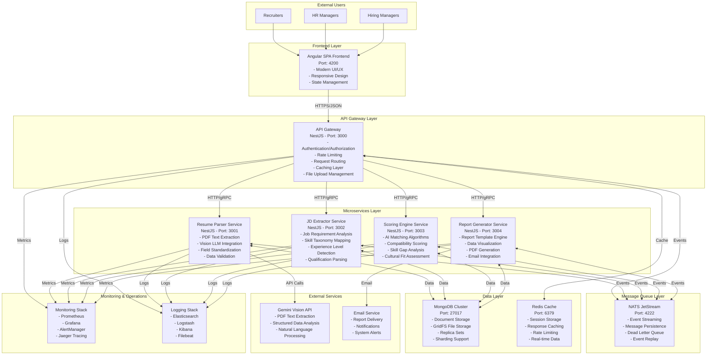

# High-Level Design Document (HLD) - AI Recruitment Clerk

## 1. Document Overview

**Document Title**: High-Level Design - AI Recruitment Clerk  
**Version**: 1.0  
**Status**: Production Ready  
**Last Updated**: August 2025  
**Authors**: Engineering Team  
**Reviewers**: Solution Architect, Security Team  

## 2. System Overview

AI Recruitment Clerk is an event-driven microservices platform designed to automate resume screening and candidate-job matching using advanced AI technology. The system processes PDF resumes and job descriptions to generate detailed matching reports with quantitative scoring.

### 2.1 Architecture Principles
- **Event-Driven**: Asynchronous processing using NATS JetStream
- **Microservices**: Loosely coupled, independently deployable services
- **Cloud-Native**: Container-first design with Docker/Kubernetes support
- **API-First**: RESTful APIs with OpenAPI specifications
- **Security by Design**: Defense-in-depth security architecture
- **Observability**: Comprehensive monitoring and logging

### 2.2 Quality Attributes
- **Performance**: Sub-30 second resume processing
- **Scalability**: Horizontal scaling for all services
- **Reliability**: 99.9% uptime with graceful degradation
- **Security**: End-to-end encryption and audit logging
- **Maintainability**: Clean code with 95%+ test coverage

## 3. System Architecture

### 3.1 Architecture Diagram (C4 Model - Container Level)



### 3.2 Service Responsibilities

#### API Gateway (app-gateway)
- **Primary Functions**:
  - User authentication and authorization using JWT
  - Request routing to appropriate microservices
  - File upload handling with virus scanning
  - Response caching with Redis integration
  - Rate limiting and DDoS protection
  - API documentation via Swagger/OpenAPI
  
- **Technology Stack**: NestJS, TypeScript, Passport.js, Multer, Redis
- **Security**: JWT tokens, RBAC, input validation, CORS protection
- **Monitoring**: Request metrics, error rates, response times

#### Resume Parser Service (resume-parser-svc)
- **Primary Functions**:
  - PDF resume parsing using Vision LLM
  - Structured data extraction and validation
  - Field standardization and normalization
  - Multi-language support (English, Chinese)
  - Confidence scoring for extracted data
  
- **Technology Stack**: NestJS, TypeScript, GridFS, Gemini Vision API
- **Data Flow**: Event-driven processing with NATS JetStream
- **Quality Gates**: 95% extraction accuracy, field validation

#### JD Extractor Service (jd-extractor-svc)
- **Primary Functions**:
  - Job description parsing and analysis
  - Skill taxonomy mapping and standardization
  - Experience level and qualification extraction
  - Required vs. preferred requirement classification
  - Industry and role categorization
  
- **Technology Stack**: NestJS, TypeScript, Natural Language Processing
- **Data Processing**: Text analysis, entity extraction, classification
- **Output**: Structured job requirement data model

#### Scoring Engine Service (scoring-engine-svc)  
- **Primary Functions**:
  - AI-driven candidate-job matching algorithms
  - Quantitative scoring (0-100 scale)
  - Skill gap analysis and recommendations
  - Cultural fit assessment (when data available)
  - Batch processing for multiple candidates
  
- **Technology Stack**: NestJS, TypeScript, Machine Learning libraries
- **Algorithms**: Weighted scoring, semantic similarity, experience matching
- **Performance**: Sub-5 second scoring for single candidate

#### Report Generator Service (report-generator-svc)
- **Primary Functions**:
  - Comprehensive matching report generation
  - Data visualization and chart creation
  - PDF export with professional formatting
  - Email delivery integration
  - Historical report analytics
  
- **Technology Stack**: NestJS, TypeScript, Chart.js, PDFKit, SendGrid
- **Templates**: Customizable report templates
- **Formats**: HTML, PDF, CSV export options

### 3.3 Data Architecture

#### Database Design
- **Primary Database**: MongoDB with replica sets
- **File Storage**: GridFS for resume and report storage
- **Cache Layer**: Redis for session and response caching
- **Message Queue**: NATS JetStream for event persistence

#### Data Models

```typescript
// Core Data Models
interface ResumeData {
  id: string;
  candidateName: string;
  contactInfo: ContactInfo;
  experience: ExperienceItem[];
  education: EducationItem[];
  skills: SkillItem[];
  certifications: CertificationItem[];
  extractionConfidence: number;
  processedAt: Date;
}

interface JobRequirements {
  id: string;
  jobTitle: string;
  companyName: string;
  requiredSkills: SkillRequirement[];
  preferredSkills: SkillRequirement[];
  experienceRequirements: ExperienceRequirement;
  educationRequirements: EducationRequirement[];
  location: LocationRequirement;
  processedAt: Date;
}

interface MatchingResult {
  id: string;
  resumeId: string;
  jobId: string;
  overallScore: number;
  skillMatchScore: number;
  experienceMatchScore: number;
  educationMatchScore: number;
  strengths: MatchingPoint[];
  weaknesses: MatchingPoint[];
  recommendations: string[];
  generatedAt: Date;
}
```

#### Data Flow Architecture

```
1. Resume Upload → GridFS Storage → Vision LLM Processing → Structured Data → MongoDB
2. JD Input → Text Processing → Skill Extraction → Standardization → MongoDB  
3. Matching Request → Data Retrieval → AI Scoring → Result Storage → Report Generation
4. Event Publishing → NATS JetStream → Service Coordination → Async Processing
```

## 4. Integration Architecture

### 4.1 Event-Driven Communication

#### Core Events
```yaml
Events:
  job.created:
    payload: { jobId, requirements, metadata }
    consumers: [jd-extractor-svc, scoring-engine-svc]
  
  resume.uploaded:
    payload: { resumeId, fileId, metadata }
    consumers: [resume-parser-svc]
  
  resume.parsed:
    payload: { resumeId, extractedData, confidence }
    consumers: [scoring-engine-svc]
  
  matching.requested:
    payload: { jobId, resumeIds, criteria }
    consumers: [scoring-engine-svc]
  
  matching.completed:
    payload: { matchingId, results, scores }
    consumers: [report-generator-svc]
  
  report.generated:
    payload: { reportId, format, downloadUrl }
    consumers: [app-gateway, notification-svc]
```

#### Event Processing Patterns
- **Publish-Subscribe**: Loose coupling between services
- **Event Sourcing**: Complete audit trail of all operations
- **CQRS**: Separate read and write operations
- **Saga Pattern**: Distributed transaction management
- **Dead Letter Queue**: Failed message handling

### 4.2 External Service Integration

#### Gemini Vision API Integration
- **Purpose**: PDF text extraction and structured analysis
- **Authentication**: API key management with rotation
- **Rate Limiting**: Intelligent request throttling
- **Error Handling**: Retry logic with exponential backoff
- **Cost Management**: Request optimization and monitoring
- **Fallback**: OCR libraries for basic text extraction

#### Email Service Integration (SendGrid/AWS SES)
- **Templates**: Branded email templates for reports
- **Delivery**: Reliable delivery with tracking
- **Bounce Handling**: Automated bounce and spam management
- **Compliance**: CAN-SPAM and GDPR compliance
- **Analytics**: Delivery and engagement metrics

### 4.3 Security Architecture

#### Authentication & Authorization
- **JWT Tokens**: Stateless authentication with refresh tokens
- **Role-Based Access Control (RBAC)**: Granular permissions
- **OAuth2 Integration**: Future social login support
- **Session Management**: Secure session handling with Redis
- **Password Security**: Bcrypt hashing with salt

#### Data Security
- **Encryption at Rest**: AES-256 database encryption
- **Encryption in Transit**: TLS 1.3 for all communications
- **File Scanning**: Malware detection for uploaded files
- **Data Masking**: PII protection in logs and reports
- **Audit Logging**: Complete activity audit trail

#### Network Security
- **API Gateway Security**: Input validation, CORS, CSP headers
- **Service Mesh**: Future mTLS between microservices
- **DDoS Protection**: Rate limiting and traffic analysis
- **Firewall Rules**: Network segmentation and access control
- **Vulnerability Scanning**: Regular security assessments

## 5. Deployment Architecture

### 5.1 Container Architecture
- **Base Images**: Node.js Alpine for minimal attack surface
- **Multi-stage Builds**: Optimized production images
- **Health Checks**: Comprehensive service health monitoring
- **Resource Limits**: CPU and memory constraints
- **Security**: Non-root containers with read-only filesystems

### 5.2 Orchestration (Docker Compose)
```yaml
Services:
  - mongodb: Database with replica set configuration
  - nats: Message queue with JetStream enabled
  - redis: Cache layer with persistence
  - app-gateway: API gateway with load balancing
  - resume-parser-svc: PDF processing service
  - jd-extractor-svc: Job analysis service  
  - scoring-engine-svc: AI matching service
  - report-generator-svc: Report generation service
  - ai-frontend: Angular SPA application
  
Networks:
  - ai-recruitment-network: Isolated service network
  
Volumes:
  - mongodb_data: Database persistence
  - redis_data: Cache persistence
  - file_storage: GridFS file storage
```

### 5.3 Production Considerations

#### Scaling Strategy
- **Horizontal Scaling**: Load balancer with multiple service instances
- **Database Scaling**: MongoDB sharding for high-volume data
- **Cache Scaling**: Redis cluster for distributed caching
- **Message Queue**: NATS clustering for high availability
- **Auto-scaling**: Container orchestration with Kubernetes

#### Monitoring & Observability
- **Metrics**: Prometheus for time-series data collection
- **Visualization**: Grafana dashboards for real-time monitoring
- **Alerting**: AlertManager for proactive issue notification
- **Distributed Tracing**: Jaeger for request flow analysis
- **Log Aggregation**: ELK stack for centralized logging

#### Disaster Recovery
- **Backup Strategy**: Automated daily backups with retention policy
- **Data Replication**: Cross-region database replication
- **Service Redundancy**: Multi-zone deployment for high availability
- **Recovery Testing**: Regular disaster recovery drills
- **Documentation**: Detailed recovery procedures

## 6. Performance Architecture

### 6.1 Performance Requirements
- **Resume Processing**: < 30 seconds per resume (P95)
- **JD Analysis**: < 15 seconds per job description (P95)
- **Matching Score**: < 5 seconds per candidate (P95)
- **Report Generation**: < 45 seconds for comprehensive report (P95)
- **Concurrent Users**: Support 100+ simultaneous users

### 6.2 Performance Optimization

#### Caching Strategy
- **API Response Caching**: Redis with TTL-based invalidation
- **Database Query Caching**: MongoDB query result caching
- **File Caching**: GridFS metadata and content caching
- **CDN Integration**: Static asset delivery optimization
- **Application Caching**: Service-level memory caching

#### Database Optimization
- **Indexing Strategy**: Compound indexes for common queries
- **Query Optimization**: Aggregation pipeline optimization
- **Connection Pooling**: Efficient database connection management
- **Sharding**: Horizontal data partitioning for scale
- **Read Replicas**: Read operation distribution

#### Service Optimization
- **Connection Pooling**: HTTP client connection reuse
- **Batch Processing**: Bulk operations for efficiency
- **Async Processing**: Non-blocking I/O operations
- **Resource Management**: Memory and CPU optimization
- **Code Optimization**: Performance profiling and tuning

## 7. Technology Decisions

### 7.1 Technology Stack Rationale

#### Backend Framework: NestJS
- **Pros**: TypeScript native, enterprise-ready, excellent testing support
- **Architecture**: Modular design with dependency injection
- **Performance**: V8 optimization with Node.js clustering
- **Community**: Large ecosystem and active development

#### Frontend Framework: Angular
- **Pros**: Enterprise-grade, TypeScript native, comprehensive tooling
- **Architecture**: Component-based with reactive forms
- **Performance**: Optimized change detection and lazy loading
- **Testing**: Built-in testing framework and e2e support

#### Database: MongoDB
- **Pros**: Document-based, flexible schema, excellent scaling
- **Use Case**: Resume and job data with varying structures
- **Performance**: Optimal for read-heavy operations
- **Integration**: Native Node.js driver support

#### Message Queue: NATS JetStream
- **Pros**: High performance, reliable delivery, cloud-native
- **Features**: Message persistence, replay capabilities
- **Scalability**: Horizontal scaling and clustering
- **Integration**: Excellent Node.js client library

### 7.2 Alternative Considerations

#### Evaluated Alternatives
- **Database**: PostgreSQL (rejected due to schema flexibility requirements)
- **Message Queue**: RabbitMQ (rejected due to performance requirements)
- **Frontend**: React (rejected due to enterprise requirements)
- **Backend**: Express.js (rejected due to structure and testing needs)

## 8. Risk Assessment

### 8.1 Technical Risks

#### High Risk Items
- **LLM API Dependency**: Gemini API availability and cost escalation
- **Performance at Scale**: Meeting response time SLAs under high load
- **Data Accuracy**: Achieving 95% extraction accuracy target
- **Security Vulnerabilities**: Protection against evolving threats

#### Mitigation Strategies
- **LLM Fallback**: Implement OCR libraries as backup solution
- **Performance Testing**: Comprehensive load testing and optimization
- **Data Validation**: Multi-layer validation and confidence scoring
- **Security Reviews**: Regular security audits and penetration testing

### 8.2 Operational Risks

#### Medium Risk Items
- **Service Dependencies**: Complex microservice interactions
- **Data Migration**: Large-scale data movement and transformation
- **Version Compatibility**: Service versioning and backward compatibility
- **Monitoring Complexity**: Observability in distributed systems

#### Mitigation Strategies
- **Circuit Breakers**: Resilient service communication patterns
- **Migration Tools**: Automated data migration and validation scripts
- **API Versioning**: Semantic versioning with deprecation policies
- **Observability Tools**: Comprehensive monitoring and alerting stack

## 9. Future Architecture Considerations

### 9.1 Scalability Roadmap
- **Phase 2**: Kubernetes orchestration for auto-scaling
- **Phase 3**: Multi-region deployment with edge computing
- **Phase 4**: Machine learning model training infrastructure
- **Phase 5**: Real-time collaboration and streaming updates

### 9.2 Technology Evolution
- **AI/ML Integration**: Custom model training and inference
- **Serverless Architecture**: Function-as-a-Service for specific operations
- **Edge Computing**: Distributed processing for improved latency
- **Blockchain Integration**: Immutable audit trails and credentials

---

**Document Status**: Approved for Production  
**Next Review**: Quarterly Architecture Review  
**Approvers**: [Solution Architect] [Principal Engineer] [Security Lead]