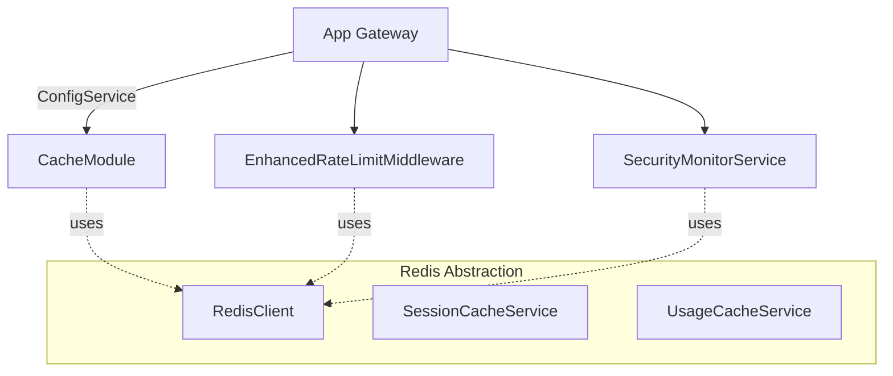
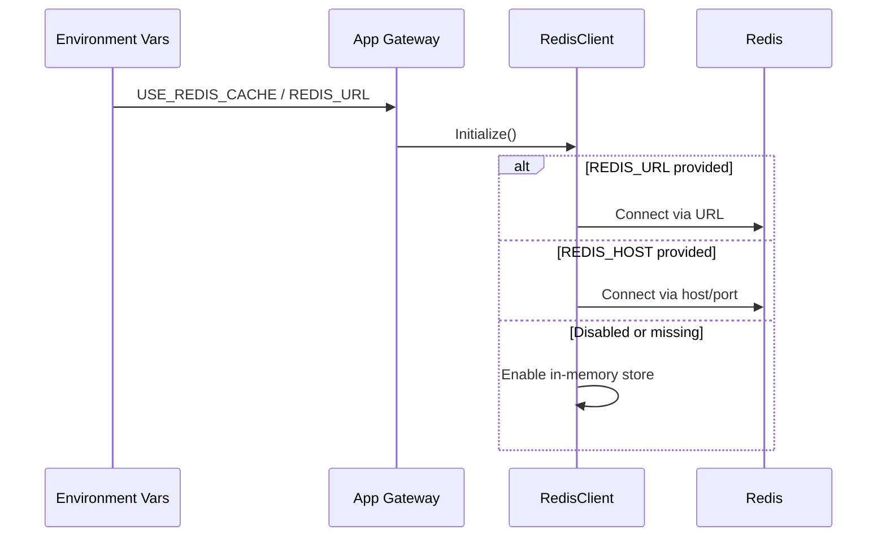

## Architecture Overview



## Caching Strategy

- Redis connection is enabled only when `USE_REDIS_CACHE` is `true` and connection information exists.
- Priority: use `REDIS_URL`. If absent but `REDIS_HOST`/`REDIS_PORT` exist, use split configuration.
- If disabled or not configured, system degrades to in-memory cache inside `RedisClient` to avoid accidental connections to 127.0.0.1:6379.

## Sequence: Startup Cache Init



## Class Diagram

```mermaid
classDiagram
  class RedisClient {
    -redis: Redis | null
    -isConnected: boolean
    -useInMemoryStore: boolean
    -memoryStore: Map<string, { value: string, expireAt?: number }>
    +connect(): Promise<void>
    +set(key, value, ttl?): Promise<void>
    +get(key): Promise<string|null>
    +del(key): Promise<number>
    +exists(key): Promise<boolean>
    +expire(key, seconds): Promise<boolean>
    +ttl(key): Promise<number>
    +incr(key): Promise<number>
    +decr(key): Promise<number>
    +mset(map): Promise<void>
    +mget(keys): Promise<string[]>
    +hset(key, field, value): Promise<number>
    +hget(key, field): Promise<string|null>
    +hgetall(key): Promise<Record<string,string>>
    +hdel(key, field): Promise<number>
    +keys(pattern): Promise<string[]>
  }
```

## Test Entrypoints and Reports

- Backend unit/integration: `npm run test:unit` / `npm run test:integration:all`
- E2E tests: `npm run test:e2e`

## Baseline

- Version: 1.0.0
- Date: 2025-08-14
- Scope: Redis connection hardening and graceful degradation


