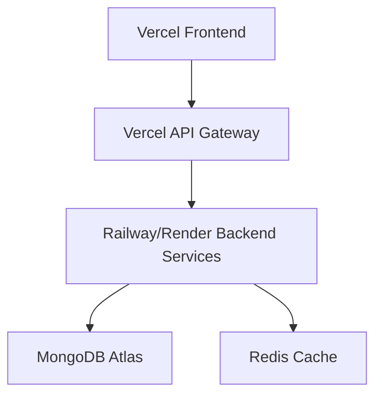

# 🚀 AI Recruitment Clerk - Vercel部署指南

## 📋 当前状态分析

**❌ 不能直接Vercel部署的原因:**
1. 微服务架构 (5个独立服务)
2. 需要MongoDB + NATS消息队列
3. 缺少前端用户界面
4. 长时间运行的后台任务

## 🛠️ 三种部署解决方案

### 方案1: 最小可行产品 (MVP) ⭐ 推荐

**目标**: 48小时内可用的简化版本

#### Step 1: 创建单体API应用
```bash
# 1. 合并所有API到单个Next.js应用
mkdir ai-recruitment-mvp
cd ai-recruitment-mvp
npx create-next-app@latest . --typescript --tailwind --app

# 2. 合并核心功能
src/
├── app/
│   ├── api/
│   │   ├── auth/          # 用户认证
│   │   ├── resumes/       # 简历上传处理
│   │   ├── jobs/          # 职位管理
│   │   └── matching/      # 简单匹配算法
│   ├── dashboard/         # 用户仪表板
│   ├── upload/           # 简历上传页面
│   └── login/            # 登录页面
└── lib/
    ├── db.ts             # MongoDB连接
    ├── auth.ts           # 认证逻辑
    └── matching.ts       # 简化匹配算法
```

#### Step 2: 简化功能实现
```typescript
// 核心功能清单
✅ 用户注册/登录
✅ 简历上传 (PDF/DOC)
✅ 职位发布
✅ 简单关键字匹配
✅ 基础仪表板
❌ 复杂AI分析 (后期添加)
❌ 实时通知 (后期添加)
❌ 高级报告 (后期添加)
```

#### Step 3: 外部服务集成
```bash
# 必需的SaaS服务
📊 数据库: MongoDB Atlas (免费层)
📁 文件存储: Vercel Blob或AWS S3
🔐 认证: NextAuth.js
📧 邮件: Resend或SendGrid
🤖 AI处理: OpenAI API (简历解析)
```

#### Step 4: 部署配置
```bash
# vercel.json
{
  "functions": {
    "app/api/**": {
      "maxDuration": 30
    }
  },
  "env": {
    "MONGODB_URI": "@mongodb-uri",
    "NEXTAUTH_SECRET": "@nextauth-secret",
    "OPENAI_API_KEY": "@openai-api-key"
  }
}
```

### 方案2: 混合部署架构

**目标**: 保留微服务，渐进式部署

#### 架构设计


#### 部署分布
```bash
🌐 Vercel:
  - Next.js前端应用
  - API Gateway (代理请求)
  - 静态文件托管

☁️ Railway/Render:
  - 4个微服务
  - NATS消息队列
  - 后台任务处理

📊 外部服务:
  - MongoDB Atlas (数据库)
  - Redis Cloud (缓存)
  - AWS S3 (文件存储)
```

### 方案3: 容器化完整部署

**目标**: 完整功能，生产级部署

#### 平台选择
```bash
🐳 容器平台:
  - AWS ECS/Fargate
  - Google Cloud Run
  - DigitalOcean App Platform
  - Fly.io

🔄 CI/CD:
  - GitHub Actions
  - 自动构建和部署
  - 多环境管理
```

## 🚀 推荐实施路径: MVP方案

### Phase 1: 核心MVP (1-2周)
```bash
Week 1:
✅ Next.js应用架构
✅ 用户认证系统
✅ 简历上传功能
✅ 基础UI/UX

Week 2:  
✅ 职位管理
✅ 简单匹配算法
✅ 用户仪表板
✅ Vercel部署
```

### Phase 2: 功能增强 (2-4周)
```bash
Week 3-4:
✅ AI简历解析 (OpenAI API)
✅ 高级搜索过滤
✅ 邮件通知系统
✅ 数据导出功能

Week 5-6:
✅ 实时通知
✅ 用户权限管理  
✅ API限制和监控
✅ 移动端适配
```

### Phase 3: 企业级功能 (1-2个月)
```bash
Month 2:
✅ 微服务架构迁移
✅ 高级AI分析
✅ 报告生成系统
✅ 企业级认证 (SSO)
✅ 完整监控和日志
```

## 🛠️ 立即开始MVP开发

### 1. 创建MVP应用骨架
```bash
# 克隆现有后端逻辑
git clone <current-repo> ai-recruitment-mvp
cd ai-recruitment-mvp

# 重构为Next.js应用
npx create-next-app@latest frontend --typescript --tailwind --app
cd frontend

# 安装依赖
npm install next-auth mongodb openai @vercel/blob nodemailer
npm install -D @types/node
```

### 2. 环境变量配置
```bash
# .env.local
MONGODB_URI="mongodb+srv://..."
NEXTAUTH_SECRET="your-secret-key"
NEXTAUTH_URL="http://localhost:3000"
OPENAI_API_KEY="sk-..."
BLOB_READ_WRITE_TOKEN="vercel-blob-token"
```

### 3. 核心页面结构
```typescript
// app/layout.tsx - 主布局
// app/page.tsx - 首页
// app/login/page.tsx - 登录页面
// app/dashboard/page.tsx - 用户仪表板
// app/upload/page.tsx - 简历上传
// app/jobs/page.tsx - 职位管理
// app/api/auth/[...nextauth]/route.ts - 认证API
// app/api/resumes/route.ts - 简历API
// app/api/jobs/route.ts - 职位API
```

### 4. 数据库模型简化
```typescript
// lib/models.ts
interface User {
  id: string;
  email: string;
  name: string;
  role: 'candidate' | 'recruiter' | 'admin';
  createdAt: Date;
}

interface Resume {
  id: string;
  userId: string;
  filename: string;
  content: string;
  skills: string[];
  experience: number;
  createdAt: Date;
}

interface Job {
  id: string;
  recruiterId: string;
  title: string;
  description: string;
  requirements: string[];
  status: 'active' | 'closed';
  createdAt: Date;
}
```

### 5. 简化匹配算法
```typescript
// lib/matching.ts
export function matchResumeToJob(resume: Resume, job: Job): number {
  const resumeSkills = resume.skills.map(s => s.toLowerCase());
  const jobRequirements = job.requirements.map(r => r.toLowerCase());
  
  const matches = resumeSkills.filter(skill => 
    jobRequirements.some(req => req.includes(skill))
  );
  
  return (matches.length / jobRequirements.length) * 100;
}
```

## 📅 部署时间线

### 立即可行 (今天开始):
- 设置MongoDB Atlas免费账户
- 创建Vercel项目
- 开发MVP前端界面

### 48小时内:
- 基础认证系统
- 简历上传功能
- 简单职位匹配

### 1周内:
- 完整用户体验
- AI简历解析集成
- 生产环境部署

### 1个月内:
- 企业级功能
- 高级分析报告
- 多租户支持

## 💡 关键成功因素

1. **从简单开始**: MVP先跑起来，再逐步完善
2. **使用托管服务**: MongoDB Atlas, Vercel, OpenAI API
3. **用户体验优先**: 简单直观的界面
4. **渐进式增强**: 每周添加新功能
5. **用户反馈驱动**: 基于真实用户需求迭代

## 🎯 下一步行动

选择方案1 (MVP)的话，我可以立即开始:

1. **创建Next.js应用架构**
2. **设计用户界面原型**  
3. **集成现有后端逻辑**
4. **配置Vercel部署**
5. **48小时内上线MVP版本**

需要我立即开始创建MVP版本吗? 🚀