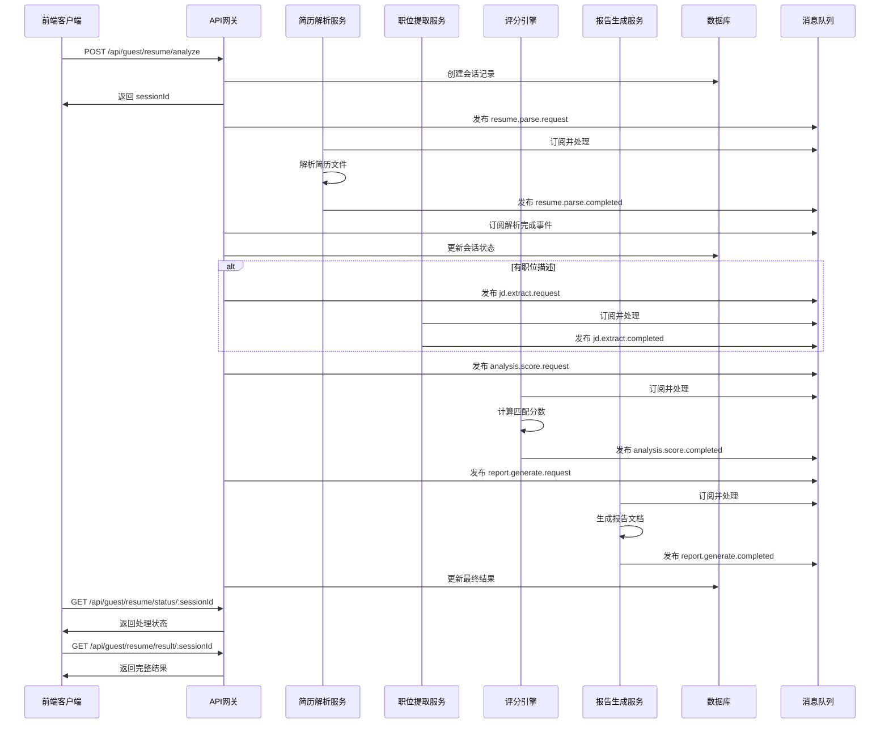

# AI 招聘助理 - 系统架构文档

## 1. 架构概览

### 1.1 系统架构图

```
┌─────────────────┐    ┌─────────────────┐    ┌─────────────────┐
│   前端 (Angular) │    │    API 网关     │    │   消息队列      │
│   Port: 4200    │◄──►│   Port: 3000    │◄──►│   NATS Stream   │
│                 │    │                 │    │   Port: 4222    │
└─────────────────┘    └─────────────────┘    └─────────────────┘
                              │
                              ▼
                    ┌─────────────────┐
                    │     MongoDB     │
                    │   Port: 27017   │
                    │   (主数据库)     │
                    └─────────────────┘
                              │
                    ┌─────────────────┐
                    │      Redis      │
                    │   Port: 6379    │
                    │    (缓存)       │
                    └─────────────────┘

                    微服务集群
┌─────────────────┐ ┌─────────────────┐ ┌─────────────────┐ ┌─────────────────┐
│  简历解析服务    │ │ 职位提取服务     │ │   评分引擎      │ │  报告生成服务    │
│  Port: 3001     │ │  Port: 3002     │ │  Port: 3003     │ │  Port: 3004     │
│                 │ │                 │ │                 │ │                 │
│ - PDF解析       │ │ - JD分析        │ │ - 智能匹配      │ │ - PDF报告       │
│ - 数据提取      │ │ - 技能提取      │ │ - 分数计算      │ │ - HTML报告      │
│ - 格式化       │ │ - 要求分析      │ │ - 推荐生成      │ │ - 数据可视化    │
└─────────────────┘ └─────────────────┘ └─────────────────┘ └─────────────────┘
```

### 1.2 核心设计原则

1. **微服务架构**: 服务间松耦合，独立部署和扩展
2. **事件驱动**: 基于消息队列的异步通信
3. **无状态设计**: 服务实例可水平扩展
4. **数据一致性**: 最终一致性模型
5. **容错设计**: 服务熔断和降级机制
6. **访客友好**: 无需注册即可体验核心功能

## 2. 技术栈详解

### 2.1 前端技术栈

```typescript
// 核心框架
Angular 20.1           // 主框架
TypeScript 5.8         // 编程语言
RxJS 7.8              // 响应式编程
NgRx 19.2             // 状态管理

// UI 和样式
Angular Material      // UI组件库
SCSS                 // 样式预处理器
Bento Grid           // 现代网格布局

// 开发工具
Nx 21.3              // 单仓库管理
ESLint               // 代码检查
Prettier             // 代码格式化
Playwright           // E2E测试
```

### 2.2 后端技术栈

```typescript
// 核心框架
NestJS 11.0          // Node.js 框架
TypeScript 5.8       // 编程语言
Express              // HTTP 服务器

// 数据存储
MongoDB 8.17         // 主数据库
Mongoose            // ODM
Redis 4.7           // 缓存和会话存储
IORedis             // Redis 客户端

// 消息队列
NATS JetStream 2.28  // 消息队列和事件流

// AI 和文档处理
Google Gemini AI     // 大语言模型
PDF Parse Fork       // PDF 解析
Multer              // 文件上传

// 安全和认证
JWT                 // JSON Web Tokens
bcryptjs            // 密码加密
Passport            // 认证中间件
```

### 2.3 基础设施

```yaml
# 部署平台
Railway             # 主要部署平台
Docker              # 容器化

# 监控和日志
Winston             # 日志记录
Prometheus          # 指标收集 (计划)
Grafana            # 监控面板 (计划)

# CI/CD
GitHub Actions      # 持续集成
Husky              # Git hooks
```

## 3. 微服务详细设计

### 3.1 API 网关 (app-gateway)

**职责**:
- 统一入口点和路由
- 访客会话管理
- 请求验证和限流
- 业务流程编排
- WebSocket 连接管理

**核心模块**:

```typescript
// 主要控制器
@Controller('api/guest')
export class GuestController {
  // 简历分析工作流
  @Post('resume/analyze')
  analyzeResume(@Body() request: AnalyzeResumeRequest)
  
  // 状态查询
  @Get('resume/status/:sessionId')
  getAnalysisStatus(@Param('sessionId') sessionId: string)
  
  // 结果获取
  @Get('resume/result/:sessionId')
  getAnalysisResult(@Param('sessionId') sessionId: string)
  
  // 反馈机制
  @Post('feedback/generate-code')
  generateFeedbackCode(@Body() request: FeedbackCodeRequest)
  
  @Post('feedback/redeem')
  redeemFeedbackCode(@Body() request: RedeemCodeRequest)
}

// 仪表板控制器
@Controller('api/dashboard')
export class DashboardController {
  @Get('stats')
  getDashboardStats(): Promise<DashboardStats>
  
  @Get('activity')
  getRecentActivity(@Query('limit') limit: number): Promise<ActivityItem[]>
}

// 健康检查
@Controller('api/health')
export class HealthController {
  @Get()
  getSystemHealth(): Promise<SystemHealth>
}
```

**数据流**:
1. 接收用户请求
2. 验证和预处理
3. 发送消息到相应微服务
4. 聚合处理结果
5. 返回响应给客户端

### 3.2 简历解析服务 (resume-parser-svc)

**职责**:
- PDF/DOC/DOCX 文件解析
- 文本提取和清理
- 结构化数据提取
- 个人信息识别

**核心功能**:

```typescript
@Injectable()
export class ResumeParserService {
  // 主解析入口
  async parseResume(file: Buffer, fileName: string): Promise<ParsedResume> {
    // 1. 文件类型检测
    const mimeType = this.detectMimeType(file, fileName);
    
    // 2. 文本提取
    const rawText = await this.extractText(file, mimeType);
    
    // 3. 结构化解析
    const structuredData = await this.parseStructuredData(rawText);
    
    return {
      personalInfo: structuredData.personalInfo,
      experience: structuredData.experience,
      education: structuredData.education,
      skills: structuredData.skills,
      rawText: rawText
    };
  }
  
  // AI 辅助解析
  private async parseStructuredData(text: string): Promise<StructuredData> {
    const prompt = this.buildParsingPrompt(text);
    const aiResponse = await this.geminiClient.generateStructuredResponse(
      prompt, 
      RESUME_SCHEMA
    );
    return aiResponse.data;
  }
}
```

**处理流程**:
1. 接收文件和元数据
2. 验证文件格式和大小
3. 提取原始文本内容
4. 使用AI模型结构化解析
5. 数据验证和清理
6. 返回结构化结果

### 3.3 职位描述提取服务 (jd-extractor-svc)

**职责**:
- 职位描述文本分析
- 技能要求提取
- 经验要求分析
- 教育背景要求识别

**核心算法**:

```typescript
@Injectable()
export class JobDescriptionExtractor {
  async extractRequirements(jobDescription: string): Promise<JobRequirements> {
    // 1. 文本预处理
    const cleanedText = this.preprocessText(jobDescription);
    
    // 2. 多维度提取
    const [skills, experience, education, responsibilities] = await Promise.all([
      this.extractSkills(cleanedText),
      this.extractExperience(cleanedText),
      this.extractEducation(cleanedText),
      this.extractResponsibilities(cleanedText)
    ]);
    
    return {
      requiredSkills: skills.required,
      preferredSkills: skills.preferred,
      experienceYears: experience.years,
      experienceLevel: experience.level,
      educationLevel: education.level,
      educationField: education.field,
      responsibilities: responsibilities
    };
  }
  
  // 技能提取算法
  private async extractSkills(text: string): Promise<SkillExtraction> {
    // 使用预训练的技能词典 + AI模型
    const skillDatabase = await this.loadSkillDatabase();
    const aiExtractedSkills = await this.geminiClient.generateStructuredResponse(
      `Extract technical skills from: ${text}`,
      SKILLS_SCHEMA
    );
    
    // 合并和验证结果
    return this.mergeAndValidateSkills(skillDatabase, aiExtractedSkills.data);
  }
}
```

### 3.4 评分引擎服务 (scoring-engine-svc)

**职责**:
- 简历与职位匹配度计算
- 多维度评分算法
- 推荐建议生成
- 评分解释说明

**核心评分算法**:

```typescript
@Injectable()
export class ScoringEngine {
  async calculateMatchScore(
    resumeData: ParsedResume, 
    jobRequirements: JobRequirements
  ): Promise<MatchingResult> {
    
    // 1. 技能匹配评分 (40% 权重)
    const skillsScore = await this.calculateSkillsMatch(
      resumeData.skills, 
      jobRequirements.requiredSkills
    );
    
    // 2. 经验匹配评分 (35% 权重)
    const experienceScore = await this.calculateExperienceMatch(
      resumeData.experience, 
      jobRequirements
    );
    
    // 3. 教育背景评分 (25% 权重)
    const educationScore = await this.calculateEducationMatch(
      resumeData.education, 
      jobRequirements
    );
    
    // 4. 综合评分计算
    const overallScore = (
      skillsScore * 0.4 + 
      experienceScore * 0.35 + 
      educationScore * 0.25
    );
    
    // 5. 生成推荐建议
    const recommendations = await this.generateRecommendations(
      resumeData, 
      jobRequirements, 
      { skillsScore, experienceScore, educationScore }
    );
    
    return {
      overallScore: Math.round(overallScore),
      breakdown: {
        skillsScore: Math.round(skillsScore),
        experienceScore: Math.round(experienceScore),
        educationScore: Math.round(educationScore)
      },
      recommendations,
      details: this.generateScoringDetails(resumeData, jobRequirements)
    };
  }
  
  // 技能匹配算法
  private calculateSkillsMatch(
    candidateSkills: Skill[], 
    requiredSkills: string[]
  ): number {
    const normalizedRequired = requiredSkills.map(s => s.toLowerCase());
    const normalizedCandidate = candidateSkills.map(s => s.name.toLowerCase());
    
    // 精确匹配
    const exactMatches = normalizedRequired.filter(req => 
      normalizedCandidate.some(cand => cand.includes(req))
    );
    
    // 相似度匹配 (使用编辑距离等算法)
    const similarityMatches = this.calculateSkillSimilarity(
      normalizedRequired, 
      normalizedCandidate
    );
    
    // 加权计算
    const exactWeight = 1.0;
    const similarityWeight = 0.6;
    
    const totalScore = (
      exactMatches.length * exactWeight + 
      similarityMatches * similarityWeight
    ) / normalizedRequired.length * 100;
    
    return Math.min(totalScore, 100);
  }
}
```

### 3.5 报告生成服务 (report-generator-svc)

**职责**:
- PDF/HTML 报告生成
- 数据可视化图表
- 报告模板管理
- 文件存储和下载

**报告生成流程**:

```typescript
@Injectable()
export class ReportGenerator {
  async generateReport(
    sessionId: string, 
    analysisData: AnalysisResult,
    format: 'pdf' | 'html' = 'pdf'
  ): Promise<GeneratedReport> {
    
    // 1. 数据预处理
    const reportData = this.prepareReportData(analysisData);
    
    // 2. 生成图表
    const charts = await this.generateCharts(reportData);
    
    // 3. 渲染模板
    const template = await this.loadTemplate(format);
    const renderedContent = await this.renderTemplate(template, {
      ...reportData,
      charts
    });
    
    // 4. 生成最终文档
    const document = format === 'pdf' 
      ? await this.generatePDF(renderedContent)
      : renderedContent;
    
    // 5. 存储和返回下载链接
    const downloadUrl = await this.storeDocument(sessionId, document, format);
    
    return {
      reportUrl: downloadUrl,
      downloadToken: this.generateDownloadToken(sessionId),
      expiresAt: new Date(Date.now() + 24 * 60 * 60 * 1000) // 24小时
    };
  }
  
  // 数据可视化
  private async generateCharts(data: ReportData): Promise<Charts> {
    return {
      skillsRadar: await this.generateSkillsRadarChart(data.skillsBreakdown),
      scoreComparison: await this.generateScoreChart(data.scoring),
      experienceTimeline: await this.generateTimelineChart(data.experience),
      matchingDetails: await this.generateMatchingChart(data.matching)
    };
  }
}
```

## 4. 数据流和状态管理

### 4.1 访客分析工作流



### 4.2 数据存储策略

#### MongoDB 集合设计

```javascript
// 访客会话集合
db.guest_sessions.createIndex({ "deviceId": 1, "createdAt": -1 });
db.guest_sessions.createIndex({ "sessionId": 1 }, { unique: true });
db.guest_sessions.createIndex({ "status": 1, "createdAt": -1 });
db.guest_sessions.createIndex({ "createdAt": 1 }, { expireAfterSeconds: 86400 * 7 }); // 7天自动过期

// 反馈码集合
db.feedback_codes.createIndex({ "code": 1 }, { unique: true });
db.feedback_codes.createIndex({ "expiresAt": 1 }, { expireAfterSeconds: 0 });
db.feedback_codes.createIndex({ "deviceId": 1, "sessionId": 1 });

// 处理指标集合
db.processing_metrics.createIndex({ "date": 1, "service": 1 });
db.processing_metrics.createIndex({ "createdAt": 1 }, { expireAfterSeconds: 86400 * 30 }); // 30天保留
```

#### Redis 缓存策略

```typescript
// 缓存键命名规范
const CACHE_KEYS = {
  // 会话状态缓存 (TTL: 1小时)
  sessionStatus: (sessionId: string) => `session:status:${sessionId}`,
  
  // 处理结果缓存 (TTL: 24小时)
  analysisResult: (sessionId: string) => `analysis:result:${sessionId}`,
  
  // 系统健康状态缓存 (TTL: 30秒)
  systemHealth: () => 'system:health',
  
  // 仪表板统计缓存 (TTL: 5分钟)
  dashboardStats: () => 'dashboard:stats',
  
  // 技能数据库缓存 (TTL: 24小时)
  skillsDatabase: () => 'skills:database'
};

// 缓存更新策略
@Injectable()
export class CacheService {
  // 写穿透缓存
  async setWithWriteThrough<T>(key: string, value: T, ttl: number): Promise<void> {
    await Promise.all([
      this.redis.setex(key, ttl, JSON.stringify(value)),
      this.database.save(key, value)
    ]);
  }
  
  // 延迟双删缓存
  async invalidateWithDoubleDelete(key: string): Promise<void> {
    await this.redis.del(key);
    setTimeout(() => this.redis.del(key), 1000); // 1秒后再次删除
  }
}
```

## 5. 消息队列和事件驱动架构

### 5.1 NATS JetStream 配置

```typescript
// 主题配置
const STREAM_CONFIG = {
  name: 'AI_RECRUITMENT',
  subjects: [
    'resume.parse.*',
    'jd.extract.*',
    'analysis.score.*',
    'report.generate.*',
    'system.health.*',
    'metrics.collect.*'
  ],
  retention: RetentionPolicy.WorkQueue,
  maxAge: 24 * 60 * 60 * 1000, // 24小时
  maxBytes: 1024 * 1024 * 1024, // 1GB
  storage: StorageType.File
};

// 消费者配置
const CONSUMER_CONFIG = {
  durable_name: 'ai-recruitment-consumer',
  ack_policy: AckPolicy.Explicit,
  ack_wait: 30 * 1000, // 30秒
  max_deliver: 3, // 最多重试3次
  deliver_policy: DeliverPolicy.All
};
```

### 5.2 事件处理器

```typescript
@Injectable()
export class EventProcessor {
  // 简历解析完成事件
  @MessagePattern('resume.parse.completed')
  async handleResumeParseCompleted(data: ResumeParseCompletedEvent): Promise<void> {
    const session = await this.sessionService.findBySessionId(data.sessionId);
    
    // 更新会话状态
    await this.sessionService.updateStatus(data.sessionId, {
      status: 'processing',
      currentStep: 'analysis',
      progress: 30,
      extractedData: data.result
    });
    
    // 触发下一步处理
    if (session.jobDescription) {
      await this.eventEmitter.emit('jd.extract.request', {
        sessionId: data.sessionId,
        jobDescription: session.jobDescription
      });
    } else {
      await this.eventEmitter.emit('analysis.score.request', {
        sessionId: data.sessionId,
        resumeData: data.result
      });
    }
  }
  
  // 错误处理和重试
  @MessagePattern('*.error')
  async handleProcessingError(data: ProcessingErrorEvent): Promise<void> {
    const session = await this.sessionService.findBySessionId(data.sessionId);
    
    if (data.retryCount < 3) {
      // 指数退避重试
      const delay = Math.pow(2, data.retryCount) * 1000;
      setTimeout(() => {
        this.retryProcessing(data);
      }, delay);
    } else {
      // 标记为失败
      await this.sessionService.updateStatus(data.sessionId, {
        status: 'failed',
        errorMessage: data.error,
        progress: 0
      });
    }
  }
}
```

## 6. 安全架构

### 6.1 访客模式安全设计

```typescript
// 设备指纹生成
class DeviceFingerprint {
  static generate(request: Request): string {
    const components = [
      request.headers['user-agent'],
      request.headers['accept-language'],
      request.headers['accept-encoding'],
      request.ip,
      request.headers['x-forwarded-for']
    ];
    
    const fingerprint = crypto
      .createHash('sha256')
      .update(components.join('|'))
      .digest('hex')
      .substring(0, 16);
    
    return fingerprint;
  }
}

// 速率限制
@Injectable()
export class RateLimitGuard implements CanActivate {
  private readonly limits = new Map<string, number[]>();
  
  canActivate(context: ExecutionContext): boolean {
    const request = context.switchToHttp().getRequest();
    const deviceId = request.headers['x-device-id'];
    
    // 每个设备每分钟最多10个请求
    const now = Date.now();
    const requests = this.limits.get(deviceId) || [];
    const recentRequests = requests.filter(time => now - time < 60000);
    
    if (recentRequests.length >= 10) {
      throw new TooManyRequestsException('Rate limit exceeded');
    }
    
    recentRequests.push(now);
    this.limits.set(deviceId, recentRequests);
    
    return true;
  }
}
```

### 6.2 数据加密策略

```typescript
// 敏感数据加密
@Injectable()
export class DataEncryption {
  private readonly encryptionKey = process.env.ENCRYPTION_MASTER_KEY;
  
  // 加密个人信息
  encryptPersonalInfo(data: PersonalInfo): EncryptedPersonalInfo {
    return {
      name: this.encrypt(data.name),
      email: this.encrypt(data.email),
      phone: this.encrypt(data.phone),
      address: this.encrypt(data.address),
      // 非敏感信息不加密
      skills: data.skills,
      summary: data.summary
    };
  }
  
  private encrypt(text: string): string {
    const iv = crypto.randomBytes(16);
    const cipher = crypto.createCipher('aes-256-gcm', this.encryptionKey);
    cipher.setAAD(Buffer.from('additional-auth-data'));
    
    let encrypted = cipher.update(text, 'utf8', 'hex');
    encrypted += cipher.final('hex');
    
    const tag = cipher.getAuthTag();
    
    return `${iv.toString('hex')}:${tag.toString('hex')}:${encrypted}`;
  }
}
```

## 7. 性能优化策略

### 7.1 数据库优化

```typescript
// 连接池配置
const mongoConfig = {
  maxPoolSize: 20,
  minPoolSize: 5,
  maxIdleTimeMS: 30000,
  serverSelectionTimeoutMS: 5000,
  socketTimeoutMS: 45000,
  bufferMaxEntries: 0
};

// 查询优化
@Injectable()
export class OptimizedQueries {
  // 使用聚合管道优化复杂查询
  async getDashboardStats(): Promise<DashboardStats> {
    const [stats] = await this.sessionModel.aggregate([
      {
        $facet: {
          totalSessions: [{ $count: "count" }],
          completedSessions: [
            { $match: { status: 'completed' } },
            { $count: "count" }
          ],
          avgProcessingTime: [
            { $match: { status: 'completed' } },
            { $group: {
              _id: null,
              avgTime: { $avg: { $subtract: ["$completedAt", "$createdAt"] } }
            }}
          ],
          recentActivity: [
            { $sort: { createdAt: -1 } },
            { $limit: 10 },
            { $project: { sessionId: 1, status: 1, createdAt: 1 } }
          ]
        }
      }
    ]);
    
    return this.formatDashboardStats(stats);
  }
}
```

### 7.2 微服务通信优化

```typescript
// HTTP客户端连接池
@Injectable()
export class OptimizedHttpClient {
  private readonly httpAgent = new http.Agent({
    keepAlive: true,
    maxSockets: 10,
    maxFreeSockets: 5,
    timeout: 60000,
    freeSocketTimeout: 30000
  });
  
  private readonly httpClient = axios.create({
    httpAgent: this.httpAgent,
    timeout: 30000,
    maxRedirects: 3
  });
  
  // 批量处理优化
  async batchProcess<T>(items: T[], processor: (item: T) => Promise<any>): Promise<any[]> {
    const batchSize = 5;
    const results = [];
    
    for (let i = 0; i < items.length; i += batchSize) {
      const batch = items.slice(i, i + batchSize);
      const batchResults = await Promise.all(
        batch.map(item => processor(item).catch(error => ({ error })))
      );
      results.push(...batchResults);
    }
    
    return results;
  }
}
```

## 8. 监控和可观测性

### 8.1 健康检查系统

```typescript
@Injectable()
export class HealthCheckService {
  @HealthCheck()
  async check(): Promise<HealthCheckResult> {
    return this.health.check([
      // 数据库连接检查
      () => this.database.pingCheck('database'),
      
      // Redis连接检查
      () => this.redis.pingCheck('redis'),
      
      // 消息队列检查
      () => this.nats.pingCheck('message-queue'),
      
      // 磁盘空间检查
      () => this.disk.checkStorage('disk', { 
        path: '/', 
        thresholdPercent: 0.8 
      }),
      
      // 内存使用检查
      () => this.memory.checkHeap('memory', { 
        thresholdPercent: 0.8 
      })
    ]);
  }
  
  // 微服务健康状态聚合
  async getServiceHealth(): Promise<ServiceHealthStatus> {
    const services = [
      'resume-parser-svc',
      'jd-extractor-svc', 
      'scoring-engine-svc',
      'report-generator-svc'
    ];
    
    const healthChecks = await Promise.allSettled(
      services.map(service => this.checkServiceHealth(service))
    );
    
    return this.aggregateHealthStatus(healthChecks);
  }
}
```

### 8.2 性能指标收集

```typescript
@Injectable()
export class MetricsCollector {
  private readonly metrics = new Map<string, any>();
  
  // 请求响应时间
  @Histogram({
    name: 'http_request_duration_seconds',
    help: 'HTTP request duration in seconds',
    labelNames: ['method', 'route', 'status_code']
  })
  httpRequestDuration: Histogram<string>;
  
  // 处理队列深度
  @Gauge({
    name: 'processing_queue_depth',
    help: 'Number of items in processing queue',
    labelNames: ['service', 'queue_type']
  })
  queueDepth: Gauge<string>;
  
  // 错误率
  @Counter({
    name: 'error_total',
    help: 'Total number of errors',
    labelNames: ['service', 'error_type']
  })
  errorCounter: Counter<string>;
  
  // 自定义业务指标
  recordProcessingMetrics(sessionId: string, metrics: ProcessingMetrics): void {
    this.httpRequestDuration
      .labels(metrics.method, metrics.route, metrics.statusCode.toString())
      .observe(metrics.duration);
      
    this.queueDepth
      .labels(metrics.service, 'processing')
      .set(metrics.queueSize);
      
    if (metrics.hasError) {
      this.errorCounter
        .labels(metrics.service, metrics.errorType)
        .inc();
    }
  }
}
```

## 9. 部署和DevOps

### 9.1 容器化配置

```dockerfile
# Dockerfile.gateway
FROM node:20-alpine AS base
WORKDIR /app

# 依赖安装
FROM base AS deps
COPY package*.json ./
RUN npm ci --only=production

# 构建阶段
FROM base AS builder
COPY . .
RUN npm ci && npm run build:gateway

# 运行阶段
FROM base AS runner
COPY --from=deps /app/node_modules ./node_modules
COPY --from=builder /app/dist ./dist
COPY --from=builder /app/package.json ./

EXPOSE 3000
CMD ["node", "dist/apps/app-gateway/main.js"]
```

### 9.2 Docker Compose 配置

```yaml
# docker-compose.yml
version: '3.8'

services:
  # API 网关
  gateway:
    build:
      context: .
      dockerfile: Dockerfile.gateway
    ports:
      - "3000:3000"
    environment:
      - MONGODB_URI=mongodb://mongo:27017/ai-recruitment
      - REDIS_URL=redis://redis:6379
      - NATS_URL=nats://nats:4222
    depends_on:
      - mongo
      - redis
      - nats
    restart: unless-stopped

  # 简历解析服务
  resume-parser:
    build:
      context: .
      dockerfile: Dockerfile.resume-parser
    ports:
      - "3001:3001"
    environment:
      - NATS_URL=nats://nats:4222
      - GEMINI_API_KEY=${GEMINI_API_KEY}
    depends_on:
      - nats
    restart: unless-stopped

  # 数据库
  mongo:
    image: mongo:7
    ports:
      - "27017:27017"
    volumes:
      - mongo_data:/data/db
    restart: unless-stopped

  # 缓存
  redis:
    image: redis:7-alpine
    ports:
      - "6379:6379"
    volumes:
      - redis_data:/data
    restart: unless-stopped

  # 消息队列
  nats:
    image: nats:2.10-alpine
    ports:
      - "4222:4222"
      - "8222:8222"
    command: ["-js", "-m", "8222"]
    volumes:
      - nats_data:/data
    restart: unless-stopped

volumes:
  mongo_data:
  redis_data:
  nats_data:
```

### 9.3 CI/CD 管道

```yaml
# .github/workflows/deploy.yml
name: Deploy to Railway

on:
  push:
    branches: [main]
  pull_request:
    branches: [main]

jobs:
  test:
    runs-on: ubuntu-latest
    steps:
      - uses: actions/checkout@v4
      - uses: actions/setup-node@v4
        with:
          node-version: '20'
          cache: 'npm'
      
      - run: npm ci
      - run: npm run lint
      - run: npm run test:unit
      - run: npm run test:e2e
      - run: npm run build:check

  security:
    runs-on: ubuntu-latest
    steps:
      - uses: actions/checkout@v4
      - name: Security Audit
        run: |
          npm audit --audit-level high
          npm run audit

  deploy:
    needs: [test, security]
    runs-on: ubuntu-latest
    if: github.ref == 'refs/heads/main'
    steps:
      - uses: actions/checkout@v4
      - name: Deploy to Railway
        uses: railway/deploy@v1
        with:
          service: ai-recruitment-gateway
          token: ${{ secrets.RAILWAY_TOKEN }}
```

## 10. 扩展性和未来规划

### 10.1 水平扩展策略

```typescript
// 负载均衡配置
const LOAD_BALANCER_CONFIG = {
  strategy: 'round-robin', // 轮询策略
  healthCheck: {
    interval: 30000, // 30秒检查一次
    timeout: 5000,   // 5秒超时
    retries: 3       // 重试3次
  },
  services: {
    'resume-parser': {
      instances: 3,
      maxConcurrency: 10
    },
    'scoring-engine': {
      instances: 2,
      maxConcurrency: 5
    }
  }
};

// 数据库分片策略
const SHARDING_CONFIG = {
  shardKey: 'deviceId', // 基于设备ID分片
  shards: [
    { name: 'shard1', connectionString: 'mongodb://shard1:27017' },
    { name: 'shard2', connectionString: 'mongodb://shard2:27017' },
    { name: 'shard3', connectionString: 'mongodb://shard3:27017' }
  ]
};
```

### 10.2 功能扩展规划

```typescript
// 计划中的新功能
interface FutureFeatures {
  // WebSocket实时通信
  realTimeUpdates: {
    implementation: 'Socket.IO',
    features: ['progress tracking', 'live notifications', 'collaborative editing']
  };
  
  // 高级分析功能
  advancedAnalytics: {
    features: ['industry benchmarking', 'salary prediction', 'career path analysis'],
    aiModels: ['GPT-4', 'Claude-3', 'custom models']
  };
  
  // 用户注册系统
  userManagement: {
    features: ['user accounts', 'history tracking', 'saved templates'],
    authentication: ['OAuth2', 'SSO', 'MFA']
  };
  
  // 企业版功能
  enterpriseFeatures: {
    features: ['bulk processing', 'custom workflows', 'API access'],
    deployment: ['on-premise', 'private cloud', 'hybrid']
  };
}
```

---

*该架构文档将随着系统演进持续更新和完善。*

*最后更新: 2025-08-17*
*版本: v1.0*