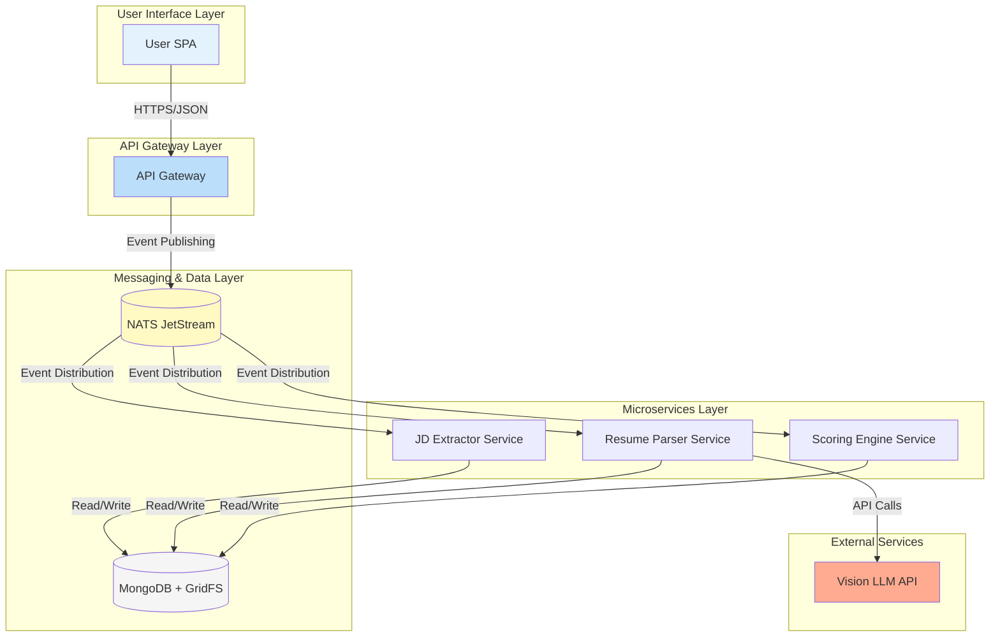
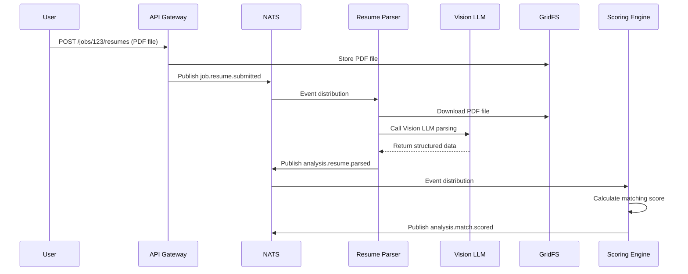

# AI Recruitment Clerk - Comprehensive Project Overview

> **Version**: 2.0  
> **Updated**: 2025-07-22  
> **Status**: Development Phase (Unit Testing Complete, TDD Ready)

## 📋 Table of Contents
- [Project Overview](#project-overview)
- [System Architecture](#system-architecture)
- [Technology Stack](#technology-stack)
- [Project Structure](#project-structure)
- [Core Services Deep Dive](#core-services-deep-dive)
- [Data Flow & Event Model](#data-flow--event-model)
- [Shared Library Architecture](#shared-library-architecture)
- [Development Status](#development-status)
- [API Specifications](#api-specifications)
- [Testing Strategy](#testing-strategy)
- [Deployment Architecture](#deployment-architecture)

## 🎯 Project Overview

### Mission Statement
Build a backend service that can automatically analyze Job Descriptions (JD) and resumes (PDF) to generate high-quality matching reports. Core objectives:
- Reduce manual screening time by **70%+**
- Achieve **95%+** accuracy in key information extraction

### Core Value Propositions
- **Intelligent Resume Parsing**: Precision extraction of structured information from PDF resumes using Vision LLM technology
- **Automated JD Analysis**: Smart parsing of job requirements to extract key skills and requirements
- **Precise Matching Scoring**: AI-driven candidate-position compatibility calculation
- **Efficient Event-Driven Processing**: Reliable asynchronous processing based on NATS JetStream
- **Enterprise-Grade Scalability**: Microservices architecture supporting horizontal scaling

## 🏗 System Architecture

### Architectural Pattern
**Event-Driven Microservices Architecture**



## 🛠 Technology Stack

| Category | Technology | Version | Use Case |
|----------|------------|---------|----------|
| **Frontend Framework** | Angular | 18 | Enterprise SPA application |
| **Backend Framework** | NestJS | 11 | TypeScript microservices framework |
| **Database** | MongoDB | 6.x | Document database, storing JD/resumes |
| **File Storage** | GridFS | - | Large file storage (PDF resumes) |
| **Message Middleware** | NATS JetStream | latest | Event stream processing |
| **Project Management** | Nx Monorepo | 21.3.2 | Multi-service unified management |
| **Package Manager** | pnpm | latest | Efficient package management |
| **Testing Framework** | Jest | 30.0.2 | Unit testing and integration testing |
| **AI Services** | Vision LLM API | - | PDF parsing and text extraction |

## 📁 Project Structure

```
AI-Recruitment-Clerk/
├── apps/                          # Application services directory
│   ├── app-gateway/              # API gateway service
│   │   ├── src/
│   │   │   ├── jobs/             # Job management module
│   │   │   │   ├── dto/          # Data transfer objects
│   │   │   │   ├── pipes/        # Validation pipes
│   │   │   │   └── types/        # Type definitions
│   │   │   └── main.ts
│   │   └── webpack.config.cjs
│   │
│   ├── jd-extractor-svc/         # JD extraction service
│   │   ├── src/
│   │   │   ├── extraction/       # Extraction logic
│   │   │   ├── llm/             # LLM integration
│   │   │   └── nats/            # Message client
│   │   └── webpack.config.cjs
│   │
│   ├── resume-parser-svc/        # Resume parsing service⭐
│   │   ├── src/
│   │   │   ├── parsing/          # Core parsing service
│   │   │   ├── vision-llm/       # Vision LLM integration
│   │   │   ├── gridfs/           # File storage service
│   │   │   ├── field-mapper/     # Field mapping service
│   │   │   └── nats/             # Event client
│   │   └── webpack.config.cjs
│   │
│   └── scoring-engine-svc/       # Scoring engine service
│       ├── src/
│       │   ├── scoring.service.ts
│       │   └── nats/
│       └── webpack.config.cjs
│
├── libs/                         # Shared libraries
│   └── shared-dtos/              # Shared data models⭐
│       ├── src/
│       │   ├── models/           # Data models
│       │   │   └── resume.dto.ts
│       │   ├── events/           # Event definitions
│       │   │   ├── resume-events.dto.ts
│       │   │   └── job-events.dto.ts
│       │   └── index.ts          # Unified exports
│       └── package.json
│
├── specs/                        # Specifications
│   ├── PROJECT_MISSION.md        # Project mission
│   ├── SYSTEM_CONTEXT.mermaid    # System context
│   ├── api_spec.openapi.yml      # API specifications
│   └── data_models.ts            # Data models (migrated)
│
├── documents/                    # Project documentation
│   ├── Business Requirements Document (BRD).md
│   ├── High-Level Design (HLD).md
│   └── Low-Level Design (LLD).md
│
├── docs/                         # Bilingual documentation
│   ├── en-US/                    # English documentation
│   └── zh-CN/                    # Chinese documentation
│
├── nx.json                       # Nx configuration
├── package.json                  # Root package configuration
└── tsconfig.base.json           # TypeScript base configuration
```

## 🎮 Core Services Deep Dive

### 1. API Gateway (`app-gateway`)
**Responsibility**: Unified entry point, routing distribution, user authentication

**Core Functions**:
- RESTful API interface provision
- File upload handling (resume PDFs)
- Event publishing to NATS
- JWT authentication and authorization

**Key Endpoints**:
```typescript
POST /jobs                    # Create job position
POST /jobs/{jobId}/resumes   # Upload resumes
GET  /jobs/{jobId}/reports   # Get reports
```

### 2. Resume Parser Service (`resume-parser-svc`) ⭐
**Responsibility**: Resume parsing and structured data extraction

**Service Components**:
- `parsing.service.ts` - Core parsing coordinator
- `vision-llm.service.ts` - Vision LLM API integration
- `gridfs.service.ts` - MongoDB GridFS file operations
- `field-mapper.service.ts` - Data standardization mapping
- `nats.client.ts` - NATS event client

**Processing Flow**:
```
job.resume.submitted → Download PDF → Vision LLM parsing → 
Field standardization → analysis.resume.parsed event
```

**Test Coverage**: ✅ **240+ unit tests complete** (TDD ready)

### 3. JD Extractor Service (`jd-extractor-svc`)
**Responsibility**: Extract structured hiring requirements from JD text

**Core Flow**:
```
job.jd.submitted → LLM analysis → Structured extraction → 
analysis.jd.extracted event
```

### 4. Scoring Engine Service (`scoring-engine-svc`)
**Responsibility**: Resume and JD matching score calculation

**Algorithm Logic**:
- Skill matching scoring
- Experience relevance calculation
- Educational background matching
- Comprehensive scoring algorithm

## 🔄 Data Flow & Event Model

### Event-Driven Architecture
Implements reliable asynchronous message processing using **NATS JetStream**

### Core Event Types

| Event Name | Publisher | Subscriber | Data Structure |
|------------|-----------|------------|----------------|
| `job.jd.submitted` | API Gateway | JD Extractor | `{ jobId, jdText }` |
| `analysis.jd.extracted` | JD Extractor | Scoring Engine | `{ jobId, jdDto }` |
| `job.resume.submitted` | API Gateway | Resume Parser | `{ jobId, resumeId, tempGridFsUrl }` |
| `analysis.resume.parsed` | Resume Parser | Scoring Engine | `{ jobId, resumeId, resumeDto }` |
| `job.resume.failed` | Resume Parser | - | `{ jobId, resumeId, error, retryCount }` |
| `analysis.match.scored` | Scoring Engine | Report Generator | `{ jobId, resumeId, matchScore }` |

### Data Flow Example - Resume Processing Flow



## 📦 Shared Library Architecture

### @ai-recruitment-clerk/shared-dtos

**Purpose**: Unified data models and event definitions, ensuring type consistency across services

**Structure**:
```typescript
// libs/shared-dtos/src/index.ts
export * from './models/resume.dto';
export * from './events/resume-events.dto';
export * from './events/job-events.dto';
```

**Core Data Models**:
```typescript
// ResumeDTO - Standardized resume data structure
interface ResumeDTO {
  contactInfo: {
    name: string;
    email: string | null;
    phone: string | null;
  };
  skills: string[];
  workExperience: WorkExperience[];
  education: Education[];
}

// Resume parsing completion event
interface AnalysisResumeParsedEvent {
  jobId: string;
  resumeId: string;
  resumeDto: ResumeDTO;
  timestamp: string;
  processingTimeMs: number;
}
```

## ✅ Development Status

### Phase 1: Architecture Design & Testing (Completed)
- ✅ Microservices architecture design
- ✅ Event-driven pattern design
- ✅ Shared library architecture design
- ✅ **Resume Parser Service complete unit test suite (240+ tests)**
- ✅ TDD methodology implementation

### Phase 2: Core Service Implementation (In Progress)
- 🔄 Resume Parser Service business logic implementation
- 🔄 Vision LLM API integration
- 🔄 GridFS file storage integration
- 📋 JD Extractor Service implementation
- 📋 Scoring Engine algorithm implementation

### Phase 3: Integration Testing & Deployment (Upcoming)
- 📋 Inter-service integration testing
- 📋 E2E test suite
- 📋 Performance benchmark testing
- 📋 Production environment deployment

### Test Maturity

| Service | Unit Tests | Integration Tests | E2E Tests | Coverage |
|---------|------------|------------------|-----------|----------|
| **resume-parser-svc** | ✅ 240+ tests | 📋 Upcoming | 📋 Upcoming | 🎯 >95% |
| **jd-extractor-svc** | 📋 To be implemented | 📋 Upcoming | 📋 Upcoming | 🎯 >90% |
| **scoring-engine-svc** | 📋 To be implemented | 📋 Upcoming | 📋 Upcoming | 🎯 >90% |
| **app-gateway** | 📋 To be improved | 📋 Upcoming | 📋 Upcoming | 🎯 >85% |

## 📋 API Specifications

### RESTful API Interfaces

Based on OpenAPI 3.0 specification design:

```yaml
# Core endpoints
paths:
  /jobs/{jobId}/resumes:
    post:
      summary: Batch upload resumes for specified job
      parameters:
        - name: jobId
          in: path
          required: true
          schema:
            type: string
      requestBody:
        content:
          multipart/form-data:
            schema:
              type: object
              properties:
                files:
                  type: array
                  items:
                    type: string
                    format: binary
      responses:
        '202':
          description: Accepted
          content:
            application/json:
              schema:
                type: object
                properties:
                  jobId:
                    type: string
                  submittedResumes:
                    type: integer
```

## 🧪 Testing Strategy

### TDD-Driven Development
- **Red-Green-Refactor** cycle
- Test-first approach, ensuring business logic correctness
- High coverage requirements (>90%)

### Test Pyramid

```
    /\     E2E Tests (few, critical flows)
   /  \    
  /____\   Integration Tests (moderate, service collaboration)
 /______\  
/__________\ Unit Tests (many, business logic)
```

### Resume Parser Service Test Highlights
- **240+ comprehensive unit tests**
- Complete mock strategy (jest.mock + jest.spyOn)
- **Test 4: analysis.resume.parsed event payload verification** (primary focus)
- Boundary conditions and exception handling coverage
- Performance and concurrency testing

## 🚀 Deployment Architecture

### Containerized Deployment
- Docker containerization
- Kubernetes orchestration
- Independent microservice scaling

### Monitoring & Observability
- Grafana LGTM Stack
- Distributed tracing
- Business metrics monitoring

### Performance Targets
- **Resume processing time**: <30 seconds
- **System availability**: >99.9%
- **Concurrent processing capability**: 100+ resumes/minute
- **Manual screening time reduction**: >70%

## 📊 Key Performance Indicators (KPIs)

| Indicator Type | Target Value | Current Status | Measurement Method |
|----------------|--------------|----------------|-------------------|
| **Processing Time** | <30 sec/resume | 📋 To be tested | End-to-end timing |
| **Accuracy Rate** | >95% | 📋 To be verified | Manual annotation comparison |
| **Availability** | >99.9% | 📋 To be deployed | System monitoring |
| **Throughput** | 100 resumes/min | 📋 To be stress tested | Load testing |

---

## 📞 Contact Information

**Project Status**: Development Phase - TDD Ready  
**Next Step**: Resume Parser Service business logic implementation  
**Key Milestone**: Complete event-driven resume processing flow

> This document is a **Living Document** and will be continuously updated as development progresses.