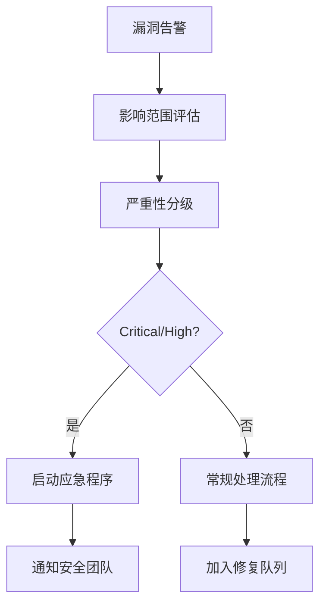
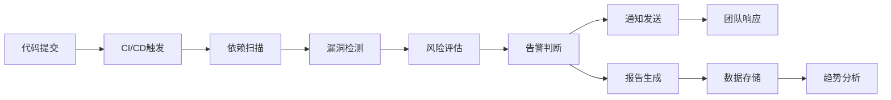

# AI Recruitment Clerk 依赖安全监控策略

## 📋 监控框架概述

### 目标
建立全面的依赖安全监控体系，确保AI招聘系统的持续安全性和合规性。

### 监控层级
1. **实时监控**: 自动化漏洞检测和告警
2. **定期审查**: 周期性人工安全评估
3. **合规检查**: 行业标准和法规遵循验证
4. **应急响应**: 安全事件快速处置流程

## 🛡️ 自动化监控配置

### 1. GitHub Actions 安全流水线

#### 依赖漏洞扫描
```yaml
# .github/workflows/security-audit.yml
name: Security Audit
on:
  push:
    branches: [main, develop]
  pull_request:
    branches: [main]
  schedule:
    - cron: '0 2 * * 1' # 每周一凌晨2点

jobs:
  security-audit:
    runs-on: ubuntu-latest
    steps:
      - uses: actions/checkout@v4
      
      - name: Setup Node.js
        uses: actions/setup-node@v4
        with:
          node-version: '20'
          cache: 'npm'
      
      - name: Install dependencies
        run: npm ci
      
      - name: Run npm audit
        run: |
          npm audit --audit-level=moderate --json > audit-results.json
          cat audit-results.json
      
      - name: Run audit-ci
        run: |
          npx audit-ci --moderate --report-type=important
      
      - name: Check for known vulnerabilities
        run: |
          npx better-npm-audit audit --level moderate
      
      - name: Upload audit results
        uses: actions/upload-artifact@v4
        if: always()
        with:
          name: security-audit-results
          path: audit-results.json
```

#### 依赖更新检查
```yaml
# .github/workflows/dependency-update.yml
name: Dependency Update Check
on:
  schedule:
    - cron: '0 6 * * 2' # 每周二早上6点

jobs:
  check-updates:
    runs-on: ubuntu-latest
    steps:
      - uses: actions/checkout@v4
      
      - name: Check for outdated packages
        run: |
          npm outdated --json > outdated.json || true
          cat outdated.json
      
      - name: Generate update report
        run: |
          echo "## Dependency Update Report" > update-report.md
          echo "Generated: $(date)" >> update-report.md
          npm outdated --long >> update-report.md
      
      - name: Create issue for updates
        uses: peter-evans/create-issue-from-file@v5
        with:
          title: "Weekly Dependency Update Report"
          content-filepath: update-report.md
          labels: |
            dependencies
            security
            maintenance
```

### 2. 本地开发监控工具

#### audit-ci 配置
```json
// .auditci.json
{
  "moderate": true,
  "high": true,
  "critical": true,
  "allowlist": [
    // 暂时允许的低风险漏洞 (需定期审查)
  ],
  "report-type": "important",
  "output-format": "text",
  "pass-enoaudit": false,
  "show-found": true,
  "show-not-found": false
}
```

#### package.json 脚本集成
```json
{
  "scripts": {
    "security:audit": "npm audit --audit-level=moderate",
    "security:audit-ci": "audit-ci --config .auditci.json",
    "security:check": "npm run security:audit && npm run security:audit-ci",
    "security:fix": "npm audit fix",
    "security:update": "npm update && npm run security:check",
    "security:report": "npm audit --json > reports/security-audit-$(date +%Y%m%d).json"
  }
}
```

### 3. IDE集成安全提示

#### VSCode 安全扩展配置
```json
// .vscode/extensions.json
{
  "recommendations": [
    "ms-vscode.vscode-npm-scripts",
    "bradlc.vscode-tailwindcss",
    "esbenp.prettier-vscode",
    "ms-vscode.security-risk-scanner",
    "snyk-security.snyk-vulnerability-scanner"
  ]
}
```

## 📊 监控指标和阈值

### 1. 安全风险评分系统

#### 漏洞严重性权重
- **Critical**: 100分 (立即修复)
- **High**: 75分 (24小时内修复)
- **Moderate**: 50分 (1周内修复)
- **Low**: 25分 (1个月内修复)

#### 系统健康度评分
```typescript
interface SecurityScore {
  overall: number;        // 0-100 总体安全分数
  vulnerabilities: {
    critical: number;
    high: number;
    moderate: number;
    low: number;
  };
  outdatedPackages: number;
  dependencyRisk: number;
  complianceScore: number;
}

// 评分阈值
const SECURITY_THRESHOLDS = {
  EXCELLENT: 95,    // 🟢 优秀
  GOOD: 85,         // 🟡 良好  
  ACCEPTABLE: 70,   // 🟠 可接受
  POOR: 50,         // 🔴 需要改进
  CRITICAL: 30      // 🚨 紧急处理
};
```

### 2. 监控告警规则

#### 告警级别定义
```yaml
alerts:
  critical:
    conditions:
      - critical_vulnerabilities > 0
      - security_score < 30
    actions:
      - immediate_notification
      - block_deployment
      - create_incident
  
  high:
    conditions:
      - high_vulnerabilities > 2
      - security_score < 50
    actions:
      - team_notification
      - schedule_fix
  
  moderate:
    conditions:
      - moderate_vulnerabilities > 5
      - outdated_packages > 20
    actions:
      - weekly_report
      - schedule_maintenance
```

## 🔄 定期审查流程

### 1. 每日自动检查
- ✅ 新漏洞数据库同步
- ✅ 依赖完整性验证
- ✅ 安全配置检查
- ✅ 日志异常分析

### 2. 每周人工审查
- 📋 安全审计报告生成
- 📋 漏洞修复进度跟踪
- 📋 依赖更新评估
- 📋 合规性检查

### 3. 每月深度评估
- 🔍 威胁模型更新
- 🔍 安全策略调整
- 🔍 工具效果评估
- 🔍 行业最佳实践研究

### 4. 季度安全回顾
- 📈 安全指标趋势分析
- 📈 事件处理效果评估
- 📈 安全投资ROI分析
- 📈 下季度改进计划

## 🚨 应急响应计划

### 1. 漏洞发现响应流程

#### 第一阶段: 快速评估 (1小时内)


#### 第二阶段: 详细分析 (4小时内)
- 确定受影响的系统组件
- 评估潜在攻击路径
- 制定修复方案
- 准备回滚计划

#### 第三阶段: 修复实施 (24小时内)
- 测试环境验证修复
- 生产环境部署
- 功能回归测试
- 安全验证测试

#### 第四阶段: 事后分析 (72小时内)
- 根本原因分析
- 流程改进建议
- 预防措施制定
- 经验教训总结

### 2. 零日漏洞应对策略

#### 临时缓解措施
```bash
# 应急脚本示例
#!/bin/bash
# emergency-mitigation.sh

# 1. 隔离受影响服务
kubectl scale deployment vulnerable-service --replicas=0

# 2. 启用WAF规则
curl -X POST "https://api.cloudflare.com/client/v4/zones/{zone}/firewall/rules" \
  -H "Authorization: Bearer $CF_TOKEN" \
  -d '{"action":"block","filter":{"expression":"vulnerable.pattern"}}'

# 3. 通知相关团队
slack-notify "🚨 Zero-day vulnerability detected. Emergency measures activated."

# 4. 开始监控日志
tail -f /var/log/security.log | grep -E "exploit|attack|vulnerability"
```

## 📈 合规性监控

### 1. 法规遵循检查

#### GDPR 数据保护合规
- 个人数据处理依赖审查
- 数据传输加密验证
- 访问控制依赖检查
- 审计日志完整性验证

#### SOX 财务合规 (如适用)
- 财务数据处理依赖
- 访问权限管理
- 变更控制流程
- 审计轨迹完整性

#### 行业标准遵循
- OWASP Top 10 对照检查
- NIST 网络安全框架映射
- ISO 27001 控制措施验证
- CIS 安全基准对比

### 2. 合规报告自动生成

#### 每月合规报告模板
```markdown
# AI Recruitment Clerk 月度安全合规报告

## 执行概要
- 报告期间: ${REPORT_PERIOD}
- 合规评分: ${COMPLIANCE_SCORE}/100
- 关键发现: ${KEY_FINDINGS}

## 漏洞管理
- 新发现漏洞: ${NEW_VULNERABILITIES}
- 已修复漏洞: ${FIXED_VULNERABILITIES}  
- 遗留风险: ${REMAINING_RISKS}

## 依赖管理
- 总依赖数量: ${TOTAL_DEPENDENCIES}
- 过时依赖: ${OUTDATED_DEPENDENCIES}
- 安全更新: ${SECURITY_UPDATES}

## 合规性检查
- GDPR合规性: ${GDPR_COMPLIANCE}
- OWASP映射: ${OWASP_MAPPING}
- 安全策略执行: ${POLICY_COMPLIANCE}

## 改进建议
${IMPROVEMENT_RECOMMENDATIONS}
```

## 🔧 工具集成和自动化

### 1. 安全工具栈

#### 核心监控工具
- **npm audit**: 基础漏洞扫描
- **audit-ci**: CI/CD集成审计
- **Snyk**: 商业级漏洞管理
- **OWASP Dependency Check**: 开源依赖扫描
- **GitGuardian**: 密钥泄露检测

#### 辅助分析工具
- **retire.js**: JavaScript库漏洞检测
- **safety**: Python依赖安全检查
- **bundler-audit**: Ruby依赖审计
- **yarn audit**: Yarn包管理器审计

### 2. 监控数据流



### 3. 数据存储和分析

#### 监控数据存储结构
```sql
-- 漏洞跟踪表
CREATE TABLE vulnerability_tracking (
    id SERIAL PRIMARY KEY,
    cve_id VARCHAR(20),
    severity VARCHAR(10),
    package_name VARCHAR(100),
    affected_version VARCHAR(50),
    fixed_version VARCHAR(50),
    discovery_date TIMESTAMP,
    fix_date TIMESTAMP,
    status VARCHAR(20)
);

-- 安全评分历史
CREATE TABLE security_score_history (
    id SERIAL PRIMARY KEY,
    date DATE,
    overall_score INTEGER,
    vulnerability_score INTEGER,
    dependency_score INTEGER,
    compliance_score INTEGER
);
```

## 📞 联系和责任分工

### 安全团队角色
- **安全架构师**: 整体策略制定和风险评估
- **安全工程师**: 工具实施和自动化开发  
- **安全分析师**: 日常监控和事件响应
- **合规专员**: 法规遵循和审计配合

### 紧急联系方式
- **安全热线**: security@ai-recruitment-clerk.com
- **值班电话**: +86-xxx-xxxx-xxxx
- **Slack频道**: #security-alerts
- **事件管理**: JIRA Security项目

---

**文档版本**: v1.0  
**最后更新**: 2025-08-19  
**下次审查**: 2025-09-19