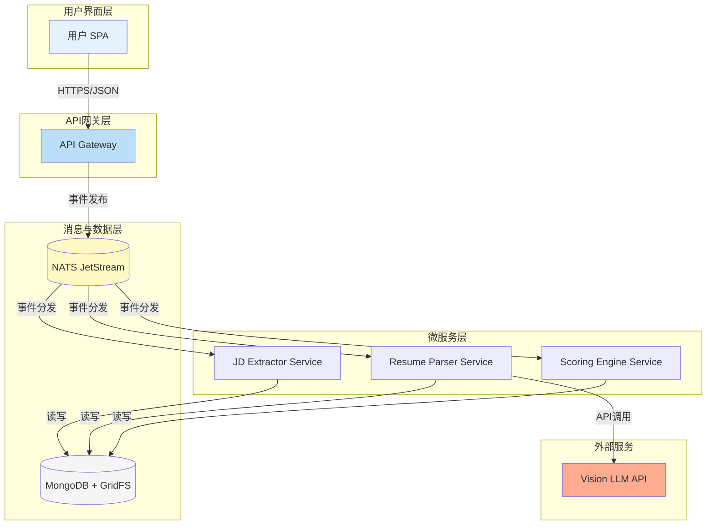
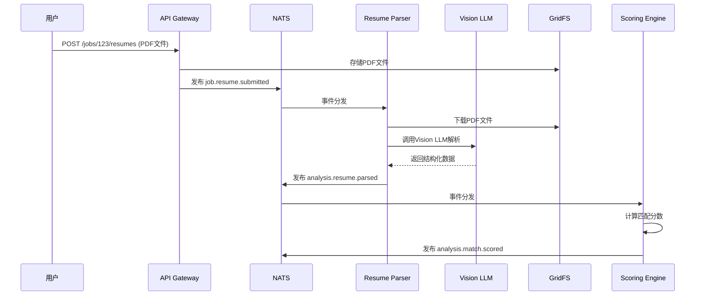

# AI Recruitment Clerk - 项目全面概览

> **版本**: 2.0  
> **更新日期**: 2025-07-22  
> **状态**: 开发阶段 (单元测试完成, TDD就绪)

## 📋 目录
- [项目概述](#项目概述)
- [系统架构](#系统架构)
- [技术栈](#技术栈)
- [项目结构](#项目结构)
- [核心服务详解](#核心服务详解)
- [数据流与事件模型](#数据流与事件模型)
- [共享库架构](#共享库架构)
- [开发状态](#开发状态)
- [API规范](#api规范)
- [测试策略](#测试策略)
- [部署架构](#部署架构)

## 🎯 项目概述

### 使命目标
构建一个能自动分析岗位描述（JD）与简历（PDF）并生成高质量匹配报告的后端服务。核心目标：
- 将人工初筛时间减少 **70%** 以上
- 关键信息提取准确率不低于 **95%**

### 核心价值
- **智能化简历解析**: 使用Vision LLM技术精准提取PDF简历结构化信息
- **自动化JD分析**: 智能解析职位需求，提取关键技能和要求
- **精准匹配评分**: AI驱动的候选人-职位匹配度计算
- **高效事件驱动**: 基于NATS JetStream的可靠异步处理
- **企业级可扩展**: 微服务架构支持水平扩展

## 🏗 系统架构

### 架构风格
**事件驱动的微服务架构 (Event-Driven Microservices)**



## 🛠 技术栈

| 类别 | 技术选型 | 版本 | 应用场景 |
|------|----------|------|----------|
| **前端框架** | Angular | 18 | 企业级SPA应用 |
| **后端框架** | NestJS | 11 | TypeScript微服务框架 |
| **数据库** | MongoDB | 6.x | 文档数据库，存储JD/简历 |
| **文件存储** | GridFS | - | 大文件存储(PDF简历) |
| **消息中间件** | NATS JetStream | latest | 事件流处理 |
| **项目管理** | Nx Monorepo | 21.3.2 | 多服务统一管理 |
| **包管理** | pnpm | latest | 高效包管理 |
| **测试框架** | Jest | 30.0.2 | 单元测试与集成测试 |
| **AI服务** | Vision LLM API | - | PDF解析与文本提取 |

## 📁 项目结构

```
AI-Recruitment-Clerk/
├── apps/                          # 应用服务目录
│   ├── app-gateway/              # API网关服务
│   │   ├── src/
│   │   │   ├── jobs/             # 岗位管理模块
│   │   │   │   ├── dto/          # 数据传输对象
│   │   │   │   ├── pipes/        # 验证管道
│   │   │   │   └── types/        # 类型定义
│   │   │   └── main.ts
│   │   └── webpack.config.cjs
│   │
│   ├── jd-extractor-svc/         # JD提取服务
│   │   ├── src/
│   │   │   ├── extraction/       # 提取逻辑
│   │   │   ├── llm/             # LLM集成
│   │   │   └── nats/            # 消息客户端
│   │   └── webpack.config.cjs
│   │
│   ├── resume-parser-svc/        # 简历解析服务⭐
│   │   ├── src/
│   │   │   ├── parsing/          # 核心解析服务
│   │   │   ├── vision-llm/       # Vision LLM集成
│   │   │   ├── gridfs/           # 文件存储服务
│   │   │   ├── field-mapper/     # 字段映射服务
│   │   │   └── nats/             # 事件客户端
│   │   └── webpack.config.cjs
│   │
│   └── scoring-engine-svc/       # 评分引擎服务
│       ├── src/
│       │   ├── scoring.service.ts
│       │   └── nats/
│       └── webpack.config.cjs
│
├── libs/                         # 共享库
│   └── shared-dtos/              # 共享数据模型⭐
│       ├── src/
│       │   ├── models/           # 数据模型
│       │   │   └── resume.dto.ts
│       │   ├── events/           # 事件定义
│       │   │   ├── resume-events.dto.ts
│       │   │   └── job-events.dto.ts
│       │   └── index.ts          # 统一导出
│       └── package.json
│
├── specs/                        # 规格说明
│   ├── PROJECT_MISSION.md        # 项目使命
│   ├── SYSTEM_CONTEXT.mermaid    # 系统上下文
│   ├── api_spec.openapi.yml      # API规范
│   └── data_models.ts            # 数据模型(已迁移)
│
├── documents/                    # 项目文档
│   ├── 商业需求文档 (BRD).md
│   ├── 概要设计文档 (HLD).md
│   └── 详细设计文档 (LLD).md
│
├── docs/                         # 双语文档
│   ├── en-US/                    # 英文文档
│   └── zh-CN/                    # 中文文档
│
├── nx.json                       # Nx配置
├── package.json                  # 根包配置
└── tsconfig.base.json           # TypeScript基础配置
```

## 🎮 核心服务详解

### 1. API Gateway (`app-gateway`)
**职责**: 统一入口，路由分发，用户认证

**核心功能**:
- RESTful API接口提供
- 文件上传处理(简历PDF)
- 事件发布到NATS
- JWT认证与授权

**关键端点**:
```typescript
POST /jobs                    # 创建岗位
POST /jobs/{jobId}/resumes   # 上传简历
GET  /jobs/{jobId}/reports   # 获取报告
```

### 2. Resume Parser Service (`resume-parser-svc`) ⭐
**职责**: 简历解析与结构化数据提取

**服务组件**:
- `parsing.service.ts` - 核心解析协调器
- `vision-llm.service.ts` - Vision LLM API集成
- `gridfs.service.ts` - MongoDB GridFS文件操作
- `field-mapper.service.ts` - 数据标准化映射
- `nats.client.ts` - NATS事件客户端

**处理流程**:
```
job.resume.submitted → 下载PDF → Vision LLM解析 → 
字段标准化 → analysis.resume.parsed事件
```

**测试覆盖**: ✅ **240+ 单元测试完成** (TDD就绪)

### 3. JD Extractor Service (`jd-extractor-svc`)
**职责**: 从JD文本提取结构化招聘需求

**核心流程**:
```
job.jd.submitted → LLM分析 → 结构化提取 → 
analysis.jd.extracted事件
```

### 4. Scoring Engine Service (`scoring-engine-svc`)
**职责**: 简历与JD匹配度计算

**算法逻辑**:
- 技能匹配评分
- 经验相关性计算
- 教育背景匹配
- 综合评分算法

## 🔄 数据流与事件模型

### 事件驱动架构
使用**NATS JetStream**实现可靠的异步消息处理

### 核心事件类型

| 事件名称 | 发布者 | 订阅者 | 数据结构 |
|----------|--------|--------|----------|
| `job.jd.submitted` | API Gateway | JD Extractor | `{ jobId, jdText }` |
| `analysis.jd.extracted` | JD Extractor | Scoring Engine | `{ jobId, jdDto }` |
| `job.resume.submitted` | API Gateway | Resume Parser | `{ jobId, resumeId, tempGridFsUrl }` |
| `analysis.resume.parsed` | Resume Parser | Scoring Engine | `{ jobId, resumeId, resumeDto }` |
| `job.resume.failed` | Resume Parser | - | `{ jobId, resumeId, error, retryCount }` |
| `analysis.match.scored` | Scoring Engine | Report Generator | `{ jobId, resumeId, matchScore }` |

### 数据流示例 - 简历处理流程



## 📦 共享库架构

### @ai-recruitment-clerk/shared-dtos

**目的**: 统一数据模型和事件定义，确保服务间类型一致性

**结构**:
```typescript
// libs/shared-dtos/src/index.ts
export * from './models/resume.dto';
export * from './events/resume-events.dto';
export * from './events/job-events.dto';
```

**核心数据模型**:
```typescript
// ResumeDTO - 标准化简历数据结构
interface ResumeDTO {
  contactInfo: {
    name: string;
    email: string | null;
    phone: string | null;
  };
  skills: string[];
  workExperience: WorkExperience[];
  education: Education[];
}

// 简历解析完成事件
interface AnalysisResumeParsedEvent {
  jobId: string;
  resumeId: string;
  resumeDto: ResumeDTO;
  timestamp: string;
  processingTimeMs: number;
}
```

## ✅ 开发状态

### Phase 1: 架构设计与测试 (已完成)
- ✅ 微服务架构设计
- ✅ 事件驱动模式设计
- ✅ 共享库架构设计
- ✅ **Resume Parser Service完整单元测试套件 (240+ tests)**
- ✅ TDD方法论实施

### Phase 2: 核心服务实现 (进行中)
- 🔄 Resume Parser Service业务逻辑实现
- 🔄 Vision LLM API集成
- 🔄 GridFS文件存储集成
- 📋 JD Extractor Service实现
- 📋 Scoring Engine算法实现

### Phase 3: 集成测试与部署 (待开始)
- 📋 服务间集成测试
- 📋 E2E测试套件
- 📋 性能基准测试
- 📋 生产环境部署

### 测试成熟度

| 服务 | 单元测试 | 集成测试 | E2E测试 | 覆盖率 |
|------|----------|----------|---------|--------|
| **resume-parser-svc** | ✅ 240+ tests | 📋 待开始 | 📋 待开始 | 🎯 >95% |
| **jd-extractor-svc** | 📋 待实施 | 📋 待开始 | 📋 待开始 | 🎯 >90% |
| **scoring-engine-svc** | 📋 待实施 | 📋 待开始 | 📋 待开始 | 🎯 >90% |
| **app-gateway** | 📋 待完善 | 📋 待开始 | 📋 待开始 | 🎯 >85% |

## 📋 API规范

### RESTful API接口

基于OpenAPI 3.0规范设计:

```yaml
# 核心端点
paths:
  /jobs/{jobId}/resumes:
    post:
      summary: 为指定岗位批量上传简历
      parameters:
        - name: jobId
          in: path
          required: true
          schema:
            type: string
      requestBody:
        content:
          multipart/form-data:
            schema:
              type: object
              properties:
                files:
                  type: array
                  items:
                    type: string
                    format: binary
      responses:
        '202':
          description: Accepted
          content:
            application/json:
              schema:
                type: object
                properties:
                  jobId:
                    type: string
                  submittedResumes:
                    type: integer
```

## 🧪 测试策略

### TDD驱动开发
- **Red-Green-Refactor**循环
- 测试先行，确保业务逻辑正确性
- 高覆盖率要求(>90%)

### 测试金字塔

```
    /\     E2E Tests (少量，关键流程)
   /  \    
  /____\   Integration Tests (适量，服务协作)
 /______\  
/__________\ Unit Tests (大量，业务逻辑)
```

### Resume Parser Service测试亮点
- **240+ 全面单元测试**
- 完整的mock策略(jest.mock + jest.spyOn)
- **Test 4: analysis.resume.parsed事件载荷验证** (主要关注点)
- 边界条件与异常处理覆盖
- 性能与并发测试

## 🚀 部署架构

### 容器化部署
- Docker容器化
- Kubernetes编排
- 微服务独立扩展

### 监控与可观测性
- Grafana LGTM Stack
- 分布式追踪
- 业务指标监控

### 性能目标
- **简历处理时间**: <30秒
- **系统可用性**: >99.9%
- **并发处理能力**: 100+ 简历/分钟
- **人工初筛时间减少**: >70%

## 📊 关键性能指标 (KPIs)

| 指标类型 | 目标值 | 当前状态 | 测量方式 |
|----------|--------|----------|----------|
| **处理时间** | <30秒/简历 | 📋 待测试 | 端到端计时 |
| **准确率** | >95% | 📋 待验证 | 人工标注对比 |
| **可用性** | >99.9% | 📋 待部署 | 系统监控 |
| **吞吐量** | 100简历/分钟 | 📋 待压测 | 负载测试 |

---

## 📞 联系信息

**项目状态**: 开发阶段 - TDD就绪  
**下一步**: Resume Parser Service业务逻辑实现  
**关键里程碑**: 完整的事件驱动简历处理流程

> 本文档是项目的**Living Document**，将随开发进度持续更新。