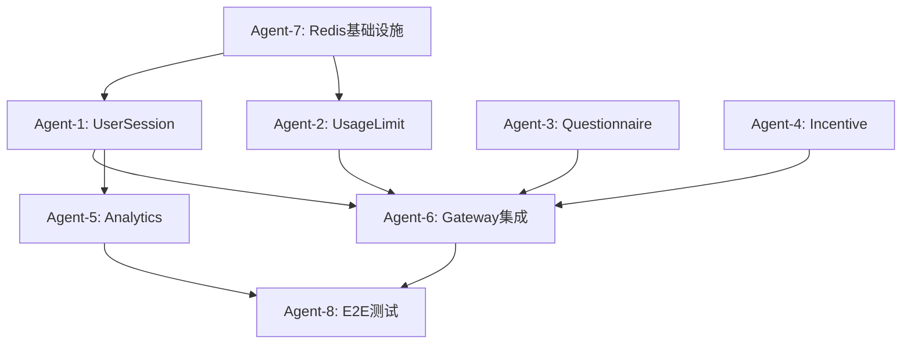

# 剩余AI Agent任务总览

## 📦 **Agent-5: Analytics领域服务**
**时间估算**: 4小时 | **复杂度**: 中等
- **目标**: 用户行为数据收集和分析的领域逻辑
- **交付**: 事件追踪、转化分析、用户画像、商业指标计算
- **测试**: 15个测试用例
- **依赖**: Agent-1的用户会话模型

## 📦 **Agent-6: Gateway集成层**  
**时间估算**: 6小时 | **复杂度**: 高
- **目标**: API Gateway的业务功能集成和路由配置
- **交付**: 中间件集成、路由配置、错误处理、限流控制
- **测试**: 20个集成测试用例
- **依赖**: Agent-1,2,3,4的所有领域服务

## 📦 **Agent-7: Redis基础设施**
**时间估算**: 3小时 | **复杂度**: 低
- **目标**: 缓存和会话存储的基础设施层实现
- **交付**: Redis连接管理、缓存策略、会话持久化
- **测试**: 12个基础设施测试用例
- **依赖**: 无外部依赖

## 📦 **Agent-8: 端到端测试套件**
**时间估算**: 5小时 | **复杂度**: 高
- **目标**: 完整业务流程的集成测试和验证
- **交付**: E2E测试场景、性能测试、契约测试
- **测试**: 完整业务流程覆盖
- **依赖**: 所有其他Agent的交付物

---

## 🕒 **总体时间规划**

### **Phase 1: 核心领域实现** (已规划)
- Agent-1: UserSession领域 (4小时)
- Agent-2: UsageLimit服务 (5小时) 
- Agent-3: Questionnaire领域 (5小时)
- Agent-4: Incentive服务 (6小时)
- **小计**: 20小时

### **Phase 2: 基础设施和集成** (待规划)
- Agent-7: Redis基础设施 (3小时)
- Agent-5: Analytics服务 (4小时)
- Agent-6: Gateway集成 (6小时)
- Agent-8: E2E测试套件 (5小时)
- **小计**: 18小时

### **总计**: 38小时 (~5个工作日)

---

## 🔗 **Agent依赖关系图**



## ✅ **验收标准统一**

### **代码质量标准**
- [ ] TypeScript严格模式，零any类型
- [ ] ESLint规则100%通过
- [ ] 测试覆盖率 ≥ 95%
- [ ] 所有契约验证生效

### **DDD原则遵循**
- [ ] 聚合边界清晰合理
- [ ] 领域逻辑正确封装
- [ ] 值对象不可变性
- [ ] 领域事件正确发布

### **SOLID原则验证**
- [ ] 单一职责原则 (SRP)
- [ ] 开闭原则 (OCP)
- [ ] 里氏替换原则 (LSP) 
- [ ] 接口隔离原则 (ISP)
- [ ] 依赖倒置原则 (DIP)

### **TDD流程遵循**
- [ ] 红-绿-重构循环
- [ ] 测试先行编写
- [ ] 最小实现原则
- [ ] 重构质量提升

---

## 🚀 **并行执行策略**

### **可并行Agent组合**
```typescript
// 第一波并行 (无依赖)
parallel_wave_1: {
  agents: [
    "Agent-1: UserSession领域",
    "Agent-3: Questionnaire领域", 
    "Agent-7: Redis基础设施"
  ],
  estimated_time: "5小时",
  可并行原因: "相互无依赖，可同时开发"
}

// 第二波并行 (依赖第一波)
parallel_wave_2: {
  agents: [
    "Agent-2: UsageLimit服务", // 依赖Agent-1
    "Agent-4: Incentive服务",   // 依赖Agent-3
    "Agent-5: Analytics服务"    // 依赖Agent-1
  ],
  estimated_time: "6小时",
  依赖关系: "需要第一波完成后开始"
}

// 第三波串行 (依赖所有前置)
serial_wave_3: {
  agents: [
    "Agent-6: Gateway集成",     // 依赖Agent-1,2,3,4
    "Agent-8: E2E测试套件"     // 依赖所有Agent
  ],
  estimated_time: "11小时",
  执行顺序: "Gateway完成后再执行E2E"
}
```

### **最优执行计划** (22小时 vs 38小时)
```
Day 1 (8小时): 第一波并行 + 第二波开始
Day 2 (8小时): 第二波完成 + Gateway集成开始  
Day 3 (6小时): Gateway完成 + E2E测试完成
```

---

## 📋 **质量保证流程**

### **每个Agent完成后的验证清单**
1. **功能验收**: 所有要求功能正确实现
2. **测试验收**: 指定数量测试用例100%通过
3. **契约验收**: DBC契约验证全部生效
4. **集成验收**: 接口定义满足后续Agent需求
5. **文档验收**: 代码注释和API文档完整

### **Phase完成后的集成验证**
1. **Phase 1验证**: 4个领域模型相互兼容
2. **Phase 2验证**: 集成功能端到端可用
3. **最终验证**: 完整业务流程测试通过

---

## 🎯 **成功标准**

### **技术目标**
- [ ] 8个Agent全部按规范完成
- [ ] 累计测试用例 ≥ 150个，100%通过
- [ ] 代码覆盖率整体 ≥ 95%
- [ ] Zero TypeScript错误，Zero ESLint警告

### **业务目标**  
- [ ] IP限制功能完整可用
- [ ] 问卷激励流程端到端可用
- [ ] 红包发放机制完整实现
- [ ] 用户数据收集分析可用

### **架构目标**
- [ ] DDD领域边界清晰合理
- [ ] SOLID原则在所有模块体现
- [ ] 契约式编程全面覆盖
- [ ] 事件驱动架构正确实现

这个AI Agents协作开发方案确保了每个任务的原子性、可验证性和可并行性，同时严格遵循DDD+TDD+SOLID+SSOT原则。